====================================================================================================
DEEP DIVE ANALYSIS - BANCO DE DADOS COREADAPT V4
Análise Abissal e Documentação Completa
====================================================================================================

## 📊 ESTATÍSTICAS GERAIS

- **Tabelas**: 22
- **Colunas totais**: 350
- **Índices**: 134
- **Foreign Keys**: 41
- **Triggers**: 8
- **Views**: 14
- **Functions**: 2

## 📁 CATEGORIZAÇÃO DE TABELAS

### Gestão de Contatos
- **corev4_contacts** (19 campos) - Contatos principais do sistema
- **corev4_contact_extras** (16 campos) - Dados extras e integrações de contatos
- **corev4_companies** (38 campos) - None

### Conversas e Mensagens
- **corev4_chats** (13 campos) - Gerenciamento de conversas ativas
- **corev4_chat_history** (15 campos) - None
- **corev4_message_dedup** (9 campos) - None
- **corev4_message_media** (19 campos) - None
- **corev4_n8n_chat_histories** (4 campos) - None

### Qualificação de Leads (ANUM)
- **corev4_lead_state** (19 campos) - None
- **corev4_anum_history** (23 campos) - Histórico de análises ANUM - auditoria completa de qualificação de leads
- **corev4_pain_categories** (11 campos) - Categorias pré-definidas de dores/problemas para classificação de leads

### Follow-up e Campanhas
- **corev4_followup_campaigns** (13 campos) - None
- **corev4_followup_configs** (10 campos) - None
- **corev4_followup_executions** (19 campos) - None
- **corev4_followup_sequences** (9 campos) - None
- **corev4_followup_steps** (7 campos) - None
- **corev4_followup_stage_history** (10 campos) - None

### Reuniões e Agendamentos
- **corev4_scheduled_meetings** (48 campos) - All scheduled Mesa de Clareza meetings from Cal.com
- **corev4_meeting_offers** (21 campos) - Audit trail of all Mesa de Clareza offers sent to leads

### Inteligência Artificial
- **corev4_ai_decisions** (11 campos) - None

### Logs e Auditoria
- **corev4_execution_logs** (11 campos) - None

### Utilitários e Migração
- **corev4_session_id_migration** (5 campos) - None


====================================================================================================
## 🔍 ANÁLISE DETALHADA POR TABELA
====================================================================================================


### 📋 corev4_ai_decisions
**Categoria**: Inteligência Artificial

**Descrição**: None

**⚠️ ATENÇÃO**: Tabela não encontrada nos fluxos N8N analisados

**Campos (11 total)**:

| Campo | Tipo | Nullable | Default | Propósito |
|-------|------|----------|---------|-----------|
| `id` | integer(32) | ❌ | `nextval('corev4_ai_decision...` | Identificador único da tabela (Primary Key) |
| `cost_usd` | numeric(10) | ✅ | `-` | Campo cost_usd |
| `decision` | character varying(30) | ❌ | `-` | Campo decision |
| `reasoning` | text | ✅ | `-` | Campo reasoning |
| `created_at` | timestamp with time zone | ✅ | `now()` | Data/hora de criação do registro |
| `model_used` | character varying(50) | ❌ | `-` | Campo model_used |
| `tokens_used` | integer(32) | ✅ | `-` | Campo tokens_used |
| `confidence_score` | integer(32) | ✅ | `-` | Pontuação/score de confidence |
| `context_snapshot` | jsonb | ✅ | `-` | Dados JSON: context_snapshot |
| `processing_time_ms` | integer(32) | ✅ | `-` | Campo processing_time_ms |
| `followup_execution_id` | integer(32) | ✅ | `-` | Chave estrangeira para tabela de followup_execution |

**Relacionamentos (2 Foreign Keys)**:

- `followup_execution_id` → `corev4_followup_executions.id` (ON DELETE SET NULL, ON UPDATE CASCADE)
- `followup_execution_id` → `corev4_followup_executions.id` (ON DELETE CASCADE, ON UPDATE NO ACTION)

**Índices (8 total)**:

- 📇 INDEX `idx_ai_decisions_execution`: followup_execution_id, created_at DESC
- 🔑 UNIQUE `corev4_ai_decisions_pkey`: id
- 📇 INDEX `idx_ai_decisions_exec`: followup_execution_id
- 📇 INDEX `idx_ai_decisions_model`: model_used
- 📇 INDEX `idx_ai_decisions_decision`: decision
- 📇 INDEX `idx_ai_decisions_created`: created_at DESC
- 📇 INDEX `idx_ai_cost_analytics`: model_used, decision, created_at DESC
- 📇 INDEX `idx_ai_execution_link`: followup_execution_id, created_at DESC

**Row Level Security (RLS)**: ✅ Habilitado (0 policies)


**Check Constraints (1 validações)**:

- `corev4_ai_decisions_confidence_score_check`: (((confidence_score >= 0) AND (confidence_score <= 100)))

**Estatísticas**: 0 linhas, tamanho: 72 kB

----------------------------------------------------------------------------------------------------

### 📋 corev4_anum_history
**Categoria**: Qualificação de Leads (ANUM)

**Descrição**: Histórico de análises ANUM - auditoria completa de qualificação de leads

**Usado em 1 fluxo(s)**:
- CoreAdapt Sync Flow: referenciado

**Campos (23 total)**:

| Campo | Tipo | Nullable | Default | Propósito |
|-------|------|----------|---------|-----------|
| `id` | integer(32) | ❌ | `nextval('corev4_anum_histor...` | Identificador único da tabela (Primary Key) |
| `evidence` | jsonb | ✅ | `-` | Dados JSON: evidence |
| `company_id` | integer(32) | ❌ | `-` | Chave estrangeira para tabela de company |
| `contact_id` | integer(32) | ❌ | `-` | Chave estrangeira para tabela de contact |
| `created_at` | timestamp with time zone | ❌ | `now()` | Data/hora de criação do registro |
| `need_delta` | integer(32) | ✅ | `-` | Campo need_delta |
| `need_score` | integer(32) | ❌ | `-` | Pontuação/score de need |
| `analyzed_at` | timestamp with time zone | ❌ | `now()` | Timestamp do evento: analyzed |
| `money_delta` | integer(32) | ✅ | `-` | Campo money_delta |
| `money_score` | integer(32) | ❌ | `-` | Pontuação/score de money |
| `total_score` | numeric(5) | ❌ | `-` | Pontuação/score de total |
| `is_qualified` | boolean | ❌ | `false` | Flag booleano: qualified |
| `urgency_delta` | integer(32) | ✅ | `-` | Campo urgency_delta |
| `urgency_score` | integer(32) | ❌ | `-` | Pontuação/score de urgency |
| `trigger_source` | character varying(50) | ✅ | `'anum_analyzer'::character ...` | Campo trigger_source |
| `authority_delta` | integer(32) | ✅ | `-` | Campo authority_delta |
| `authority_score` | integer(32) | ❌ | `-` | Pontuação/score de authority |
| `confidence_score` | numeric(3) | ✅ | `-` | Pontuação/score de confidence |
| `main_pain_detail` | text | ✅ | `-` | Campo main_pain_detail |
| `messages_analyzed` | integer(32) | ❌ | `-` | Campo messages_analyzed |
| `analysis_reasoning` | text | ✅ | `-` | Campo analysis_reasoning |
| `qualification_stage` | character varying(20) | ✅ | `-` | Campo qualification_stage |
| `main_pain_category_id` | integer(32) | ✅ | `-` | Chave estrangeira para tabela de main_pain_category |

**Relacionamentos (3 Foreign Keys)**:

- `company_id` → `corev4_companies.id` (ON DELETE CASCADE, ON UPDATE NO ACTION)
- `main_pain_category_id` → `corev4_pain_categories.id` (ON DELETE NO ACTION, ON UPDATE NO ACTION)
- `contact_id` → `corev4_contacts.id` (ON DELETE CASCADE, ON UPDATE NO ACTION)

**Índices (6 total)**:

- 📇 INDEX `idx_anum_history_pain_category`: main_pain_category_id
- 🔑 UNIQUE `corev4_anum_history_pkey`: id
- 📇 INDEX `idx_anum_history_contact`: contact_id
- 📇 INDEX `idx_anum_history_company`: company_id
- 📇 INDEX `idx_anum_history_analyzed_at`: analyzed_at DESC
- 📇 INDEX `idx_anum_history_qualified`: is_qualified

**Row Level Security (RLS)**: ✅ Habilitado (0 policies)


**Check Constraints (6 validações)**:

- `corev4_anum_history_urgency_score_check`: (((urgency_score >= 0) AND (urgency_score <= 100)))
- `corev4_anum_history_authority_score_check`: (((authority_score >= 0) AND (authority_score <= 100)))
- `corev4_anum_history_confidence_score_check`: (((confidence_score >= (0)::numeric) AND (confidence_score <= (1)::numeric)))
- `corev4_anum_history_money_score_check`: (((money_score >= 0) AND (money_score <= 100)))
- `corev4_anum_history_need_score_check`: (((need_score >= 0) AND (need_score <= 100)))
- `corev4_anum_history_qualification_stage_check`: (((qualification_stage)::text = ANY ((ARRAY['pre'::character varying, 'partial'::character varying, 'full'::character varying, 'rejected'::character varying])::text[])))

**Estatísticas**: 0 linhas, tamanho: 56 kB

----------------------------------------------------------------------------------------------------

### 📋 corev4_chat_history
**Categoria**: Conversas e Mensagens

**Descrição**: None

**Usado em 4 fluxo(s)**:
- CoreAdapt Commands Flow: SELECT(2)
- CoreAdapt Genesis Flow: SELECT(2)
- CoreAdapt One Flow: SELECT(2)
- CoreAdapt Scheduler Flow: SELECT(2)

**Campos (15 total)**:

| Campo | Tipo | Nullable | Default | Propósito |
|-------|------|----------|---------|-----------|
| `id` | integer(32) | ❌ | `nextval('corev4_chat_histor...` | Identificador único da tabela (Primary Key) |
| `role` | character varying(50) | ✅ | `-` | Campo role |
| `message` | text | ✅ | `-` | Campo message |
| `cost_usd` | numeric(10) | ✅ | `-` | Campo cost_usd |
| `has_media` | boolean | ✅ | `false` | Flag booleano: media |
| `media_url` | text | ✅ | `-` | URL para media |
| `company_id` | integer(32) | ❌ | `-` | Chave estrangeira para tabela de company |
| `contact_id` | integer(32) | ❌ | `-` | Chave estrangeira para tabela de contact |
| `created_at` | timestamp with time zone | ✅ | `now()` | Data/hora de criação do registro |
| `model_used` | character varying(100) | ✅ | `-` | Campo model_used |
| `session_id` | character varying(255) | ✅ | `-` | Chave estrangeira para tabela de session |
| `tokens_used` | integer(32) | ✅ | `-` | Campo tokens_used |
| `message_type` | character varying(100) | ✅ | `-` | Campo message_type |
| `media_mime_type` | character varying(100) | ✅ | `-` | Campo media_mime_type |
| `message_timestamp` | timestamp with time zone | ✅ | `-` | Data/hora: message_timestamp |

**Relacionamentos (2 Foreign Keys)**:

- `company_id` → `corev4_companies.id` (ON DELETE RESTRICT, ON UPDATE CASCADE)
- `contact_id` → `corev4_contacts.id` (ON DELETE CASCADE, ON UPDATE CASCADE)

**Índices (6 total)**:

- 📇 INDEX `idx_chat_session_time`: session_id, created_at DESC
- 🔑 UNIQUE `corev4_chat_history_pkey`: id
- 📇 INDEX `idx_chat_history_session`: session_id
- 📇 INDEX `idx_chat_history_contact`: contact_id
- 📇 INDEX `idx_chat_history_contact_company`: contact_id, company_id
- 📇 INDEX `idx_chat_history_has_media`: has_media

**Row Level Security (RLS)**: ✅ Habilitado (0 policies)


**Estatísticas**: 0 linhas, tamanho: 56 kB

----------------------------------------------------------------------------------------------------

### 📋 corev4_chats
**Categoria**: Conversas e Mensagens

**Descrição**: Gerenciamento de conversas ativas

**⚠️ ATENÇÃO**: Tabela não encontrada nos fluxos N8N analisados

**Campos (13 total)**:

| Campo | Tipo | Nullable | Default | Propósito |
|-------|------|----------|---------|-----------|
| `id` | bigint(64) | ❌ | `nextval('corev4_chats_id_se...` | Identificador único da tabela (Primary Key) |
| `company_id` | integer(32) | ❌ | `-` | Chave estrangeira para tabela de company |
| `contact_id` | bigint(64) | ❌ | `-` | Chave estrangeira para tabela de contact |
| `created_at` | timestamp with time zone | ✅ | `now()` | Data/hora de criação do registro |
| `updated_at` | timestamp with time zone | ✅ | `now()` | Data/hora da última atualização do registro |
| `agent_alias` | text | ✅ | `-` | Campo agent_alias |
| `closed_reason` | text | ✅ | `-` | Campo closed_reason |
| `last_message_ts` | bigint(64) | ✅ | `-` | Campo last_message_ts |
| `batch_collecting` | boolean | ✅ | `false` | Flag booleano: batch_collecting |
| `batch_expires_at` | timestamp with time zone | ✅ | `-` | Timestamp do evento: batch_expires |
| `conversation_open` | boolean | ✅ | `true` | Flag booleano: conversation_open |
| `last_lead_message_ts` | bigint(64) | ✅ | `-` | Campo last_lead_message_ts |
| `last_agent_message_ts` | bigint(64) | ✅ | `-` | Campo last_agent_message_ts |

**Relacionamentos (2 Foreign Keys)**:

- `company_id` → `corev4_companies.id` (ON DELETE RESTRICT, ON UPDATE CASCADE)
- `contact_id` → `corev4_contacts.id` (ON DELETE CASCADE, ON UPDATE NO ACTION)

**Índices (8 total)**:

- 🔑 UNIQUE `corev4_chats_pkey`: id
- 🔑 UNIQUE `unique_contact_chat`: contact_id, company_id
- 📇 INDEX `idx_chats_contact`: contact_id
- 📇 INDEX `idx_chats_company`: company_id
- 📇 INDEX `idx_chats_open`: conversation_open
- 📇 INDEX `idx_chats_batch`: batch_collecting
- 📇 INDEX `idx_chats_last_message`: last_message_ts DESC NULLS LAST
- 📇 INDEX `idx_chats_conversation_open`: conversation_open

**Triggers (1 total)**:

- `update_chats_updated_at`: BEFORE UPDATE → `update_updated_at_column()`

**Row Level Security (RLS)**: ✅ Habilitado (0 policies)


**Unique Constraints**:

- `contact_id`, `company_id`

**Estatísticas**: 0 linhas, tamanho: 72 kB

----------------------------------------------------------------------------------------------------

### 📋 corev4_companies
**Categoria**: Gestão de Contatos

**Descrição**: None

**Usado em 3 fluxo(s)**:
- CoreAdapt Meeting Reminders Flow: SELECT(1)
- CoreAdapt Scheduler Flow: SELECT(1)
- CoreAdapt Sentinel Flow: SELECT(1)

**Campos (38 total)**:

| Campo | Tipo | Nullable | Default | Propósito |
|-------|------|----------|---------|-----------|
| `id` | integer(32) | ❌ | `nextval('corev4_companies_i...` | Identificador único da tabela (Primary Key) |
| `name` | character varying(255) | ❌ | `-` | Campo name |
| `slug` | character varying(255) | ❌ | `-` | Campo slug |
| `bot_name` | character varying(100) | ✅ | `'Frank'::character varying` | Campo bot_name |
| `features` | jsonb | ✅ | `'{}'::jsonb` | Dados JSON: features |
| `is_active` | boolean | ✅ | `true` | Flag booleano: active |
| `llm_model` | character varying(100) | ✅ | `'gpt-4-turbo'::character va...` | Configuração de LLM: model |
| `plan_tier` | character varying(50) | ✅ | `'free'::character varying` | Campo plan_tier |
| `created_at` | timestamp with time zone | ✅ | `now()` | Data/hora de criação do registro |
| `updated_at` | timestamp with time zone | ✅ | `now()` | Data/hora da última atualização do registro |
| `crm_api_key` | text | ✅ | `-` | Integração CRM: api_key |
| `billing_email` | character varying(255) | ✅ | `-` | Endereço de email para billing |
| `system_prompt` | text | ✅ | `-` | Campo system_prompt |
| `trial_ends_at` | timestamp with time zone | ✅ | `-` | Timestamp do evento: trial_ends |
| `llm_max_tokens` | integer(32) | ✅ | `1000` | Configuração de LLM: max_tokens |
| `webhook_secret` | text | ✅ | `-` | Campo webhook_secret |
| `bot_personality` | text | ✅ | `-` | Campo bot_personality |
| `crm_integration` | character varying(50) | ✅ | `-` | Integração CRM: integration |
| `crm_pipeline_id` | text | ✅ | `-` | Chave estrangeira para tabela de crm_pipeline |
| `llm_temperature` | numeric(3) | ✅ | `0.7` | Configuração de LLM: temperature |
| `greeting_message` | text | ✅ | `-` | Campo greeting_message |
| `suspended_reason` | text | ✅ | `-` | Campo suspended_reason |
| `contact_type_mode` | character varying(50) | ✅ | `'leads_only'::character var...` | Campo contact_type_mode |
| `evolution_api_key` | text | ✅ | `-` | Integração Evolution API: api_key |
| `evolution_api_url` | text | ✅ | `-` | URL para evolution_api |
| `evolution_instance` | text | ✅ | `-` | Integração Evolution API: instance |
| `enable_anum_analysis` | boolean | ✅ | `true` | Flag booleano: enable_anum_analysis |
| `auto_create_campaigns` | boolean | ✅ | `false` | Flag booleano: auto_create_campaigns |
| `monthly_message_limit` | integer(32) | ✅ | `1000` | Campo monthly_message_limit |
| `current_month_messages` | integer(32) | ✅ | `0` | Campo current_month_messages |
| `enable_audio_responses` | boolean | ✅ | `false` | Flag booleano: enable_audio_responses |
| `enable_media_processing` | boolean | ✅ | `true` | Flag booleano: enable_media_processing |
| `anum_threshold_qualified` | integer(32) | ✅ | `70` | Campo anum_threshold_qualified |
| `enable_command_processing` | boolean | ✅ | `true` | Flag booleano: enable_command_processing |
| `enable_followup_campaigns` | boolean | ✅ | `true` | Flag booleano: enable_followup_campaigns |
| `default_followup_config_id` | integer(32) | ✅ | `-` | Chave estrangeira para tabela de default_followup_config |
| `webhook_validation_enabled` | boolean | ✅ | `false` | Flag booleano: webhook_validation_enabled |
| `anum_threshold_disqualified` | integer(32) | ✅ | `20` | Campo anum_threshold_disqualified |

**Relacionamentos (1 Foreign Keys)**:

- `default_followup_config_id` → `corev4_followup_configs.id` (ON DELETE NO ACTION, ON UPDATE NO ACTION)

**Índices (5 total)**:

- 📇 INDEX `idx_companies_slug`: slug
- 📇 INDEX `idx_companies_is_active`: is_active
- 📇 INDEX `idx_companies_plan_tier`: plan_tier
- 🔑 UNIQUE `corev4_companies_pkey`: id
- 🔑 UNIQUE `corev4_companies_slug_key`: slug

**Check Constraints (6 validações)**:

- `corev4_companies_plan_tier_check`: (((plan_tier)::text = ANY ((ARRAY['free'::character varying, 'starter'::character varying, 'pro'::character varying, 'enterprise'::character varying, 'custom'::character varying])::text[])))
- `corev4_companies_anum_threshold_disqualified_check`: (((anum_threshold_disqualified >= 0) AND (anum_threshold_disqualified <= 100)))
- `corev4_companies_anum_threshold_qualified_check`: (((anum_threshold_qualified >= 0) AND (anum_threshold_qualified <= 100)))
- `corev4_companies_contact_type_mode_check`: (((contact_type_mode)::text = ANY ((ARRAY['leads_only'::character varying, 'customers_only'::character varying, 'mixed'::character varying, 'saas_users'::character varying])::text[])))
- `corev4_companies_llm_max_tokens_check`: ((llm_max_tokens > 0))
- `corev4_companies_llm_temperature_check`: (((llm_temperature >= 0.0) AND (llm_temperature <= 1.0)))

**Unique Constraints**:

- `slug`

**Estatísticas**: 1 linhas, tamanho: 96 kB

----------------------------------------------------------------------------------------------------

### 📋 corev4_contact_extras
**Categoria**: Gestão de Contatos

**Descrição**: Dados extras e integrações de contatos

**Usado em 3 fluxo(s)**:
- CoreAdapt Commands Flow: referenciado
- CoreAdapt Genesis Flow: referenciado
- CoreAdapt One Flow: referenciado

**Campos (16 total)**:

| Campo | Tipo | Nullable | Default | Propósito |
|-------|------|----------|---------|-----------|
| `id` | bigint(64) | ❌ | `nextval('corev4_contact_ext...` | Identificador único da tabela (Primary Key) |
| `crm_id` | text | ✅ | `-` | Chave estrangeira para tabela de crm |
| `deals_id` | text | ✅ | `-` | Chave estrangeira para tabela de deals |
| `plan_tier` | integer(32) | ✅ | `-` | Campo plan_tier |
| `stripe_id` | text | ✅ | `-` | Chave estrangeira para tabela de stripe |
| `thread_id` | text | ✅ | `-` | Chave estrangeira para tabela de thread |
| `company_id` | integer(32) | ❌ | `-` | Chave estrangeira para tabela de company |
| `contact_id` | bigint(64) | ❌ | `-` | Chave estrangeira para tabela de contact |
| `created_at` | timestamp with time zone | ✅ | `now()` | Data/hora de criação do registro |
| `updated_at` | timestamp with time zone | ✅ | `now()` | Data/hora da última atualização do registro |
| `pipeline_id` | text | ✅ | `-` | Chave estrangeira para tabela de pipeline |
| `interactions` | integer(32) | ✅ | `0` | Campo interactions |
| `text_response` | boolean | ✅ | `true` | Flag booleano: text_response |
| `audio_response` | boolean | ✅ | `false` | Flag booleano: audio_response |
| `last_interaction_at` | timestamp with time zone | ✅ | `-` | Timestamp do evento: last_interaction |
| `evolution_api_contact` | text | ✅ | `-` | Integração Evolution API: api_contact |

**Relacionamentos (2 Foreign Keys)**:

- `contact_id` → `corev4_contacts.id` (ON DELETE CASCADE, ON UPDATE CASCADE)
- `company_id` → `corev4_companies.id` (ON DELETE RESTRICT, ON UPDATE CASCADE)

**Índices (8 total)**:

- 🔑 UNIQUE `corev4_contact_extras_pkey`: id
- 🔑 UNIQUE `unique_contact_extras`: contact_id, company_id
- 📇 INDEX `idx_extras_contact`: contact_id
- 📇 INDEX `idx_extras_company`: company_id
- 📇 INDEX `idx_extras_crm`: crm_id
- 📇 INDEX `idx_extras_stripe`: stripe_id
- 📇 INDEX `idx_extras_last_interaction`: last_interaction_at DESC NULLS LAST
- 📇 INDEX `idx_contact_extras_contact`: contact_id, company_id

**Triggers (1 total)**:

- `update_contact_extras_updated_at`: BEFORE UPDATE → `update_updated_at_column()`

**Row Level Security (RLS)**: ✅ Habilitado (0 policies)


**Check Constraints (2 validações)**:

- `corev4_contact_extras_interactions_check`: ((interactions >= 0))
- `corev4_contact_extras_plan_tier_check`: ((plan_tier >= 0))

**Unique Constraints**:

- `contact_id`, `company_id`

**Estatísticas**: 0 linhas, tamanho: 72 kB

----------------------------------------------------------------------------------------------------

### 📋 corev4_contacts
**Categoria**: Gestão de Contatos

**Descrição**: Contatos principais do sistema

**Usado em 8 fluxo(s)**:
- CoreAdapt Commands Flow: SELECT(2)
- CoreAdapt Genesis Flow: SELECT(2)
- CoreAdapt Main Router Flow: SELECT(2)
- CoreAdapt Meeting Reminders Flow: SELECT(2)
- CoreAdapt Scheduler Flow: SELECT(2)
- CoreAdapt Sentinel Flow: SELECT(2)
- CoreAdapt Sync Flow: SELECT(2)
- Reactivate Blocked Contact: SELECT(2)

**Campos (19 total)**:

| Campo | Tipo | Nullable | Default | Propósito |
|-------|------|----------|---------|-----------|
| `id` | bigint(64) | ❌ | `nextval('corev4_contacts_id...` | Identificador único da tabela (Primary Key) |
| `tags` | text[] | ✅ | `'{}'::text[]` | Campo tags |
| `email` | text | ✅ | `-` | Campo email |
| `sector` | text | ✅ | `-` | Campo sector |
| `opt_out` | boolean | ✅ | `false` | Flag booleano: opt_out |
| `whatsapp` | text | ❌ | `-` | Número de telefone WhatsApp |
| `full_name` | text | ❌ | `-` | Campo full_name |
| `is_active` | boolean | ✅ | `true` | Flag booleano: active |
| `company_id` | integer(32) | ❌ | `-` | Chave estrangeira para tabela de company |
| `created_at` | timestamp with time zone | ✅ | `now()` | Data/hora de criação do registro |
| `updated_at` | timestamp with time zone | ✅ | `now()` | Data/hora da última atualização do registro |
| `utm_medium` | text | ✅ | `-` | Parâmetro UTM: medium (origem de marketing) |
| `utm_source` | text | ✅ | `-` | Parâmetro UTM: source (origem de marketing) |
| `utm_adgroup` | text | ✅ | `-` | Parâmetro UTM: adgroup (origem de marketing) |
| `phone_number` | text | ✅ | `-` | Número de telefone |
| `utm_campaign` | text | ✅ | `-` | Parâmetro UTM: campaign (origem de marketing) |
| `utm_creative` | text | ✅ | `-` | Parâmetro UTM: creative (origem de marketing) |
| `origin_source` | text | ❌ | `'whatsapp'::text` | Campo origin_source |
| `last_interaction_at` | timestamp with time zone | ✅ | `-` | Timestamp do evento: last_interaction |

**Relacionamentos (1 Foreign Keys)**:

- `company_id` → `corev4_companies.id` (ON DELETE RESTRICT, ON UPDATE CASCADE)

**Índices (10 total)**:

- 🔑 UNIQUE `corev4_contacts_pkey`: id
- 🔑 UNIQUE `unique_whatsapp_company`: whatsapp, company_id
- 📇 INDEX `idx_contacts_company`: company_id
- 📇 INDEX `idx_contacts_whatsapp`: whatsapp
- 📇 INDEX `idx_contacts_email`: email
- 📇 INDEX `idx_contacts_active`: is_active
- 📇 INDEX `idx_contacts_opt_out`: opt_out
- 📇 INDEX `idx_contacts_last_interaction`: last_interaction_at DESC NULLS LAST
- 📇 INDEX `idx_contacts_full_name_trgm`: full_name gin_trgm_ops
- 📇 INDEX `idx_contacts_created`: created_at DESC

**Triggers (1 total)**:

- `update_contacts_updated_at`: BEFORE UPDATE → `update_updated_at_column()`

**Row Level Security (RLS)**: ✅ Habilitado (1 policies)

- **tenant_isolation_contacts**: ALL (PERMISSIVE)
  - USING: `(company_id = (current_setting('app.current_company_id'::text, true))::integer)`

**Check Constraints (2 validações)**:

- `valid_email`: (((email IS NULL) OR (email ~* '^[A-Za-z0-9._%+-]+@[A-Za-z0-9.-]+\.[A-Za-z]{2,}$'::text)))
- `valid_phone`: (((phone_number IS NULL) OR (length(phone_number) >= 10)))

**Unique Constraints**:

- `whatsapp`, `company_id`

**Estatísticas**: 0 linhas, tamanho: 96 kB

----------------------------------------------------------------------------------------------------

### 📋 corev4_execution_logs
**Categoria**: Logs e Auditoria

**Descrição**: None

**Usado em 1 fluxo(s)**:
- CoreAdapt Commands Flow: SELECT(1)

**Campos (11 total)**:

| Campo | Tipo | Nullable | Default | Propósito |
|-------|------|----------|---------|-----------|
| `id` | integer(32) | ❌ | `nextval('corev4_execution_l...` | Identificador único da tabela (Primary Key) |
| `details` | jsonb | ✅ | `-` | Dados JSON: details |
| `success` | boolean | ✅ | `true` | Flag booleano: success |
| `contact_id` | integer(32) | ✅ | `-` | Chave estrangeira para tabela de contact |
| `created_at` | timestamp with time zone | ✅ | `now()` | Data/hora de criação do registro |
| `duration_ms` | integer(32) | ✅ | `-` | Campo duration_ms |
| `followup_id` | integer(32) | ✅ | `-` | Chave estrangeira para tabela de followup |
| `action_taken` | character varying(100) | ✅ | `-` | Campo action_taken |
| `execution_id` | character varying(255) | ✅ | `-` | Chave estrangeira para tabela de execution |
| `error_message` | text | ✅ | `-` | Campo error_message |
| `workflow_name` | character varying(255) | ❌ | `-` | Campo workflow_name |

**Relacionamentos (3 Foreign Keys)**:

- `contact_id` → `corev4_contacts.id` (ON DELETE SET NULL, ON UPDATE NO ACTION)
- `followup_id` → `corev4_followup_executions.id` (ON DELETE SET NULL, ON UPDATE NO ACTION)
- `contact_id` → `corev4_contacts.id` (ON DELETE SET NULL, ON UPDATE NO ACTION)

**Índices (9 total)**:

- 📇 INDEX `idx_logs_workflow_time`: workflow_name, created_at DESC
- 🔑 UNIQUE `corev4_execution_logs_pkey`: id
- 📇 INDEX `idx_execution_logs_workflow`: workflow_name
- 📇 INDEX `idx_execution_logs_contact`: contact_id
- 📇 INDEX `idx_execution_logs_followup`: followup_id
- 📇 INDEX `idx_execution_logs_success`: success
- 📇 INDEX `idx_execution_logs_created`: created_at DESC
- 📇 INDEX `idx_logs_analytics`: success, workflow_name, created_at DESC
- 📇 INDEX `idx_logs_errors`: success, workflow_name, created_at DESC

**Estatísticas**: 0 linhas, tamanho: 80 kB

----------------------------------------------------------------------------------------------------

### 📋 corev4_followup_campaigns
**Categoria**: Follow-up e Campanhas

**Descrição**: None

**Usado em 2 fluxo(s)**:
- CoreAdapt Sentinel Flow: UPDATE(1)
- Create Followup Campaign: UPDATE(1)

**Campos (13 total)**:

| Campo | Tipo | Nullable | Default | Propósito |
|-------|------|----------|---------|-----------|
| `id` | integer(32) | ❌ | `nextval('corev4_followup_ca...` | Identificador único da tabela (Primary Key) |
| `status` | character varying(50) | ✅ | `'active'::character varying` | Campo status |
| `config_id` | integer(32) | ❌ | `-` | Chave estrangeira para tabela de config |
| `company_id` | integer(32) | ❌ | `-` | Chave estrangeira para tabela de company |
| `contact_id` | bigint(64) | ❌ | `-` | Chave estrangeira para tabela de contact |
| `created_at` | timestamp with time zone | ✅ | `now()` | Data/hora de criação do registro |
| `updated_at` | timestamp with time zone | ✅ | `now()` | Data/hora da última atualização do registro |
| `total_steps` | integer(32) | ❌ | `-` | Campo total_steps |
| `pause_reason` | text | ✅ | `-` | Campo pause_reason |
| `stopped_reason` | character varying(100) | ✅ | `-` | Campo stopped_reason |
| `should_continue` | boolean | ✅ | `true` | Flag booleano: should_continue |
| `steps_completed` | integer(32) | ✅ | `0` | Campo steps_completed |
| `last_step_sent_at` | timestamp with time zone | ✅ | `-` | Timestamp do evento: last_step_sent |

**Relacionamentos (3 Foreign Keys)**:

- `config_id` → `corev4_followup_configs.id` (ON DELETE RESTRICT, ON UPDATE CASCADE)
- `contact_id` → `corev4_contacts.id` (ON DELETE CASCADE, ON UPDATE CASCADE)
- `company_id` → `corev4_companies.id` (ON DELETE RESTRICT, ON UPDATE CASCADE)

**Índices (8 total)**:

- 🔑 UNIQUE `corev4_followup_campaigns_pkey1`: id
- 📇 INDEX `idx_campaigns_contact`: contact_id
- 📇 INDEX `idx_campaigns_company`: company_id
- 📇 INDEX `idx_campaigns_config`: config_id
- 📇 INDEX `idx_campaigns_status`: status
- 📇 INDEX `idx_campaigns_active`: should_continue
- 📇 INDEX `idx_followup_campaigns_status`: status, company_id, should_continue
- 📇 INDEX `idx_followup_campaigns_contact`: contact_id, company_id

**Row Level Security (RLS)**: ✅ Habilitado (0 policies)


**Estatísticas**: 0 linhas, tamanho: 72 kB

----------------------------------------------------------------------------------------------------

### 📋 corev4_followup_configs
**Categoria**: Follow-up e Campanhas

**Descrição**: None

**Usado em 1 fluxo(s)**:
- Create Followup Campaign: referenciado

**Campos (10 total)**:

| Campo | Tipo | Nullable | Default | Propósito |
|-------|------|----------|---------|-----------|
| `id` | integer(32) | ❌ | `nextval('corev4_followup_co...` | Identificador único da tabela (Primary Key) |
| `is_active` | boolean | ✅ | `true` | Flag booleano: active |
| `company_id` | integer(32) | ❌ | `-` | Chave estrangeira para tabela de company |
| `created_at` | timestamp with time zone | ✅ | `now()` | Data/hora de criação do registro |
| `updated_at` | timestamp with time zone | ✅ | `now()` | Data/hora da última atualização do registro |
| `config_name` | character varying(100) | ❌ | `-` | Campo config_name |
| `total_steps` | integer(32) | ❌ | `5` | Campo total_steps |
| `max_no_response_days` | integer(32) | ✅ | `30` | Campo max_no_response_days |
| `qualification_threshold` | integer(32) | ✅ | `60` | Campo qualification_threshold |
| `disqualification_threshold` | integer(32) | ✅ | `15` | Campo disqualification_threshold |

**Relacionamentos (1 Foreign Keys)**:

- `company_id` → `corev4_companies.id` (ON DELETE RESTRICT, ON UPDATE CASCADE)

**Índices (4 total)**:

- 🔑 UNIQUE `corev4_followup_configs_pkey1`: id
- 📇 INDEX `idx_followup_configs_company`: company_id
- 📇 INDEX `idx_followup_configs_active`: is_active
- 🔑 UNIQUE `corev4_followup_configs_company_name_key`: company_id, config_name

**Row Level Security (RLS)**: ✅ Habilitado (0 policies)


**Unique Constraints**:

- `company_id`, `config_name`

**Estatísticas**: 1 linhas, tamanho: 80 kB

----------------------------------------------------------------------------------------------------

### 📋 corev4_followup_executions
**Categoria**: Follow-up e Campanhas

**Descrição**: None

**Usado em 2 fluxo(s)**:
- CoreAdapt Sentinel Flow: referenciado
- Create Followup Campaign: referenciado

**Campos (19 total)**:

| Campo | Tipo | Nullable | Default | Propósito |
|-------|------|----------|---------|-----------|
| `id` | integer(32) | ❌ | `nextval('corev4_followup_ex...` | Identificador único da tabela (Primary Key) |
| `step` | integer(32) | ❌ | `-` | Campo step |
| `sent_at` | timestamp with time zone | ✅ | `-` | Timestamp do evento: sent |
| `executed` | boolean | ✅ | `false` | Flag booleano: executed |
| `company_id` | integer(32) | ❌ | `-` | Chave estrangeira para tabela de company |
| `contact_id` | bigint(64) | ❌ | `-` | Chave estrangeira para tabela de contact |
| `created_at` | timestamp with time zone | ✅ | `now()` | Data/hora de criação do registro |
| `updated_at` | timestamp with time zone | ✅ | `now()` | Data/hora da última atualização do registro |
| `campaign_id` | integer(32) | ❌ | `-` | Chave estrangeira para tabela de campaign |
| `should_send` | boolean | ✅ | `true` | Flag booleano: should_send |
| `total_steps` | integer(32) | ❌ | `-` | Campo total_steps |
| `scheduled_at` | timestamp with time zone | ❌ | `-` | Timestamp do evento: scheduled |
| `decision_reason` | text | ✅ | `-` | Campo decision_reason |
| `anum_at_execution` | jsonb | ✅ | `-` | Dados JSON: anum_at_execution |
| `evolution_api_url` | character varying(255) | ✅ | `-` | URL para evolution_api |
| `generated_message` | text | ✅ | `-` | Campo generated_message |
| `evolution_instance` | character varying(255) | ✅ | `-` | Integração Evolution API: instance |
| `generation_context` | jsonb | ✅ | `-` | Dados JSON: generation_context |
| `evolution_message_id` | character varying(255) | ✅ | `-` | Chave estrangeira para tabela de evolution_message |

**Relacionamentos (3 Foreign Keys)**:

- `contact_id` → `corev4_contacts.id` (ON DELETE CASCADE, ON UPDATE CASCADE)
- `campaign_id` → `corev4_followup_campaigns.id` (ON DELETE CASCADE, ON UPDATE CASCADE)
- `company_id` → `corev4_companies.id` (ON DELETE RESTRICT, ON UPDATE CASCADE)

**Índices (7 total)**:

- 📇 INDEX `idx_executions_lookup`: company_id, contact_id, executed
- 🔑 UNIQUE `corev4_followup_executions_pkey1`: id
- 📇 INDEX `idx_executions_campaign`: campaign_id
- 📇 INDEX `idx_executions_contact`: contact_id
- 📇 INDEX `idx_executions_pending`: executed, scheduled_at, should_send
- 📇 INDEX `idx_executions_scheduled`: scheduled_at
- 📇 INDEX `idx_followup_executions_pending`: scheduled_at, executed, company_id

**Row Level Security (RLS)**: ✅ Habilitado (0 policies)


**Estatísticas**: 0 linhas, tamanho: 64 kB

----------------------------------------------------------------------------------------------------

### 📋 corev4_followup_sequences
**Categoria**: Follow-up e Campanhas

**Descrição**: None

**⚠️ ATENÇÃO**: Tabela não encontrada nos fluxos N8N analisados

**Campos (9 total)**:

| Campo | Tipo | Nullable | Default | Propósito |
|-------|------|----------|---------|-----------|
| `id` | integer(32) | ❌ | `nextval('corev4_followup_se...` | Identificador único da tabela (Primary Key) |
| `created_at` | timestamp with time zone | ✅ | `now()` | Data/hora de criação do registro |
| `campaign_id` | integer(32) | ❌ | `-` | Chave estrangeira para tabela de campaign |
| `step_number` | integer(32) | ❌ | `-` | Campo step_number |
| `interval_hours` | integer(32) | ❌ | `-` | Campo interval_hours |
| `max_anum_score` | integer(32) | ✅ | `-` | Pontuação/score de max_anum |
| `min_anum_score` | integer(32) | ✅ | `-` | Pontuação/score de min_anum |
| `required_stage` | character varying(20) | ✅ | `-` | Campo required_stage |
| `message_template` | text | ❌ | `-` | Campo message_template |

**Relacionamentos (1 Foreign Keys)**:

- `campaign_id` → `corev4_followup_campaigns.id` (ON DELETE CASCADE, ON UPDATE NO ACTION)

**Índices (3 total)**:

- 🔑 UNIQUE `corev4_followup_sequences_pkey`: id
- 🔑 UNIQUE `corev4_followup_sequences_campaign_id_step_number_key`: campaign_id, step_number
- 📇 INDEX `idx_followup_sequences_campaign`: campaign_id

**Row Level Security (RLS)**: ✅ Habilitado (0 policies)


**Unique Constraints**:

- `campaign_id`, `step_number`

**Estatísticas**: 0 linhas, tamanho: 32 kB

----------------------------------------------------------------------------------------------------

### 📋 corev4_followup_stage_history
**Categoria**: Follow-up e Campanhas

**Descrição**: None

**⚠️ ATENÇÃO**: Tabela não encontrada nos fluxos N8N analisados

**Campos (10 total)**:

| Campo | Tipo | Nullable | Default | Propósito |
|-------|------|----------|---------|-----------|
| `id` | integer(32) | ❌ | `nextval('corev4_followup_st...` | Identificador único da tabela (Primary Key) |
| `notes` | text | ✅ | `-` | Campo notes |
| `new_stage` | character varying(20) | ✅ | `-` | Campo new_stage |
| `old_stage` | character varying(20) | ✅ | `-` | Campo old_stage |
| `changed_at` | timestamp with time zone | ✅ | `now()` | Timestamp do evento: changed |
| `changed_by` | character varying(100) | ✅ | `-` | Campo changed_by |
| `company_id` | integer(32) | ✅ | `-` | Chave estrangeira para tabela de company |
| `contact_id` | integer(32) | ✅ | `-` | Chave estrangeira para tabela de contact |
| `created_at` | timestamp with time zone | ❌ | `now()` | Data/hora de criação do registro |
| `followup_execution_id` | integer(32) | ✅ | `-` | Chave estrangeira para tabela de followup_execution |

**Relacionamentos (3 Foreign Keys)**:

- `followup_execution_id` → `corev4_followup_executions.id` (ON DELETE CASCADE, ON UPDATE NO ACTION)
- `company_id` → `corev4_companies.id` (ON DELETE NO ACTION, ON UPDATE NO ACTION)
- `contact_id` → `corev4_contacts.id` (ON DELETE CASCADE, ON UPDATE NO ACTION)

**Índices (5 total)**:

- 🔑 UNIQUE `corev4_followup_stage_history_pkey`: id
- 📇 INDEX `idx_followup_stage_hist_contact`: contact_id
- 📇 INDEX `idx_followup_stage_hist_exec`: followup_execution_id
- 📇 INDEX `idx_followup_stage_hist_changed`: changed_at DESC
- 📇 INDEX `idx_followup_stage_history_created`: created_at DESC

**Row Level Security (RLS)**: ✅ Habilitado (0 policies)


**Estatísticas**: 0 linhas, tamanho: 48 kB

----------------------------------------------------------------------------------------------------

### 📋 corev4_followup_steps
**Categoria**: Follow-up e Campanhas

**Descrição**: None

**Usado em 2 fluxo(s)**:
- CoreAdapt Sentinel Flow: referenciado
- Create Followup Campaign: referenciado

**Campos (7 total)**:

| Campo | Tipo | Nullable | Default | Propósito |
|-------|------|----------|---------|-----------|
| `id` | integer(32) | ❌ | `nextval('corev4_followup_st...` | Identificador único da tabela (Primary Key) |
| `config_id` | integer(32) | ❌ | `-` | Chave estrangeira para tabela de config |
| `created_at` | timestamp with time zone | ✅ | `now()` | Data/hora de criação do registro |
| `updated_at` | timestamp with time zone | ✅ | `now()` | Data/hora da última atualização do registro |
| `wait_hours` | integer(32) | ❌ | `0` | Campo wait_hours |
| `step_number` | integer(32) | ❌ | `-` | Campo step_number |
| `wait_minutes` | integer(32) | ❌ | `0` | Campo wait_minutes |

**Relacionamentos (1 Foreign Keys)**:

- `config_id` → `corev4_followup_configs.id` (ON DELETE CASCADE, ON UPDATE NO ACTION)

**Índices (4 total)**:

- 🔑 UNIQUE `corev4_followup_steps_pkey`: id
- 🔑 UNIQUE `unique_step_per_config`: config_id, step_number
- 📇 INDEX `idx_followup_steps_config`: config_id
- 📇 INDEX `idx_followup_steps_step`: step_number

**Row Level Security (RLS)**: ✅ Habilitado (0 policies)


**Check Constraints (2 validações)**:

- `valid_timing`: (((wait_hours >= 0) AND (wait_minutes >= 0)))
- `valid_step_number`: ((step_number > 0))

**Unique Constraints**:

- `config_id`, `step_number`

**Estatísticas**: 5 linhas, tamanho: 72 kB

----------------------------------------------------------------------------------------------------

### 📋 corev4_lead_state
**Categoria**: Qualificação de Leads (ANUM)

**Descrição**: None

**Usado em 7 fluxo(s)**:
- CoreAdapt Commands Flow: SELECT(1), UPDATE(1)
- CoreAdapt Genesis Flow: SELECT(1), UPDATE(1)
- CoreAdapt One Flow: SELECT(1), UPDATE(1)
- CoreAdapt Scheduler Flow: SELECT(1), UPDATE(1)
- CoreAdapt Sentinel Flow: SELECT(1), UPDATE(1)
- CoreAdapt Sync Flow: SELECT(1), UPDATE(1)
- Reactivate Blocked Contact: SELECT(1), UPDATE(1)

**Campos (19 total)**:

| Campo | Tipo | Nullable | Default | Propósito |
|-------|------|----------|---------|-----------|
| `id` | integer(32) | ❌ | `nextval('corev4_lead_state_...` | Identificador único da tabela (Primary Key) |
| `status` | character varying(50) | ✅ | `'cold'::character varying` | Campo status |
| `company_id` | integer(32) | ❌ | `-` | Chave estrangeira para tabela de company |
| `contact_id` | bigint(64) | ❌ | `-` | Chave estrangeira para tabela de contact |
| `created_at` | timestamp with time zone | ✅ | `now()` | Data/hora de criação do registro |
| `need_score` | integer(32) | ✅ | `-` | Pontuação/score de need |
| `updated_at` | timestamp with time zone | ✅ | `now()` | Data/hora da última atualização do registro |
| `analyzed_at` | timestamp with time zone | ✅ | `-` | Timestamp do evento: analyzed |
| `money_score` | integer(32) | ✅ | `-` | Pontuação/score de money |
| `total_score` | numeric(5) | ✅ | `-` | Pontuação/score de total |
| `is_qualified` | boolean | ✅ | `false` | Flag booleano: qualified |
| `urgency_score` | integer(32) | ✅ | `-` | Pontuação/score de urgency |
| `analysis_count` | integer(32) | ✅ | `0` | Contador de analysis |
| `authority_score` | integer(32) | ✅ | `-` | Pontuação/score de authority |
| `last_analysis_id` | integer(32) | ✅ | `-` | Chave estrangeira para tabela de last_analysis |
| `last_analyzed_at` | timestamp with time zone | ✅ | `-` | Timestamp do evento: last_analyzed |
| `main_pain_detail` | text | ✅ | `-` | Campo main_pain_detail |
| `qualification_stage` | character varying(20) | ✅ | `-` | Campo qualification_stage |
| `main_pain_category_id` | integer(32) | ✅ | `-` | Chave estrangeira para tabela de main_pain_category |

**Relacionamentos (3 Foreign Keys)**:

- `contact_id` → `corev4_contacts.id` (ON DELETE CASCADE, ON UPDATE CASCADE)
- `company_id` → `corev4_companies.id` (ON DELETE RESTRICT, ON UPDATE CASCADE)
- `main_pain_category_id` → `corev4_pain_categories.id` (ON DELETE SET NULL, ON UPDATE NO ACTION)

**Índices (9 total)**:

- 🔑 UNIQUE `corev4_lead_state_contact_id_key`: contact_id
- 📇 INDEX `idx_lead_state_contact`: contact_id
- 🔑 UNIQUE `corev4_lead_state_pkey`: id
- 📇 INDEX `idx_lead_state_company`: company_id
- 📇 INDEX `idx_lead_state_total_score`: total_score DESC
- 📇 INDEX `idx_lead_state_stage`: qualification_stage
- 📇 INDEX `idx_lead_state_last_analyzed`: last_analyzed_at
- 📇 INDEX `idx_lead_state_pain_category`: main_pain_category_id
- 📇 INDEX `idx_lead_state_qualified`: is_qualified, company_id, total_score DESC

**Triggers (2 total)**:

- `calculate_lead_state_score`: BEFORE INSERT → `calculate_anum_total_score()`
- `update_lead_state_updated_at`: BEFORE UPDATE → `update_updated_at_column()`

**Row Level Security (RLS)**: ✅ Habilitado (0 policies)


**Check Constraints (6 validações)**:

- `corev4_lead_state_need_score_check`: (((need_score >= 0) AND (need_score <= 100)))
- `corev4_lead_state_qualification_stage_check`: (((qualification_stage)::text = ANY ((ARRAY['pre'::character varying, 'partial'::character varying, 'full'::character varying, 'rejected'::character varying])::text[])))
- `corev4_lead_state_urgency_score_check`: (((urgency_score >= 0) AND (urgency_score <= 100)))
- `check_main_pain_detail_length`: ((length(main_pain_detail) <= 200))
- `corev4_lead_state_authority_score_check`: (((authority_score >= 0) AND (authority_score <= 100)))
- `corev4_lead_state_money_score_check`: (((money_score >= 0) AND (money_score <= 100)))

**Unique Constraints**:

- `contact_id`

**Estatísticas**: 0 linhas, tamanho: 80 kB

----------------------------------------------------------------------------------------------------

### 📋 corev4_meeting_offers
**Categoria**: Reuniões e Agendamentos

**Descrição**: Audit trail of all Mesa de Clareza offers sent to leads

**Usado em 1 fluxo(s)**:
- CoreAdapt One Flow: referenciado

**Campos (21 total)**:

| Campo | Tipo | Nullable | Default | Propósito |
|-------|------|----------|---------|-----------|
| `id` | integer(32) | ❌ | `nextval('corev4_meeting_off...` | Identificador único da tabela (Primary Key) |
| `link_sent` | text | ✅ | `'https://cal.com/francisco-...` | Campo link_sent |
| `booking_id` | integer(32) | ✅ | `-` | Chave estrangeira para tabela de booking |
| `company_id` | integer(32) | ❌ | `-` | Chave estrangeira para tabela de company |
| `contact_id` | bigint(64) | ❌ | `-` | Chave estrangeira para tabela de contact |
| `created_at` | timestamp with time zone | ✅ | `now()` | Data/hora de criação do registro |
| `need_score` | integer(32) | ✅ | `-` | Pontuação/score de need |
| `offered_at` | timestamp with time zone | ❌ | `now()` | Timestamp do evento: offered |
| `offered_by` | character varying(50) | ✅ | `'frank_ai'::character varying` | Campo offered_by |
| `updated_at` | timestamp with time zone | ✅ | `now()` | Data/hora da última atualização do registro |
| `lead_booked` | boolean | ✅ | `false` | Flag booleano: lead_booked |
| `money_score` | integer(32) | ✅ | `-` | Pontuação/score de money |
| `lead_clicked` | boolean | ✅ | `false` | Flag booleano: lead_clicked |
| `offer_message` | text | ✅ | `-` | Campo offer_message |
| `urgency_score` | integer(32) | ✅ | `-` | Pontuação/score de urgency |
| `lead_booked_at` | timestamp with time zone | ✅ | `-` | Timestamp do evento: lead_booked |
| `authority_score` | integer(32) | ✅ | `-` | Pontuação/score de authority |
| `lead_clicked_at` | timestamp with time zone | ✅ | `-` | Timestamp do evento: lead_clicked |
| `offered_in_flow` | character varying(100) | ✅ | `-` | Campo offered_in_flow |
| `anum_score_at_offer` | numeric(5) | ✅ | `-` | Campo anum_score_at_offer |
| `qualification_stage` | character varying(50) | ✅ | `-` | Campo qualification_stage |

**Relacionamentos (3 Foreign Keys)**:

- `company_id` → `corev4_companies.id` (ON DELETE RESTRICT, ON UPDATE NO ACTION)
- `booking_id` → `corev4_scheduled_meetings.id` (ON DELETE SET NULL, ON UPDATE NO ACTION)
- `contact_id` → `corev4_contacts.id` (ON DELETE CASCADE, ON UPDATE NO ACTION)

**Índices (5 total)**:

- 🔑 UNIQUE `corev4_meeting_offers_pkey`: id
- 📇 INDEX `idx_meeting_offers_contact`: contact_id
- 📇 INDEX `idx_meeting_offers_company`: company_id
- 📇 INDEX `idx_meeting_offers_offered_at`: offered_at DESC
- 📇 INDEX `idx_meeting_offers_booked`: lead_booked

**Triggers (1 total)**:

- `set_timestamp_meeting_offers`: BEFORE UPDATE → `trigger_set_timestamp()`

**Row Level Security (RLS)**: ✅ Habilitado (0 policies)


**Estatísticas**: 0 linhas, tamanho: 48 kB

----------------------------------------------------------------------------------------------------

### 📋 corev4_message_dedup
**Categoria**: Conversas e Mensagens

**Descrição**: None

**Usado em 1 fluxo(s)**:
- CoreAdapt Main Router Flow: INSERT(1)

**Campos (9 total)**:

| Campo | Tipo | Nullable | Default | Propósito |
|-------|------|----------|---------|-----------|
| `processed` | boolean | ✅ | `true` | Flag booleano: processed |
| `company_id` | integer(32) | ❌ | `-` | Chave estrangeira para tabela de company |
| `contact_id` | integer(32) | ✅ | `-` | Chave estrangeira para tabela de contact |
| `created_at` | timestamp with time zone | ❌ | `now()` | Data/hora de criação do registro |
| `message_id` | text | ❌ | `-` | Chave estrangeira para tabela de message |
| `received_at` | timestamp with time zone | ✅ | `now()` | Timestamp do evento: received |
| `whatsapp_id` | text | ❌ | `-` | Chave estrangeira para tabela de whatsapp |
| `received_at_second` | bigint(64) | ✅ | `-` | Campo received_at_second |
| `workflow_execution_id` | text | ✅ | `-` | Chave estrangeira para tabela de workflow_execution |

**Relacionamentos (2 Foreign Keys)**:

- `company_id` → `corev4_companies.id` (ON DELETE RESTRICT, ON UPDATE CASCADE)
- `contact_id` → `corev4_contacts.id` (ON DELETE CASCADE, ON UPDATE NO ACTION)

**Índices (6 total)**:

- 📇 INDEX `idx_message_dedup_created`: created_at
- 📇 INDEX `idx_message_dedup_whatsapp_time`: whatsapp_id, received_at DESC, company_id
- 🔑 UNIQUE `corev4_message_dedup_pkey`: message_id
- 📇 INDEX `idx_dedup_received`: received_at DESC
- 📇 INDEX `idx_dedup_contact`: contact_id, received_at DESC
- 🔑 UNIQUE `idx_dedup_whatsapp_second`: whatsapp_id, received_at_second

**Estatísticas**: 0 linhas, tamanho: 56 kB

----------------------------------------------------------------------------------------------------

### 📋 corev4_message_media
**Categoria**: Conversas e Mensagens

**Descrição**: None

**Usado em 1 fluxo(s)**:
- CoreAdapt One Flow: referenciado

**Campos (19 total)**:

| Campo | Tipo | Nullable | Default | Propósito |
|-------|------|----------|---------|-----------|
| `id` | integer(32) | ❌ | `nextval('corev4_message_med...` | Identificador único da tabela (Primary Key) |
| `width` | integer(32) | ✅ | `-` | Campo width |
| `height` | integer(32) | ✅ | `-` | Campo height |
| `ai_tags` | text[] | ✅ | `-` | Campo ai_tags |
| `ocr_text` | text | ✅ | `-` | Campo ocr_text |
| `embedding` | USER-DEFINED | ✅ | `-` | Campo embedding |
| `file_size` | integer(32) | ✅ | `-` | Campo file_size |
| `mime_type` | text | ✅ | `-` | Campo mime_type |
| `company_id` | integer(32) | ❌ | `-` | Chave estrangeira para tabela de company |
| `created_at` | timestamp with time zone | ✅ | `-` | Data/hora de criação do registro |
| `media_type` | text | ✅ | `-` | Campo media_type |
| `message_id` | integer(32) | ✅ | `-` | Chave estrangeira para tabela de message |
| `storage_url` | text | ✅ | `-` | URL para storage |
| `original_url` | text | ✅ | `-` | URL para original |
| `storage_path` | text | ✅ | `-` | Campo storage_path |
| `transcription` | text | ✅ | `-` | Campo transcription |
| `ai_description` | text | ✅ | `-` | Campo ai_description |
| `thumbnail_path` | text | ✅ | `-` | Campo thumbnail_path |
| `storage_provider` | text | ✅ | `-` | Campo storage_provider |

**Relacionamentos (2 Foreign Keys)**:

- `message_id` → `corev4_chat_history.id` (ON DELETE CASCADE, ON UPDATE CASCADE)
- `company_id` → `corev4_companies.id` (ON DELETE RESTRICT, ON UPDATE CASCADE)

**Índices (3 total)**:

- 📇 INDEX `idx_message_media_message`: message_id, company_id
- 🔑 UNIQUE `corev4_message_media_pkey`: id
- 📇 INDEX `idx_message_media_company_message`: company_id, message_id

**Row Level Security (RLS)**: ✅ Habilitado (1 policies)

- **tenant_isolation_message_media**: ALL (PERMISSIVE)
  - USING: `(company_id = (current_setting('app.current_company_id'::text, true))::integer)`

**Estatísticas**: 0 linhas, tamanho: 32 kB

----------------------------------------------------------------------------------------------------

### 📋 corev4_n8n_chat_histories
**Categoria**: Conversas e Mensagens

**Descrição**: None

**Usado em 4 fluxo(s)**:
- CoreAdapt Commands Flow: referenciado
- CoreAdapt One Flow: referenciado
- CoreAdapt Sentinel Flow: referenciado
- CoreAdapt Sync Flow: referenciado

**Campos (4 total)**:

| Campo | Tipo | Nullable | Default | Propósito |
|-------|------|----------|---------|-----------|
| `id` | integer(32) | ❌ | `nextval('corev4_n8n_chat_hi...` | Identificador único da tabela (Primary Key) |
| `message` | jsonb | ❌ | `-` | Dados JSON: message |
| `created_at` | timestamp with time zone | ❌ | `now()` | Data/hora de criação do registro |
| `session_id` | character varying(255) | ❌ | `-` | Chave estrangeira para tabela de session |

**Índices (3 total)**:

- 📇 INDEX `idx_n8n_chat_created`: created_at DESC
- 🔑 UNIQUE `corev4_n8n_chat_histories_pkey`: id
- 📇 INDEX `idx_n8n_chat_histories_session`: session_id

**Estatísticas**: 0 linhas, tamanho: 32 kB

----------------------------------------------------------------------------------------------------

### 📋 corev4_pain_categories
**Categoria**: Qualificação de Leads (ANUM)

**Descrição**: Categorias pré-definidas de dores/problemas para classificação de leads

**Usado em 2 fluxo(s)**:
- CoreAdapt Scheduler Flow: referenciado
- CoreAdapt Sync Flow: referenciado

**Campos (11 total)**:

| Campo | Tipo | Nullable | Default | Propósito |
|-------|------|----------|---------|-----------|
| `id` | integer(32) | ❌ | `nextval('corev4_pain_catego...` | Identificador único da tabela (Primary Key) |
| `keywords` | text[] | ❌ | `ARRAY[]::text[]` | Campo keywords |
| `is_active` | boolean | ✅ | `true` | Flag booleano: active |
| `company_id` | integer(32) | ❌ | `-` | Chave estrangeira para tabela de company |
| `created_at` | timestamp with time zone | ✅ | `now()` | Data/hora de criação do registro |
| `updated_at` | timestamp with time zone | ✅ | `now()` | Data/hora da última atualização do registro |
| `description` | text | ✅ | `-` | Campo description |
| `category_key` | character varying(50) | ❌ | `-` | Campo category_key |
| `display_order` | integer(32) | ✅ | `0` | Campo display_order |
| `category_label_en` | character varying(100) | ❌ | `-` | Campo category_label_en |
| `category_label_pt` | character varying(100) | ❌ | `-` | Campo category_label_pt |

**Relacionamentos (1 Foreign Keys)**:

- `company_id` → `corev4_companies.id` (ON DELETE CASCADE, ON UPDATE NO ACTION)

**Índices (5 total)**:

- 🔑 UNIQUE `corev4_pain_categories_pkey`: id
- 🔑 UNIQUE `unique_company_category`: company_id, category_key
- 📇 INDEX `idx_pain_categories_company`: company_id
- 📇 INDEX `idx_pain_categories_active`: company_id, is_active
- 📇 INDEX `idx_pain_categories_key`: category_key

**Row Level Security (RLS)**: ✅ Habilitado (0 policies)


**Unique Constraints**:

- `company_id`, `category_key`

**Estatísticas**: 9 linhas, tamanho: 96 kB

----------------------------------------------------------------------------------------------------

### 📋 corev4_scheduled_meetings
**Categoria**: Reuniões e Agendamentos

**Descrição**: All scheduled Mesa de Clareza meetings from Cal.com

**Usado em 2 fluxo(s)**:
- CoreAdapt Meeting Reminders Flow: SELECT(1), UPDATE(1)
- CoreAdapt Scheduler Flow: SELECT(1), UPDATE(1)

**Campos (48 total)**:

| Campo | Tipo | Nullable | Default | Propósito |
|-------|------|----------|---------|-----------|
| `id` | integer(32) | ❌ | `nextval('corev4_scheduled_m...` | Identificador único da tabela (Primary Key) |
| `status` | character varying(20) | ✅ | `'scheduled'::character varying` | Campo status |
| `no_show` | boolean | ✅ | `false` | Flag booleano: no_show |
| `company_id` | integer(32) | ❌ | `-` | Chave estrangeira para tabela de company |
| `contact_id` | bigint(64) | ❌ | `-` | Chave estrangeira para tabela de contact |
| `created_at` | timestamp with time zone | ✅ | `now()` | Data/hora de criação do registro |
| `created_by` | character varying(50) | ✅ | `'cal_webhook'::character va...` | Campo created_by |
| `need_score` | integer(32) | ✅ | `-` | Pontuação/score de need |
| `updated_at` | timestamp with time zone | ✅ | `now()` | Data/hora da última atualização do registro |
| `money_score` | integer(32) | ✅ | `-` | Pontuação/score de money |
| `next_action` | text | ✅ | `-` | Campo next_action |
| `cal_location` | text | ✅ | `-` | Integração Cal.com: location |
| `cal_metadata` | jsonb | ✅ | `-` | Integração Cal.com: metadata |
| `cancelled_at` | timestamp with time zone | ✅ | `-` | Timestamp do evento: cancelled |
| `cancelled_by` | character varying(50) | ✅ | `-` | Campo cancelled_by |
| `meeting_date` | timestamp with time zone | ❌ | `-` | Data/hora: meeting_date |
| `meeting_type` | character varying(50) | ✅ | `'mesa_clareza'::character v...` | Campo meeting_type |
| `meeting_notes` | text | ✅ | `-` | Campo meeting_notes |
| `pain_category` | character varying(100) | ✅ | `-` | Campo pain_category |
| `urgency_score` | integer(32) | ✅ | `-` | Pontuação/score de urgency |
| `rescheduled_at` | timestamp with time zone | ✅ | `-` | Timestamp do evento: rescheduled |
| `rescheduled_to` | integer(32) | ✅ | `-` | Campo rescheduled_to |
| `authority_score` | integer(32) | ✅ | `-` | Pontuação/score de authority |
| `cal_booking_uid` | text | ❌ | `-` | Integração Cal.com: booking_uid |
| `cal_event_title` | text | ✅ | `-` | Integração Cal.com: event_title |
| `cal_meeting_url` | text | ✅ | `-` | URL para cal_meeting |
| `meeting_outcome` | character varying(50) | ✅ | `-` | Campo meeting_outcome |
| `meeting_end_date` | timestamp with time zone | ✅ | `-` | Data/hora: meeting_end_date |
| `meeting_timezone` | character varying(50) | ✅ | `'America/Sao_Paulo'::charac...` | Campo meeting_timezone |
| `reminder_1h_sent` | boolean | ✅ | `false` | Flag booleano: reminder_1h_sent |
| `cal_attendee_name` | text | ✅ | `-` | Integração Cal.com: attendee_name |
| `cal_cancel_reason` | text | ✅ | `-` | Integração Cal.com: cancel_reason |
| `cal_event_type_id` | integer(32) | ✅ | `-` | Chave estrangeira para tabela de cal_event_type |
| `meeting_completed` | boolean | ✅ | `false` | Flag booleano: meeting_completed |
| `reminder_24h_sent` | boolean | ✅ | `false` | Flag booleano: reminder_24h_sent |
| `cal_attendee_email` | text | ✅ | `-` | Endereço de email para cal_attendee |
| `cal_reschedule_uid` | text | ✅ | `-` | Integração Cal.com: reschedule_uid |
| `no_show_reported_at` | timestamp with time zone | ✅ | `-` | Timestamp do evento: no_show_reported |
| `qualification_stage` | character varying(50) | ✅ | `-` | Campo qualification_stage |
| `reminder_1h_sent_at` | timestamp with time zone | ✅ | `-` | Timestamp do evento: reminder_1h_sent |
| `conversation_summary` | text | ✅ | `-` | Campo conversation_summary |
| `meeting_completed_at` | timestamp with time zone | ✅ | `-` | Timestamp do evento: meeting_completed |
| `reminder_24h_sent_at` | timestamp with time zone | ✅ | `-` | Timestamp do evento: reminder_24h_sent |
| `anum_score_at_booking` | integer(32) | ✅ | `-` | Campo anum_score_at_booking |
| `cal_attendee_timezone` | text | ✅ | `-` | Integração Cal.com: attendee_timezone |
| `meeting_duration_minutes` | integer(32) | ✅ | `45` | Campo meeting_duration_minutes |
| `reminder_1h_delivery_status` | character varying(50) | ✅ | `-` | Campo reminder_1h_delivery_status |
| `reminder_24h_delivery_status` | character varying(50) | ✅ | `-` | Campo reminder_24h_delivery_status |

**Relacionamentos (2 Foreign Keys)**:

- `contact_id` → `corev4_contacts.id` (ON DELETE CASCADE, ON UPDATE NO ACTION)
- `company_id` → `corev4_companies.id` (ON DELETE RESTRICT, ON UPDATE NO ACTION)

**Índices (9 total)**:

- 🔑 UNIQUE `corev4_scheduled_meetings_pkey`: id
- 🔑 UNIQUE `corev4_scheduled_meetings_cal_booking_uid_key`: cal_booking_uid
- 📇 INDEX `idx_scheduled_meetings_contact`: contact_id
- 📇 INDEX `idx_scheduled_meetings_company`: company_id
- 📇 INDEX `idx_scheduled_meetings_date`: meeting_date
- 📇 INDEX `idx_scheduled_meetings_status`: status
- 📇 INDEX `idx_scheduled_meetings_booking_uid`: cal_booking_uid
- 📇 INDEX `idx_scheduled_meetings_upcoming`: meeting_date, status
- 📇 INDEX `idx_scheduled_meetings_reminders`: meeting_date, reminder_24h_sent, reminder_1h_sent, status

**Triggers (2 total)**:

- `set_timestamp_scheduled_meetings`: BEFORE UPDATE → `trigger_set_timestamp()`
- `trigger_scheduled_meetings_updated_at`: BEFORE UPDATE → `update_scheduled_meetings_updated_at()`

**Row Level Security (RLS)**: ✅ Habilitado (0 policies)


**Unique Constraints**:

- `cal_booking_uid`

**Estatísticas**: 0 linhas, tamanho: 80 kB

----------------------------------------------------------------------------------------------------

### 📋 corev4_session_id_migration
**Categoria**: Utilitários e Migração

**Descrição**: None

**Usado em 1 fluxo(s)**:
- CoreAdapt Commands Flow: SELECT(1)

**Campos (5 total)**:

| Campo | Tipo | Nullable | Default | Propósito |
|-------|------|----------|---------|-----------|
| `company_id` | integer(32) | ✅ | `-` | Chave estrangeira para tabela de company |
| `contact_id` | integer(32) | ✅ | `-` | Chave estrangeira para tabela de contact |
| `migrated_at` | timestamp with time zone | ✅ | `now()` | Timestamp do evento: migrated |
| `new_session_id` | uuid | ❌ | `-` | Chave estrangeira para tabela de new_session |
| `old_session_id` | text | ❌ | `-` | Chave estrangeira para tabela de old_session |

**Índices (3 total)**:

- 🔑 UNIQUE `corev4_session_id_migration_pkey`: old_session_id
- 🔑 UNIQUE `corev4_session_id_migration_new_session_id_key`: new_session_id
- 📇 INDEX `idx_session_migration_new`: new_session_id

**Unique Constraints**:

- `new_session_id`

**Estatísticas**: 0 linhas, tamanho: 32 kB

----------------------------------------------------------------------------------------------------

====================================================================================================
## 📊 VIEWS (VISÕES)
====================================================================================================

### 👁️ v_analyses_stats
**Descrição**: Daily statistics for monitoring

**Definição SQL** (primeiras linhas):
```sql
SELECT date(dermadoc_analyses.created_at) AS date,
    count(*) AS total_analyses,
    count(*) FILTER (WHERE (dermadoc_analyses.status = 'completed'::text)) AS completed,
    count(*) FILTER (WHERE (dermadoc_analyses.status = 'failed'::text)) AS failed,
    avg(dermadoc_analyses.risk_score) FILTER (WHERE (dermadoc_analyses.status = 'completed'::text)) AS avg_risk_score,
    count(*) FILTER (WHERE (dermadoc_analyses.classification = 'CRÍTICO'::text)) AS critical_cases,
    count(*) FILTER (WHERE (dermadoc_analyses.classification = 'ALTO'::text)) AS high_risk_cases,
    count(*) FILTER (WHERE (dermadoc_analyses.classification = 'MODERADO'::text)) AS moderate_cases,
    count(*) FILTER (WHERE (dermadoc_analyses.classification = 'BAIXO'::text)) AS low_risk_cases,
    avg(dermadoc_analyses.processing_duration_seconds) AS avg_duration_seconds
... (truncado)
```

----------------------------------------------------------------------------------------------------

### 👁️ v_webhook_metrics
**Descrição**: None

**Definição SQL** (primeiras linhas):
```sql
SELECT date_trunc('hour'::text, corev3_execution_logs.created_at) AS hour,
    count(*) AS total_executions,
    round(avg(corev3_execution_logs.duration_ms)) AS avg_duration_ms,
    percentile_cont((0.95)::double precision) WITHIN GROUP (ORDER BY ((corev3_execution_logs.duration_ms)::double precision)) AS p95_duration_ms,
    percentile_cont((0.99)::double precision) WITHIN GROUP (ORDER BY ((corev3_execution_logs.duration_ms)::double precision)) AS p99_duration_ms,
    count(*) FILTER (WHERE ((corev3_execution_logs.status)::text = 'error'::text)) AS error_count,
    count(*) FILTER (WHERE ((corev3_execution_logs.status)::text = 'success'::text)) AS success_count,
    round(((100.0 * (count(*) FILTER (WHERE ((corev3_execution_logs.status)::text = 'success'::text)))::numeric) / (count(*))::numeric), 2) AS success_rate
   FROM corev3_execution_logs
  WHERE (((corev3_execution_logs.workflow_name)::text = 'Webhook Main'::text) AND (corev3_execution_logs.created_at > (now() - '7 days'::interval)))
... (truncado)
```

----------------------------------------------------------------------------------------------------

### 👁️ v_active_campaigns
**Descrição**: None

**Definição SQL** (primeiras linhas):
```sql
SELECT c.id,
    c.contact_id,
    c.company_id,
    c.config_id,
    c.status,
    c.steps_completed,
    c.total_steps,
    c.should_continue,
    c.stopped_reason,
    c.last_step_sent_at,
... (truncado)
```

----------------------------------------------------------------------------------------------------

### 👁️ v_processing_queue
**Descrição**: Real-time view of analyses in progress

**Definição SQL** (primeiras linhas):
```sql
SELECT dermadoc_analyses.id,
    dermadoc_analyses.user_id,
    dermadoc_analyses.status,
    dermadoc_analyses.image_type,
    dermadoc_analyses.created_at,
    dermadoc_analyses.processing_started_at,
    (EXTRACT(epoch FROM (now() - dermadoc_analyses.processing_started_at)))::integer AS seconds_processing,
    dermadoc_analyses.retry_count
   FROM dermadoc_analyses
  WHERE (dermadoc_analyses.status <> ALL (ARRAY['completed'::text, 'failed'::text]))
... (truncado)
```

----------------------------------------------------------------------------------------------------

### 👁️ corev4_contacts_readable
**Descrição**: None

**Definição SQL** (primeiras linhas):
```sql
SELECT c.id,
    c.company_id,
    c.full_name,
    c.whatsapp,
    c.phone_number,
    c.email,
    c.origin_source,
    c.utm_source,
    c.utm_medium,
    c.utm_campaign,
... (truncado)
```

----------------------------------------------------------------------------------------------------

### 👁️ corev4_lead_state_with_pain
**Descrição**: Lead State com informações de categoria de dor para analytics (V4 Clean)

**Definição SQL** (primeiras linhas):
```sql
SELECT ls.id,
    ls.company_id,
    ls.contact_id,
    ls.authority_score,
    ls.need_score,
    ls.urgency_score,
    ls.money_score,
    ls.total_score,
    ls.qualification_stage,
    ls.is_qualified,
... (truncado)
```

----------------------------------------------------------------------------------------------------

### 👁️ v_active_scheduled_meetings
**Descrição**: All upcoming scheduled meetings with lead details

**Definição SQL** (primeiras linhas):
```sql
SELECT sm.id,
    sm.contact_id,
    sm.company_id,
    sm.meeting_date,
    sm.meeting_end_date,
    sm.meeting_duration_minutes,
    sm.meeting_type,
    sm.meeting_timezone,
    sm.cal_booking_uid,
    sm.cal_event_type_id,
... (truncado)
```

----------------------------------------------------------------------------------------------------

### 👁️ v_followup_execution_status
**Descrição**: Debug view showing why each followup is or is not being executed

**Definição SQL** (primeiras linhas):
```sql
SELECT e.id AS execution_id,
    e.contact_id,
    c.full_name,
    c.whatsapp,
    e.step,
    e.scheduled_at,
    e.executed,
    e.should_send,
    c.opt_out,
    ls.total_score AS anum_score,
... (truncado)
```

----------------------------------------------------------------------------------------------------

### 👁️ corev4_chat_history_readable
**Descrição**: None

**Definição SQL** (primeiras linhas):
```sql
SELECT ch.id,
    ch.session_id,
    ch.contact_id,
    ch.company_id,
    ch.role,
    ch.message,
    ch.message_type,
    ch.media_url,
    ch.media_mime_type,
    ch.tokens_used,
... (truncado)
```

----------------------------------------------------------------------------------------------------

### 👁️ v_meetings_needing_reminders
**Descrição**: Meetings that need 24h or 1h reminders sent

**Definição SQL** (primeiras linhas):
```sql
SELECT sm.id,
    sm.contact_id,
    sm.company_id,
    sm.meeting_date,
    sm.cal_meeting_url,
    c.full_name AS contact_name,
    c.whatsapp,
    co.evolution_api_url,
    co.evolution_instance,
    co.evolution_api_key,
... (truncado)
```

----------------------------------------------------------------------------------------------------

### 👁️ v_pending_followup_executions
**Descrição**: None

**Definição SQL** (primeiras linhas):
```sql
SELECT fe.id AS execution_id,
    fe.campaign_id,
    fe.contact_id,
    fe.company_id,
    fe.step,
    fe.total_steps,
    fe.scheduled_at,
    fe.executed,
    fe.should_send,
    c.config_id,
... (truncado)
```

----------------------------------------------------------------------------------------------------

### 👁️ corev4_followup_campaigns_readable
**Descrição**: None

**Definição SQL** (primeiras linhas):
```sql
SELECT fc.id,
    fc.contact_id,
    fc.company_id,
    fc.config_id,
    fc.status,
    fc.pause_reason,
    fc.steps_completed,
    fc.total_steps,
    fc.last_step_sent_at,
    fc.should_continue,
... (truncado)
```

----------------------------------------------------------------------------------------------------

### 👁️ corev4_followup_configs_with_steps
**Descrição**: None

**Definição SQL** (primeiras linhas):
```sql
SELECT c.id,
    c.company_id,
    c.total_steps,
    c.is_active,
    jsonb_object_agg(('step_'::text || s.step_number), ((s.wait_hours)::numeric + ((s.wait_minutes)::numeric / (60)::numeric))) AS timing_pattern,
    c.created_at
   FROM (corev4_followup_configs c
     LEFT JOIN corev4_followup_steps s ON ((c.id = s.config_id)))
  GROUP BY c.id, c.company_id, c.total_steps, c.is_active, c.created_at;
```

----------------------------------------------------------------------------------------------------

### 👁️ corev4_followup_executions_readable
**Descrição**: None

**Definição SQL** (primeiras linhas):
```sql
SELECT e.id,
    e.campaign_id,
    e.contact_id,
    e.company_id,
    e.step,
    e.total_steps,
    e.scheduled_at,
    e.executed,
    e.sent_at,
    e.generated_message,
... (truncado)
```

----------------------------------------------------------------------------------------------------


====================================================================================================
## ⚙️ FUNCTIONS (FUNÇÕES)
====================================================================================================

### 🔧 function_0()
**Descrição**: Sem descrição


----------------------------------------------------------------------------------------------------

### 🔧 function_1()
**Descrição**: Sem descrição


----------------------------------------------------------------------------------------------------


====================================================================================================
## 🔗 MAPA DE RELACIONAMENTOS
====================================================================================================

Diagrama de relacionamentos entre tabelas:

```mermaid
erDiagram

    corev4_companies ||--|| corev4_chats : "company_id"
    corev4_contacts ||--o{ corev4_chats : "contact_id"
    corev4_companies ||--|| corev4_contacts : "company_id"
    corev4_followup_configs ||--|| corev4_companies : "default_followup_config_id"
    corev4_contacts ||--o{ corev4_lead_state : "contact_id"
    corev4_companies ||--|| corev4_lead_state : "company_id"
    corev4_pain_categories ||--|| corev4_lead_state : "main_pain_category_id"
    corev4_followup_executions ||--|| corev4_ai_decisions : "followup_execution_id"
    corev4_followup_executions ||--o{ corev4_ai_decisions : "followup_execution_id"
    corev4_companies ||--o{ corev4_anum_history : "company_id"
    corev4_pain_categories ||--|| corev4_anum_history : "main_pain_category_id"
    corev4_contacts ||--o{ corev4_anum_history : "contact_id"
    corev4_companies ||--|| corev4_chat_history : "company_id"
    corev4_contacts ||--o{ corev4_chat_history : "contact_id"
    corev4_companies ||--|| corev4_message_dedup : "company_id"
    corev4_contacts ||--o{ corev4_message_dedup : "contact_id"
    corev4_chat_history ||--o{ corev4_message_media : "message_id"
    corev4_companies ||--|| corev4_message_media : "company_id"
    corev4_contacts ||--o{ corev4_contact_extras : "contact_id"
    corev4_companies ||--|| corev4_contact_extras : "company_id"
    corev4_contacts ||--|| corev4_execution_logs : "contact_id"
    corev4_followup_executions ||--|| corev4_execution_logs : "followup_id"
    corev4_contacts ||--|| corev4_execution_logs : "contact_id"
    corev4_followup_configs ||--o{ corev4_followup_steps : "config_id"
    corev4_companies ||--|| corev4_meeting_offers : "company_id"
    corev4_scheduled_meetings ||--|| corev4_meeting_offers : "booking_id"
    corev4_contacts ||--o{ corev4_meeting_offers : "contact_id"
    corev4_companies ||--o{ corev4_pain_categories : "company_id"
    corev4_companies ||--|| corev4_followup_configs : "company_id"
    corev4_followup_configs ||--|| corev4_followup_campaigns : "config_id"
    corev4_contacts ||--o{ corev4_followup_campaigns : "contact_id"
    corev4_companies ||--|| corev4_followup_campaigns : "company_id"
    corev4_followup_campaigns ||--o{ corev4_followup_sequences : "campaign_id"
    corev4_contacts ||--o{ corev4_scheduled_meetings : "contact_id"
    corev4_companies ||--|| corev4_scheduled_meetings : "company_id"
    corev4_contacts ||--o{ corev4_followup_executions : "contact_id"
    corev4_followup_campaigns ||--o{ corev4_followup_executions : "campaign_id"
    corev4_companies ||--|| corev4_followup_executions : "company_id"
    corev4_followup_executions ||--o{ corev4_followup_stage_history : "followup_execution_id"
    corev4_companies ||--|| corev4_followup_stage_history : "company_id"
    corev4_contacts ||--o{ corev4_followup_stage_history : "contact_id"
```




====================================================================================================
FIM DA ANÁLISE
====================================================================================================
