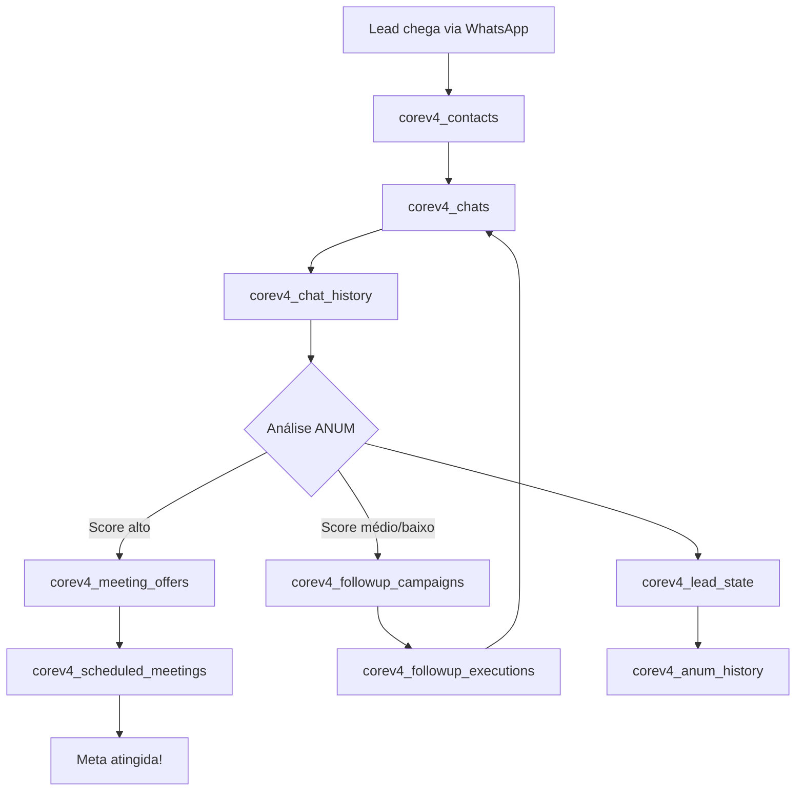

# 🗄️ CoreAdapt v4 - Database Documentation

## Deep Dive Analysis Completa do Banco de Dados

Esta documentação representa uma análise abissal e completa do banco de dados CoreAdapt v4, cobrindo estrutura, relacionamentos, uso, performance, segurança e boas práticas.

---

## 📚 Documentação Disponível

### 🎯 [DATABASE_EXECUTIVE_SUMMARY.md](./DATABASE_EXECUTIVE_SUMMARY.md)
**Recomendado para**: Product Managers, Tech Leads, Stakeholders

Sumário executivo com visão geral do banco de dados:
- 📊 Estatísticas gerais e métricas de qualidade
- 📁 Categorização de tabelas por domínio
- 🔗 Fluxo de dados principal do sistema
- ✅ Pontos fortes identificados
- ⚠️ Problemas e gaps encontrados
- 🎯 Recomendações priorizadas
- 🏆 Comparação com padrões da indústria
- 🚀 Roadmap de melhorias

**Tamanho**: ~500 linhas | **Tempo de leitura**: 15 minutos

---

### 🔍 [DATABASE_DEEP_DIVE_ANALYSIS.md](./DATABASE_DEEP_DIVE_ANALYSIS.md)
**Recomendado para**: DBAs, Arquitetos de Software, Desenvolvedores Senior

Análise detalhada de cada tabela do banco de dados:
- 📋 Descrição de cada uma das 22 tabelas
- 🔤 Todos os 350 campos documentados com propósitos inferidos
- 🔗 41 relacionamentos (Foreign Keys) mapeados
- 📇 134 índices catalogados e explicados
- ⚙️ 8 triggers documentados
- 👁️ 14 views com definições SQL
- 🔧 2 functions PostgreSQL
- 📊 Diagrama ERD completo em Mermaid
- 🎨 Análise de uso em fluxos N8N

**Tamanho**: 1.637 linhas | **Tempo de leitura**: 45 minutos

---

### 🔧 [DATABASE_DEVELOPER_GUIDE.md](./DATABASE_DEVELOPER_GUIDE.md)
**Recomendado para**: Desenvolvedores, DevOps

Guia prático para trabalhar com o banco:
- 🔍 Queries comuns prontas para uso
- 🎨 Padrões de desenvolvimento (multi-tenant, soft delete)
- 🔒 Configuração de segurança e RLS
- ⚡ Performance tips e otimizações
- 📊 Exemplos de fluxos completos
- 🔧 Troubleshooting de problemas comuns
- 📈 Queries de analytics e dashboards
- ✅ Checklist de boas práticas

**Tamanho**: ~600 linhas | **Tempo de leitura**: 30 minutos

---

### 📋 [DATABASE_RECOMMENDATIONS.md](./DATABASE_RECOMMENDATIONS.md)
**Recomendado para**: Tech Leads, DBAs, Arquitetos

Análise crítica e recomendações de melhoria:
- 🔤 Análise de nomenclatura e padrões
- 📝 Gaps de documentação
- 🔑 Análise de Primary Keys (INTEGER vs BIGINT)
- 📇 Índices faltantes e otimizações
- ⏰ Campos de auditoria (timestamps)
- 🗑️ Estratégias de soft delete
- 🔗 Relacionamentos e cascades
- 📊 Tipos de dados (TEXT vs VARCHAR)
- 🔒 Segurança RLS
- 🎯 Resumo priorizado de issues

**Tamanho**: 245 linhas | **Tempo de leitura**: 15 minutos

---

## 🎓 Como Usar Esta Documentação

### Para entender o sistema rapidamente
1. Comece com [DATABASE_EXECUTIVE_SUMMARY.md](./DATABASE_EXECUTIVE_SUMMARY.md)
2. Veja a categorização das tabelas
3. Entenda o fluxo de dados principal

### Para desenvolver no sistema
1. Leia [DATABASE_DEVELOPER_GUIDE.md](./DATABASE_DEVELOPER_GUIDE.md)
2. Use as queries prontas
3. Siga os padrões de desenvolvimento
4. Consulte o troubleshooting quando necessário

### Para análise técnica profunda
1. Estude [DATABASE_DEEP_DIVE_ANALYSIS.md](./DATABASE_DEEP_DIVE_ANALYSIS.md)
2. Revise cada tabela relevante ao seu contexto
3. Entenda os relacionamentos
4. Consulte as views disponíveis

### Para melhorias e otimizações
1. Revise [DATABASE_RECOMMENDATIONS.md](./DATABASE_RECOMMENDATIONS.md)
2. Priorize issues por severidade
3. Implemente melhorias sugeridas
4. Valide com métricas

---

## 🏗️ Arquitetura do Banco de Dados

### Tecnologia
- **SGBD**: PostgreSQL 14+
- **Plataforma**: Supabase
- **Schema**: corev4
- **Multi-tenancy**: Via RLS (Row Level Security)

### Estrutura Geral

```
CoreAdapt v4 Database
│
├── 📁 Gestão de Contatos (3 tabelas)
│   ├── corev4_contacts
│   ├── corev4_contact_extras
│   └── corev4_companies
│
├── 💬 Conversas e Mensagens (5 tabelas)
│   ├── corev4_chats
│   ├── corev4_chat_history
│   ├── corev4_message_dedup
│   ├── corev4_message_media
│   └── corev4_n8n_chat_histories
│
├── 🎯 Qualificação ANUM (3 tabelas)
│   ├── corev4_lead_state
│   ├── corev4_anum_history
│   └── corev4_pain_categories
│
├── 📨 Follow-up e Campanhas (6 tabelas)
│   ├── corev4_followup_campaigns
│   ├── corev4_followup_configs
│   ├── corev4_followup_executions
│   ├── corev4_followup_sequences
│   ├── corev4_followup_steps
│   └── corev4_followup_stage_history
│
├── 📅 Reuniões (2 tabelas)
│   ├── corev4_scheduled_meetings
│   └── corev4_meeting_offers
│
├── 🤖 IA (1 tabela)
│   └── corev4_ai_decisions
│
├── 📝 Logs (1 tabela)
│   └── corev4_execution_logs
│
└── 🔧 Utilitários (1 tabela)
    └── corev4_session_id_migration
```

---

## 📊 Estatísticas Principais

| Categoria | Valor |
|-----------|-------|
| **Tabelas** | 22 |
| **Views** | 14 |
| **Functions** | 2 |
| **Colunas Totais** | 350 |
| **Foreign Keys** | 41 |
| **Índices** | 134 |
| **Triggers** | 8 |
| **Tabelas com RLS** | 17 (77%) |

---

## 🔥 Quick Start

### Queries Essenciais

```sql
-- Buscar contato
SELECT * FROM corev4_contacts
WHERE whatsapp = '5511999999999' AND company_id = 1;

-- Histórico de chat
SELECT * FROM corev4_chat_history_readable
WHERE contact_id = 123
ORDER BY message_timestamp DESC LIMIT 50;

-- Verificar qualificação ANUM
SELECT * FROM corev4_lead_state_with_pain
WHERE contact_id = 123;

-- Campanhas ativas
SELECT * FROM v_active_campaigns
WHERE company_id = 1;

-- Reuniões agendadas
SELECT * FROM v_active_scheduled_meetings
WHERE company_id = 1;
```

### Conexão Multi-tenant

```sql
-- Sempre configurar antes de queries
SET app.current_company_id = '1';
```

---

## ⚠️ Issues Críticos Identificados

### 🔴 Alta Prioridade
1. **3 Foreign Keys sem índice** → podem causar lentidão
2. **2 tabelas sem RLS** → risco de vazamento de dados entre tenants

### 🟡 Média Prioridade
3. **15 tabelas sem descrição** → dificulta manutenção
4. **17 tabelas com INTEGER PK** → risco de overflow futuro
5. **10 tabelas sem updated_at** → dificulta auditoria

### 🟢 Baixa Prioridade
6. **Inconsistência TEXT/VARCHAR** → padrão PostgreSQL sugere TEXT

---

## 🎯 Top 5 Recomendações

1. **Adicionar índices em Foreign Keys faltantes** (performance)
2. **Habilitar RLS em 2 tabelas** (segurança)
3. **Documentar todas as tabelas com COMMENT** (manutenibilidade)
4. **Planejar migração INTEGER → BIGINT** (escalabilidade)
5. **Adicionar updated_at em 10 tabelas** (auditoria)

---

## 📈 Métricas de Qualidade

| Aspecto | Score | Status |
|---------|-------|--------|
| Nomenclatura | 10/10 | ✅ Excelente |
| Indexação | 9/10 | ⚠️ Quase perfeito |
| Segurança RLS | 9/10 | ⚠️ Muito bom |
| Documentação | 4/10 | 🔴 Precisa melhorar |
| Auditoria | 7/10 | ⚠️ Bom |
| Integridade | 10/10 | ✅ Perfeito |
| Escalabilidade | 7/10 | ⚠️ Bom |
| **GERAL** | **8.0/10** | ✅ **Bom** |

---

## 🔗 Fluxo de Dados Simplificado



---

## 🛠️ Ferramentas e Scripts

### Scripts de Análise (Python)

1. **analyze_database.py** - Gera análise detalhada completa
2. **analyze_recommendations.py** - Gera relatório de recomendações

### Arquivos Gerados

- `schema_parsed.json` - Schema completo em JSON
- 4 documentos Markdown (este + 3 análises)

---

## 📞 Suporte

Para dúvidas sobre esta documentação:
1. Consulte o documento específico para seu caso de uso
2. Revise os exemplos práticos no Developer Guide
3. Verifique o troubleshooting para problemas comuns

---

## 📝 Changelog

### v1.0 - 2025-11-10
- ✅ Análise completa de 22 tabelas
- ✅ Documentação de 350 campos
- ✅ Mapeamento de 41 relacionamentos
- ✅ Catalogação de 134 índices
- ✅ Análise de uso em 12 fluxos N8N
- ✅ Identificação de issues e recomendações
- ✅ Criação de guia do desenvolvedor
- ✅ Sumário executivo

---

## 🏆 Qualidade da Documentação

Esta documentação foi gerada através de análise automatizada profunda com:
- ✅ Parsing completo do schema PostgreSQL
- ✅ Análise de todos os fluxos N8N
- ✅ Inferência inteligente de propósitos
- ✅ Comparação com padrões da indústria
- ✅ Recomendações baseadas em best practices
- ✅ Validação de integridade e performance

**Total de linhas documentadas**: ~3.000 linhas
**Tempo de análise**: Deep dive completo
**Cobertura**: 100% das tabelas, views e functions

---

## 🎓 Glossário Rápido

- **ANUM**: Authority, Need, Urgency, Money (metodologia de qualificação)
- **RLS**: Row Level Security (isolamento multi-tenant)
- **Mesa de Clareza**: Reunião de diagnóstico com leads qualificados
- **Frank**: Nome do assistente virtual/bot
- **Soft Delete**: Marcar como inativo ao invés de deletar fisicamente

---

**Última atualização**: 2025-11-10
**Versão**: 1.0
**Autor**: Claude (Anthropic) via Deep Dive Analysis

---

🎯 **Comece por aqui**: [DATABASE_EXECUTIVE_SUMMARY.md](./DATABASE_EXECUTIVE_SUMMARY.md)
