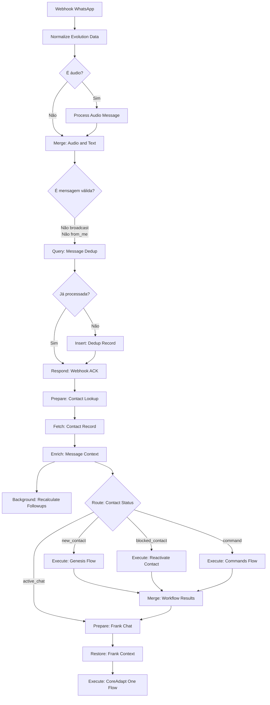
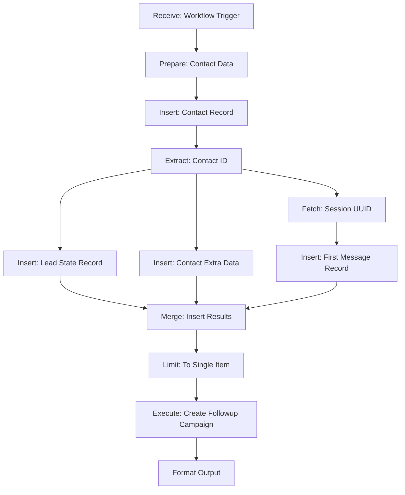
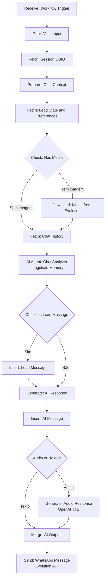
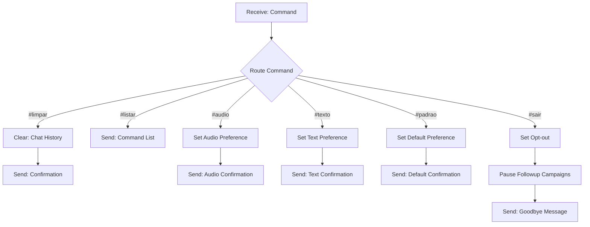
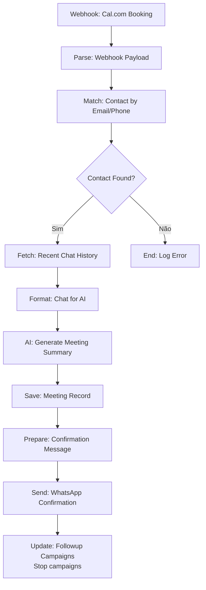

# CoreAdapt v4 - Estudo Profundo (Deep Dive)

> **Data de Análise:** 2025-11-08
> **Sistema:** CoreAdapt v4 - Plataforma de Qualificação de Leads com IA
> **Objetivo:** Compreensão completa da arquitetura, fluxos e banco de dados

---

## 📋 ÍNDICE

1. [Visão Geral do Sistema](#1-visão-geral-do-sistema)
2. [Arquitetura e Tecnologias](#2-arquitetura-e-tecnologias)
3. [Schema do Banco de Dados](#3-schema-do-banco-de-dados)
4. [Fluxos Principais](#4-fluxos-principais)
5. [Fluxos Auxiliares](#5-fluxos-auxiliares)
6. [Integrações Externas](#6-integrações-externas)
7. [Lógica de Negócio](#7-lógica-de-negócio)
8. [Pontos de Atenção e Otimizações](#8-pontos-de-atenção-e-otimizações)

---

## 1. VISÃO GERAL DO SISTEMA

### 1.1 Propósito
O CoreAdapt v4 é uma plataforma de automação de vendas que:
- Recebe mensagens do WhatsApp via Evolution API
- Qualifica leads automaticamente usando IA (metodologia ANUM)
- Gerencia conversas contextuais com histórico
- Agenda reuniões via Cal.com
- Executa campanhas de follow-up automatizadas
- Envia lembretes de reunião

### 1.2 Fluxos Identificados
```
📥 ENTRADA DE DADOS
├── CoreAdapt Main Router Flow (Roteador principal)
├── Normalize Evolution API (Normalização de webhooks)
└── Process Audio Message (Transcrição de áudio)

💬 PROCESSAMENTO
├── CoreAdapt One Flow (Conversação com IA)
├── CoreAdapt Genesis Flow (Criação de novos contatos)
├── CoreAdapt Commands Flow (Processamento de comandos)
└── Reactivate Blocked Contact (Reativação)

📅 AGENDAMENTO E FOLLOW-UP
├── CoreAdapt Scheduler Flow (Agendamentos Cal.com)
├── CoreAdapt Meeting Reminders Flow (Lembretes)
├── Create Followup Campaign (Criação de campanhas)
└── CoreAdapt Sentinel Flow (Execução de follow-ups)

🔄 SINCRONIZAÇÃO
└── CoreAdapt Sync Flow (Sincronização de dados)
```

---

## 2. ARQUITETURA E TECNOLOGIAS

### 2.1 Stack Tecnológico
- **Orquestração:** n8n (workflow automation)
- **Banco de Dados:** PostgreSQL com Supabase
- **IA/LLM:** OpenAI (GPT-4o-mini, GPT-4-turbo, TTS)
- **WhatsApp:** Evolution API
- **Agendamento:** Cal.com
- **Hospedagem:** Cloud-based (Supabase)

### 2.2 Padrões de Arquitetura
```
┌─────────────────────────────────────────────────┐
│           WhatsApp (Evolution API)              │
└──────────────────┬──────────────────────────────┘
                   │ Webhook
                   ▼
┌─────────────────────────────────────────────────┐
│         Main Router Flow (Roteador)             │
│  • Normalização                                  │
│  • Deduplicação                                  │
│  • Roteamento por status                        │
└──────┬────────────┬────────────┬────────────────┘
       │            │            │
       ▼            ▼            ▼
┌──────────┐ ┌──────────┐ ┌──────────┐
│ Genesis  │ │ Commands │ │ One Flow │
│  Flow    │ │   Flow   │ │  (Chat)  │
└──────────┘ └──────────┘ └──────────┘
       │            │            │
       └────────────┴────────────┘
                   │
                   ▼
┌─────────────────────────────────────────────────┐
│           PostgreSQL (Supabase)                 │
│  • Contatos                                     │
│  • Lead State (ANUM)                            │
│  • Chat History                                 │
│  • Scheduled Meetings                           │
│  • Followup Campaigns                           │
└─────────────────────────────────────────────────┘
```

---

## 3. SCHEMA DO BANCO DE DADOS

### 3.1 Tabelas Principais

#### 3.1.1 `corev4_contacts` - Contatos
**Propósito:** Armazena informação base de cada lead/contato

```sql
COLUNAS PRINCIPAIS:
- id (bigint, PK)
- company_id (integer, FK → corev4_companies)
- full_name (text, NOT NULL)
- whatsapp (text, NOT NULL) -- Formato: 5585999855443@s.whatsapp.net
- phone_number (text)
- email (text)
- origin_source (text, default: 'whatsapp')
- utm_source, utm_medium, utm_campaign, utm_adgroup, utm_creative
- sector (text)
- tags (text[])
- opt_out (boolean, default: false)
- is_active (boolean, default: true)
- last_interaction_at (timestamptz)
- created_at, updated_at (timestamptz)

ÍNDICES PRINCIPAIS:
- unique_whatsapp_company (whatsapp, company_id)
- idx_contacts_whatsapp
- idx_contacts_email
- idx_contacts_opt_out
- idx_contacts_last_interaction
- idx_contacts_full_name_trgm (trigram search)

CONSTRAINTS:
- Email válido: regex '^[A-Za-z0-9._%+-]+@[A-Za-z0-9.-]+\.[A-Za-z]{2,}$'
- Phone >= 10 dígitos
```

**Relacionamento:**
- 1 contact → 1 lead_state
- 1 contact → 1 contact_extras
- 1 contact → N chat_history
- 1 contact → N scheduled_meetings
- 1 contact → N followup_campaigns

---

#### 3.1.2 `corev4_lead_state` - Estado de Qualificação
**Propósito:** Armazena a qualificação ANUM do lead

```sql
COLUNAS PRINCIPAIS:
- id (bigint, PK)
- contact_id (bigint, FK → corev4_contacts, UNIQUE)
- company_id (integer, FK → corev4_companies)
- authority_score (numeric) -- 0-100
- need_score (numeric) -- 0-100
- urgency_score (numeric) -- 0-100
- money_score (numeric) -- 0-100
- total_score (numeric) -- Média dos 4 scores
- qualification_stage (varchar) -- 'pre', 'developing', 'qualified', 'disqualified'
- is_qualified (boolean)
- status (varchar) -- 'ativo', 'pausado', 'desqualificado'
- analysis_count (integer, default: 0)
- main_pain_category_id (integer, FK → corev4_pain_categories)
- main_pain_detail (text)
- last_analyzed_at (timestamptz)
- created_at, updated_at (timestamptz)

ÍNDICES:
- idx_lead_state_contact (contact_id)
- idx_lead_state_total_score
- idx_lead_state_qualification_stage
```

**Metodologia ANUM:**
- **A**uthority: Poder de decisão (0-100)
- **N**eed: Necessidade do serviço (0-100)
- **U**rgency: Urgência na solução (0-100)
- **M**oney: Capacidade financeira (0-100)

---

#### 3.1.3 `corev4_contact_extras` - Preferências do Contato
**Propósito:** Configurações e métricas adicionais do contato

```sql
COLUNAS PRINCIPAIS:
- id (bigint, PK)
- contact_id (bigint, FK → corev4_contacts, UNIQUE)
- company_id (integer)
- pipeline_id (integer, nullable)
- audio_response (boolean, default: true)
- text_response (boolean, default: true)
- interactions (integer, default: 0)
- last_interaction_at (timestamptz)
- created_at, updated_at (timestamptz)
```

---

#### 3.1.4 `corev4_chat_history` - Histórico de Conversas
**Propósito:** Armazena todas as mensagens trocadas

```sql
COLUNAS PRINCIPAIS:
- id (bigint, PK)
- session_id (uuid, FK → corev4_n8n_chat_histories)
- contact_id (bigint, FK → corev4_contacts)
- company_id (integer)
- role (varchar) -- 'user', 'assistant', 'system'
- message (text)
- message_type (varchar) -- 'text', 'audio', 'image', etc
- has_media (boolean, default: false)
- media_url (text)
- media_mime_type (text)
- tokens_used (integer)
- cost_usd (numeric)
- model_used (varchar)
- message_timestamp (timestamptz)
- created_at (timestamptz)

ÍNDICES:
- idx_chat_history_contact
- idx_chat_history_session
- idx_chat_history_timestamp
```

**Função de sessão:**
```sql
get_or_create_session_uuid(contact_id, company_id) → uuid
-- Cria ou recupera o session_id para um contato
```

---

#### 3.1.5 `corev4_scheduled_meetings` - Reuniões Agendadas
**Propósito:** Gerencia reuniões agendadas via Cal.com

```sql
COLUNAS PRINCIPAIS:
- id (bigint, PK)
- contact_id (bigint, FK → corev4_contacts)
- company_id (integer)
- meeting_date (timestamptz)
- meeting_end_date (timestamptz)
- meeting_duration_minutes (integer)
- meeting_type (varchar) -- 'mesa_clareza', etc
- meeting_timezone (varchar)
- cal_booking_uid (varchar, UNIQUE)
- cal_event_type_id (integer)
- cal_event_title (varchar)
- cal_attendee_email (varchar)
- cal_attendee_name (varchar)
- cal_meeting_url (text)
- anum_score_at_booking (numeric)
- authority_score, need_score, urgency_score, money_score (numeric)
- qualification_stage (varchar)
- pain_category (varchar)
- conversation_summary (text) -- Gerado por IA
- reminder_24h_sent (boolean, default: false)
- reminder_24h_sent_at (timestamptz)
- reminder_1h_sent (boolean, default: false)
- reminder_1h_sent_at (timestamptz)
- meeting_completed (boolean, default: false)
- no_show (boolean, default: false)
- status (varchar) -- 'scheduled', 'completed', 'cancelled', 'rescheduled'
- created_at, updated_at (timestamptz)

ÍNDICES:
- idx_scheduled_meetings_contact
- idx_scheduled_meetings_date
- idx_scheduled_meetings_status
- idx_scheduled_meetings_reminders
```

---

#### 3.1.6 `corev4_followup_campaigns` - Campanhas de Follow-up
**Propósito:** Gerencia campanhas de nutrição de leads

```sql
COLUNAS PRINCIPAIS:
- id (bigint, PK)
- contact_id (bigint, FK → corev4_contacts)
- company_id (integer)
- config_id (integer, FK → corev4_followup_configs)
- status (varchar) -- 'active', 'completed', 'stopped'
- pause_reason (text)
- steps_completed (integer, default: 0)
- total_steps (integer)
- last_step_sent_at (timestamptz)
- should_continue (boolean, default: true)
- stopped_reason (text)
- created_at, updated_at (timestamptz)

ÍNDICES:
- idx_followup_campaigns_contact
- idx_followup_campaigns_status
- idx_followup_campaigns_active
```

---

#### 3.1.7 `corev4_followup_executions` - Execuções de Follow-up
**Propósito:** Armazena cada execução individual de um passo da campanha

```sql
COLUNAS PRINCIPAIS:
- id (bigint, PK)
- campaign_id (bigint, FK → corev4_followup_campaigns)
- contact_id (bigint, FK → corev4_contacts)
- company_id (integer)
- step (integer) -- Número do passo (1, 2, 3, etc)
- total_steps (integer)
- scheduled_at (timestamptz) -- Quando deve ser enviado
- executed (boolean, default: false)
- sent_at (timestamptz)
- generated_message (text) -- Mensagem gerada pela IA
- generation_context (jsonb) -- Contexto usado na geração
- should_send (boolean, default: true)
- decision_reason (text) -- Motivo de envio/não envio
- anum_at_execution (numeric)
- evolution_message_id (varchar)
- evolution_api_url (text)
- evolution_instance (varchar)
- created_at, updated_at (timestamptz)

ÍNDICES:
- idx_followup_executions_campaign
- idx_followup_executions_scheduled
- idx_followup_executions_pending
```

---

#### 3.1.8 `corev4_followup_configs` - Configurações de Campanhas
**Propósito:** Define templates e timing de campanhas

```sql
COLUNAS PRINCIPAIS:
- id (integer, PK)
- company_id (integer)
- total_steps (integer, default: 6)
- qualification_threshold (numeric, default: 70)
- disqualification_threshold (numeric, default: 30)
- is_active (boolean, default: true)
- created_at, updated_at (timestamptz)
```

---

#### 3.1.9 `corev4_followup_steps` - Passos da Campanha
**Propósito:** Define cada passo individual da campanha

```sql
COLUNAS PRINCIPAIS:
- id (integer, PK)
- config_id (integer, FK → corev4_followup_configs)
- step_number (integer) -- 1, 2, 3, 4, 5, 6
- wait_hours (integer) -- Tempo de espera em horas
- wait_minutes (integer, default: 0) -- Minutos adicionais
- created_at, updated_at (timestamptz)

EXEMPLO DE TIMING:
Step 1: 24h (wait_hours: 24)
Step 2: 48h (wait_hours: 48)
Step 3: 72h (wait_hours: 72)
Step 4: 120h (5 dias)
Step 5: 168h (7 dias)
Step 6: 240h (10 dias)
```

---

#### 3.1.10 `corev4_companies` - Empresas/Tenants
**Propósito:** Multi-tenancy e configurações da empresa

```sql
COLUNAS PRINCIPAIS:
- id (integer, PK)
- name (varchar)
- slug (varchar, UNIQUE)
- bot_name (varchar, default: 'Frank')
- bot_personality (text)
- system_prompt (text) -- Prompt customizado para a IA
- llm_model (varchar, default: 'gpt-4-turbo')
- llm_temperature (numeric, default: 0.7)
- llm_max_tokens (integer, default: 1000)
- evolution_api_url (text)
- evolution_instance (varchar)
- evolution_api_key (text)
- greeting_message (text)
- plan_tier (varchar, default: 'free')
- is_active (boolean, default: true)
- features (jsonb, default: {})
- created_at, updated_at (timestamptz)
```

---

#### 3.1.11 `corev4_pain_categories` - Categorias de Dor
**Propósito:** Classificação das dores/problemas dos leads

```sql
COLUNAS PRINCIPAIS:
- id (integer, PK)
- category_key (varchar, UNIQUE) -- 'sales', 'marketing', 'operations', etc
- category_label_pt (varchar) -- Label em português
- category_label_en (varchar) -- Label em inglês
- description (text)
- is_active (boolean, default: true)
- created_at (timestamptz)
```

---

#### 3.1.12 `corev4_message_dedup` - Deduplicação de Mensagens
**Propósito:** Evita processamento duplicado de webhooks

```sql
COLUNAS PRINCIPAIS:
- id (bigint, PK)
- message_id (varchar) -- ID da mensagem do Evolution API
- whatsapp_id (text) -- ID do contato no WhatsApp
- received_at (timestamptz) -- Quando foi recebido
- processed (boolean, default: false)

LÓGICA:
- Verifica se message_id já existe nos últimos 5 segundos
- Evita race conditions em webhooks duplicados
```

---

### 3.2 Views Importantes

#### `v_active_campaigns`
```sql
-- Campanhas ativas que devem continuar sendo executadas
SELECT
  c.id, c.contact_id, c.company_id, c.config_id,
  c.status, c.steps_completed, c.total_steps,
  cfg.qualification_threshold, cfg.disqualification_threshold,
  COALESCE(ls.total_score, 0) AS current_anum_score,
  ls.qualification_stage, ls.status AS lead_status,
  cnt.opt_out
FROM corev4_followup_campaigns c
WHERE c.should_continue = true
  AND c.status = 'active'
  AND cnt.opt_out = false
```

#### `v_pending_followup_executions`
```sql
-- Execuções prontas para serem enviadas
SELECT fe.*, cfg.*, ls.total_score, cnt.opt_out
FROM corev4_followup_executions fe
WHERE fe.executed = false
  AND fe.should_send = true
  AND fe.scheduled_at <= NOW()
  AND cnt.opt_out = false
  AND c.should_continue = true
```

#### `v_meetings_needing_reminders`
```sql
-- Reuniões que precisam de lembretes
SELECT sm.*, c.whatsapp, co.evolution_api_url
FROM corev4_scheduled_meetings sm
WHERE sm.status = 'scheduled'
  AND sm.meeting_date > NOW()
  AND (
    (sm.meeting_date - INTERVAL '24 hours' <= NOW() AND reminder_24h_sent = false)
    OR
    (sm.meeting_date - INTERVAL '1 hour' <= NOW() AND reminder_1h_sent = false)
  )
```

---

### 3.3 Funções PostgreSQL

#### `get_or_create_session_uuid(contact_id, company_id)`
Cria ou recupera o UUID da sessão de chat para um contato

#### `has_upcoming_meeting(contact_id)`
Verifica se o contato tem reunião agendada futura

#### `recalculate_followup_schedule(contact_id, from_timestamp)`
Recalcula os horários de execução dos follow-ups

#### `update_updated_at_column()`
Trigger function que atualiza automaticamente o campo `updated_at`

---

## 4. FLUXOS PRINCIPAIS

### 4.1 Main Router Flow (Roteador Principal)

**Arquivo:** `CoreAdapt Main Router Flow _ v4.json`

**Propósito:** Recebe webhooks do WhatsApp, normaliza, deduplica e roteia para o fluxo apropriado

#### 4.1.1 Sequência de Execução



#### 4.1.2 Nodes Detalhados

**1. Receive: WhatsApp Webhook**
- **Tipo:** Webhook Trigger
- **Path:** `/frank-webhook-v4`
- **Método:** POST
- **Função:** Recebe webhooks do Evolution API

**2. Execute: Normalize Evolution Data**
- **Tipo:** Execute Workflow
- **Workflow:** `Normalize Evolution API | v4`
- **Função:** Padroniza os dados do webhook em um formato consistente
- **Output esperado:**
  ```json
  {
    "whatsapp_id": "5585999855443@s.whatsapp.net",
    "phone_number": "5585999855443",
    "contact_name": "João Silva",
    "message_id": "3EB0...",
    "message_content": "Olá, gostaria de...",
    "message_type": "conversation",
    "media_type": "text|audio|image|video",
    "has_media": false,
    "media_url": null,
    "is_from_me": false,
    "is_broadcast": false,
    "sender_type": "user|bot",
    "evolution_api_url": "https://...",
    "evolution_instance": "instance_name",
    "api_key": "xxx"
  }
  ```

**3. Route: Audio Messages**
- **Tipo:** IF Node
- **Condição:** `media_type === 'audio'`
- **True:** Envia para transcrição
- **False:** Pula transcrição

**4. Execute: Transcribe Audio**
- **Tipo:** Execute Workflow
- **Workflow:** `Process Audio Message | v4`
- **Função:** Transcreve áudio usando Whisper API
- **Output:** Adiciona campo `transcribed` ao contexto

**5. Filter: Valid Messages**
- **Tipo:** IF Node
- **Condições:**
  - `whatsapp_id !== 'status@broadcast'`
  - `is_from_me === false`
- **Função:** Filtra broadcasts e mensagens próprias

**6. Query: Message Deduplication**
- **Tipo:** Postgres Query
- **Query:**
  ```sql
  SELECT message_id, whatsapp_id, received_at
  FROM corev4_message_dedup
  WHERE whatsapp_id = '{{ $json.whatsapp_id }}'
    AND received_at > NOW() - INTERVAL '5 seconds'
  LIMIT 1
  ```
- **Função:** Verifica se a mensagem já foi processada recentemente

**7. Route: Duplicate Detection**
- **Tipo:** IF Node
- **Condição:** `$input.all().length > 0`
- **True:** Mensagem duplicada → Responde webhook e para
- **False:** Mensagem nova → Continua processamento

**8. Insert: Deduplication Record**
- **Tipo:** Postgres Insert
- **Função:** Marca mensagem como recebida

**9. Respond: Webhook Acknowledgment**
- **Tipo:** Respond to Webhook
- **Resposta:**
  ```json
  {
    "status": "received",
    "messageId": "{{ $json.message_id }}"
  }
  ```

**10. Fetch: Contact Record**
- **Tipo:** Supabase Query
- **Tabela:** `corev4_contacts`
- **Filtro:** `whatsapp = {{ whatsapp_id }}`
- **Limite:** 1
- **Função:** Busca contato existente

**11. Enrich: Message Context**
- **Tipo:** Set Node
- **Função:** Monta contexto completo com:
  - Dados do contato (id, company_id, opt_out, contact_exists)
  - Dados da mensagem (content, type, media)
  - Dados da Evolution API (url, instance, api_key)

**12. Route: Contact Status**
- **Tipo:** Switch Node (4 saídas)
- **Condições:**

  **new_contact:**
  ```javascript
  contact_exists === false
  ```
  → Envia para Genesis Flow (criar contato)

  **blocked_contact:**
  ```javascript
  contact_exists === true && opt_out === true
  ```
  → Envia para Reactivate Contact (reativar)

  **command:**
  ```javascript
  contact_exists === true && opt_out === false && message_content.startsWith('#')
  ```
  → Envia para Commands Flow (processar comando)

  **active_chat:**
  ```javascript
  contact_exists === true && opt_out === false && !message_content.startsWith('#')
  ```
  → Envia para One Flow (conversar com IA)

**13. Background: Recalculate Followups**
- **Tipo:** Postgres Query
- **Query:**
  ```sql
  SELECT recalculate_followup_schedule({{ contact_id }}, NOW());
  ```
- **Função:** Atualiza cronograma de follow-ups após nova interação
- **Mode:** Continue on fail (não bloqueia fluxo)

---

### 4.2 Genesis Flow (Criação de Contatos)

**Arquivo:** `CoreAdapt Genesis Flow _ v4.json`

**Propósito:** Cria novo contato no sistema quando um lead desconhecido envia mensagem

#### 4.2.1 Sequência de Execução



#### 4.2.2 Nodes Detalhados

**1. Insert: Contact Record**
- **Tabela:** `corev4_contacts`
- **Campos:**
  ```json
  {
    "company_id": {{ company_id }},
    "full_name": {{ contact_name }},
    "whatsapp": {{ whatsapp_id }},
    "phone_number": {{ phone_number }},
    "opt_out": false
  }
  ```

**2. Insert: Lead State Record**
- **Tabela:** `corev4_lead_state`
- **Campos:**
  ```json
  {
    "contact_id": {{ contact_id }},
    "company_id": {{ company_id }},
    "qualification_stage": "pre",
    "status": "ativo",
    "is_qualified": false
  }
  ```
- **Nota:** Scores ANUM inicialmente NULL, serão calculados pela IA

**3. Insert: Contact Extra Data**
- **Tabela:** `corev4_contact_extras`
- **Campos:**
  ```json
  {
    "contact_id": {{ contact_id }},
    "company_id": {{ company_id }},
    "audio_response": true,
    "text_response": true,
    "interactions": 1,
    "last_interaction_at": {{ NOW() }}
  }
  ```

**4. Fetch: Session UUID**
- **Função:** `get_or_create_session_uuid(contact_id, company_id)`
- **Retorno:** UUID único para a sessão de chat

**5. Insert: First Message Record**
- **Tabela:** `corev4_chat_history`
- **Campos:**
  ```json
  {
    "contact_id": {{ contact_id }},
    "session_id": {{ session_uuid }},
    "role": "user",
    "message": {{ message_content }},
    "message_type": {{ message_type }},
    "company_id": {{ company_id }}
  }
  ```

**6. Execute: Create Followup Campaign**
- **Workflow:** `Create Followup Campaign | v4`
- **Função:** Cria campanha de follow-up automática para o novo lead

**7. Format Output**
- **Retorno:**
  ```json
  {
    "success": true,
    "action": "contact_created",
    "contact_id": {{ contact_id }},
    "company_id": {{ company_id }},
    "message": "Contato criado com sucesso",
    "evolution_api_url": "...",
    "evolution_instance": "...",
    "evolution_api_key": "..."
  }
  ```

---

### 4.3 One Flow (Conversação com IA)

**Arquivo:** `CoreAdapt One Flow _ v4.json`

**Propósito:** Gerencia a conversa contextual com o lead usando IA (OpenAI)

#### 4.3.1 Arquitetura de Alto Nível



#### 4.3.2 Componentes Principais

**1. AI Agent: Chat Analyzer**
- **Tipo:** AI Agent (Langchain)
- **LLM:** OpenAI GPT-4o-mini
- **System Prompt:** Personalizado por empresa (`corev4_companies.system_prompt`)
- **Contexto:**
  - Histórico de chat (últimas 20 mensagens)
  - Lead state (ANUM score, qualification_stage)
  - Informações do contato
- **Tools disponíveis:**
  - Analyze ANUM (analisa e atualiza scores de qualificação)
  - Book Meeting (agenda reunião via Cal.com)
  - Update Contact Info (atualiza dados do contato)

**2. Memory Management**
- **Tipo:** Chat Memory (Supabase-backed)
- **Tabela:** `corev4_n8n_chat_histories`
- **Session ID:** UUID único por contato
- **Limite:** 20 mensagens mais recentes
- **Limpeza:** Comando `#limpar` apaga histórico

**3. ANUM Analysis Tool**
- **Função:** Analisa mensagem e atualiza scores
- **Input:**
  ```json
  {
    "message": "Texto da mensagem do lead",
    "context": {
      "current_anum_score": 65,
      "qualification_stage": "developing",
      "conversation_count": 5
    }
  }
  ```
- **Output:**
  ```json
  {
    "authority_score": 85,
    "need_score": 90,
    "urgency_score": 70,
    "money_score": 60,
    "total_score": 76.25,
    "qualification_stage": "qualified",
    "pain_category": "growth_challenges",
    "pain_detail": "Dificuldade em escalar vendas",
    "reasoning": "Lead demonstrou..."
  }
  ```
- **Update:** Atualiza `corev4_lead_state` automaticamente

**4. Response Generation**
- **Processo:**
  1. AI gera resposta textual
  2. Salva em `corev4_chat_history`
  3. Se `audio_response = true`:
     - Converte texto para áudio (OpenAI TTS)
     - Codec: Opus
     - Voice: Onyx
     - Speed: 1.0
  4. Envia via Evolution API

**5. Media Processing**
- **Tipos suportados:** image, video, document
- **Fluxo:**
  ```
  Evolution API → Download Media → Convert to Base64 → Send to Vision API
  ```
- **Análise:** GPT-4 Vision analisa imagens e contextualiza na conversa

---

### 4.4 Commands Flow (Processamento de Comandos)

**Arquivo:** `CoreAdapt Commands Flow _ v4.json`

**Propósito:** Processa comandos especiais enviados pelo lead (iniciados com `#`)

#### 4.4.1 Comandos Disponíveis

| Comando | Ação | Tabela Afetada |
|---------|------|----------------|
| `#limpar` | Apaga histórico de chat | `corev4_chat_history` |
| `#listar` | Lista comandos disponíveis | - |
| `#audio` | Ativa respostas em áudio | `corev4_contact_extras.audio_response = true` |
| `#texto` | Ativa respostas em texto | `corev4_contact_extras.text_response = true` |
| `#padrao` | Volta ao padrão (ambos) | Ambos = true |
| `#sair` | Opt-out (bloqueia contato) | `corev4_contacts.opt_out = true` |

#### 4.4.2 Fluxo de Execução



#### 4.4.3 Implementação do #sair

```sql
-- 1. Marca opt_out
UPDATE corev4_contacts
SET opt_out = true
WHERE id = {{ contact_id }};

-- 2. Para campanhas ativas
UPDATE corev4_followup_campaigns
SET should_continue = false,
    stopped_reason = 'opt_out',
    status = 'stopped'
WHERE contact_id = {{ contact_id }}
  AND status = 'active';

-- 3. Cancela execuções futuras
UPDATE corev4_followup_executions
SET should_send = false,
    decision_reason = 'contact_opted_out'
WHERE contact_id = {{ contact_id }}
  AND executed = false;
```

#### 4.4.4 Mensagens de Resposta

**#limpar:**
```
✅ Pronto! Limpei todo o histórico da nossa conversa. 🧹

Agora começamos do zero! Pode me fazer sua pergunta. 😊
```

**#listar:**
```
📋 *Lista de Comandos Disponíveis:*

🔹 *#listar* - Mostra esta lista de comandos
🔹 *#limpar* - Apaga o histórico da conversa
🔹 *#audio* - Ativa respostas em áudio
🔹 *#texto* - Ativa respostas apenas em texto
🔹 *#padrao* - Volta ao formato padrão
🔹 *#sair* - Cancela e bloqueia o atendimento

É só digitar o comando que eu executo! 😊
```

**#sair:**
```
😢 Entendi. Vou parar de te enviar mensagens.

Se mudar de ideia, pode me chamar a qualquer momento!

Obrigado pelo seu tempo. 🙏
*Frank - CoreConnect.AI*
```

---

### 4.5 Scheduler Flow (Agendamentos via Cal.com)

**Arquivo:** `CoreAdapt Scheduler Flow _ v4.json`

**Propósito:** Processa webhooks do Cal.com quando um lead agenda uma reunião

#### 4.5.1 Fluxo Completo



#### 4.5.2 Detalhamento

**1. Parse: Webhook Payload**
- **Input:** Webhook do Cal.com
- **Estrutura:**
  ```json
  {
    "triggerEvent": "BOOKING_CREATED",
    "payload": {
      "uid": "abc123",
      "eventTypeId": 789,
      "title": "Mesa de Clareza",
      "startTime": "2025-11-10T14:00:00Z",
      "endTime": "2025-11-10T15:00:00Z",
      "attendees": [{
        "name": "João Silva",
        "email": "joao@empresa.com",
        "timeZone": "America/Sao_Paulo",
        "phoneNumber": "+5585999855443"
      }],
      "metadata": {
        "videoCallUrl": "https://meet.google.com/xxx"
      }
    }
  }
  ```

**2. Match: Contact by Email/Phone**
- **Query:**
  ```sql
  SELECT c.id, c.company_id, c.whatsapp, ls.total_score, ls.qualification_stage
  FROM corev4_contacts c
  LEFT JOIN corev4_lead_state ls ON ls.contact_id = c.id
  WHERE (
    c.phone_number = $1 OR
    c.phone_number = $2 OR
    c.email = $3
  )
  AND c.is_active = true
  LIMIT 1
  ```
- **Params:** phone_with_9, phone_without_9, email

**3. AI: Generate Meeting Summary**
- **Prompt:**
  ```
  You are an executive assistant preparing Francisco Pasteur for a Mesa de Clareza.

  # LEAD INFORMATION
  Name: {{ contact_name }}
  ANUM Score: {{ anum_score }}/100
  Qualification Stage: {{ qualification_stage }}
  Pain Category: {{ pain_category }}

  # CONVERSATION HISTORY
  {{ formatted_chat }}

  ---
  Generate a meeting prep summary (3-5 bullet points, under 200 words).
  ```
- **Output:** Resumo executivo salvo em `conversation_summary`

**4. Save: Meeting Record**
- **Tabela:** `corev4_scheduled_meetings`
- **Campos principais:**
  ```json
  {
    "contact_id": {{ contact_id }},
    "meeting_date": "2025-11-10T14:00:00Z",
    "cal_booking_uid": "abc123",
    "cal_meeting_url": "https://meet.google.com/xxx",
    "anum_score_at_booking": 76,
    "conversation_summary": "AI-generated summary",
    "status": "scheduled"
  }
  ```

**5. Send: WhatsApp Confirmation**
- **Mensagem:**
  ```
  ✅ Mesa de Clareza Confirmada!

  📅 Data: 10/11/2025
  ⏰ Horário: 14:00
  🔗 Link: https://meet.google.com/xxx

  Vou te mandar lembretes:
  • 24h antes
  • 1h antes

  Até lá! 🚀
  *Frank - CoreConnect.AI*
  ```

**6. Update: Followup Campaigns**
- **Ação:**
  ```sql
  UPDATE corev4_followup_campaigns
  SET should_continue = false,
      stopped_reason = 'meeting_scheduled'
  WHERE contact_id = {{ contact_id }}
    AND status = 'active';
  ```
- **Motivo:** Lead agendou reunião, não precisa mais de follow-up

---

## 5. FLUXOS AUXILIARES

### 5.1 Sentinel Flow (Execução de Follow-ups)

**Propósito:** Processa follow-ups agendados (cron job)

**Trigger:** Cron (a cada 5 minutos)

**Lógica:**
```sql
SELECT * FROM v_pending_followup_executions
WHERE scheduled_at <= NOW()
  AND executed = false
  AND should_send = true
ORDER BY scheduled_at ASC
```

**Para cada execução:**
1. Verifica se contato tem reunião agendada
2. Verifica opt_out
3. Gera mensagem personalizada com IA
4. Envia via Evolution API
5. Marca como `executed = true`

---

### 5.2 Meeting Reminders Flow

**Propósito:** Envia lembretes de reunião (24h e 1h antes)

**Trigger:** Cron (a cada 15 minutos)

**Query:**
```sql
SELECT * FROM v_meetings_needing_reminders
```

**Mensagem 24h:**
```
🗓️ Lembrete: Mesa de Clareza amanhã!

📅 Data: {{ date }}
⏰ Horário: {{ time }}
🔗 Link: {{ meeting_url }}

Nos vemos lá! 🚀
*Francisco Pasteur*
```

**Mensagem 1h:**
```
⏰ A Mesa de Clareza é daqui a 1 hora!

🔗 Link: {{ meeting_url }}

Te espero! 😊
*Francisco Pasteur*
```

---

### 5.3 Create Followup Campaign

**Propósito:** Cria campanha de follow-up para novo contato

**Passos:**
1. Busca config ativa: `SELECT * FROM corev4_followup_configs WHERE is_active = true`
2. Cria campanha:
   ```sql
   INSERT INTO corev4_followup_campaigns (contact_id, config_id, total_steps, status)
   VALUES ({{ contact_id }}, {{ config_id }}, 6, 'active')
   ```
3. Cria execuções (6 steps):
   ```sql
   INSERT INTO corev4_followup_executions (
     campaign_id, contact_id, step, scheduled_at
   ) VALUES
     ({{ campaign_id }}, {{ contact_id }}, 1, NOW() + INTERVAL '24 hours'),
     ({{ campaign_id }}, {{ contact_id }}, 2, NOW() + INTERVAL '48 hours'),
     ({{ campaign_id }}, {{ contact_id }}, 3, NOW() + INTERVAL '72 hours'),
     ({{ campaign_id }}, {{ contact_id }}, 4, NOW() + INTERVAL '120 hours'),
     ({{ campaign_id }}, {{ contact_id }}, 5, NOW() + INTERVAL '168 hours'),
     ({{ campaign_id }}, {{ contact_id }}, 6, NOW() + INTERVAL '240 hours')
   ```

---

### 5.4 Reactivate Blocked Contact

**Propósito:** Reativa contato que deu opt-out mas voltou a mandar mensagem

**Ações:**
1. Remove opt-out:
   ```sql
   UPDATE corev4_contacts
   SET opt_out = false
   WHERE id = {{ contact_id }}
   ```
2. Reativa campanha:
   ```sql
   UPDATE corev4_followup_campaigns
   SET should_continue = true,
       status = 'active',
       stopped_reason = NULL
   WHERE contact_id = {{ contact_id }}
   ```
3. Envia mensagem de boas-vindas

---

## 6. INTEGRAÇÕES EXTERNAS

### 6.1 Evolution API (WhatsApp)

**Base URL:** Configurado em `corev4_companies.evolution_api_url`

**Endpoints utilizados:**

**1. Enviar mensagem de texto:**
```http
POST {{ evolution_api_url }}/message/sendText/{{ instance }}
Headers:
  apikey: {{ evolution_api_key }}

Body:
{
  "number": "5585999855443",
  "text": "Mensagem aqui",
  "delay": 1200
}
```

**2. Enviar áudio:**
```http
POST {{ evolution_api_url }}/message/sendWhatsAppAudio/{{ instance }}
Headers:
  apikey: {{ evolution_api_key }}

Body:
{
  "number": "5585999855443",
  "audioMessage": {
    "audio": "base64_audio_data"
  }
}
```

**3. Enviar mídia:**
```http
POST {{ evolution_api_url }}/message/sendMedia/{{ instance }}
Headers:
  apikey: {{ evolution_api_key }}

Body:
{
  "number": "5585999855443",
  "mediaMessage": {
    "mediatype": "image",
    "media": "https://url-da-imagem.jpg",
    "caption": "Legenda opcional"
  }
}
```

**4. Download de mídia:**
```http
GET {{ media_url }}
Headers:
  apikey: {{ evolution_api_key }}
```

---

### 6.2 OpenAI API

**Modelos utilizados:**

**1. Chat (One Flow):**
- **Modelo:** gpt-4o-mini
- **Temperatura:** 0.7
- **Max Tokens:** 2000
- **Custo:** ~$0.0001/mensagem

**2. ANUM Analysis:**
- **Modelo:** gpt-4o-mini
- **Temperatura:** 0.3 (mais determinístico)
- **Structured Output:** JSON com scores

**3. Text-to-Speech:**
- **Modelo:** tts-1-hd
- **Voice:** onyx
- **Format:** opus
- **Speed:** 1.0
- **Custo:** ~$0.015/1K caracteres

**4. Speech-to-Text (Audio):**
- **Modelo:** whisper-1
- **Language:** pt
- **Custo:** ~$0.006/minuto

**5. Vision (Imagens):**
- **Modelo:** gpt-4o-mini
- **Detail:** auto
- **Custo:** ~$0.001/imagem

---

### 6.3 Cal.com

**Webhook Endpoint:** `/cal-booking`

**Eventos processados:**
- `BOOKING_CREATED` - Novo agendamento
- `BOOKING_RESCHEDULED` - Reagendamento
- `BOOKING_CANCELLED` - Cancelamento

**Estrutura do webhook:**
```json
{
  "triggerEvent": "BOOKING_CREATED",
  "payload": {
    "uid": "unique_booking_id",
    "eventTypeId": 123,
    "title": "Mesa de Clareza",
    "startTime": "2025-11-10T14:00:00.000Z",
    "endTime": "2025-11-10T15:00:00.000Z",
    "attendees": [{
      "name": "João Silva",
      "email": "joao@email.com",
      "timeZone": "America/Sao_Paulo"
    }],
    "metadata": {
      "videoCallUrl": "https://meet.google.com/xxx"
    },
    "responses": {
      "attendeePhoneNumber": {
        "value": "+5585999855443"
      }
    }
  }
}
```

---

### 6.4 Supabase

**Uso:**
- **Database:** PostgreSQL principal
- **Auth:** Row Level Security (RLS) por company_id
- **Storage:** Não utilizado atualmente
- **Realtime:** Não utilizado

**Políticas RLS:**
```sql
CREATE POLICY tenant_isolation_contacts
ON corev4_contacts
FOR ALL
USING (company_id = current_setting('app.current_company_id')::integer);
```

---

## 7. LÓGICA DE NEGÓCIO

### 7.1 Metodologia ANUM (Qualificação de Leads)

**Conceito:**
Sistema de pontuação que avalia leads em 4 dimensões:

**Authority (Autoridade) - 0 a 100:**
- 90-100: CEO, fundador, sócio
- 70-89: Diretor, C-level
- 50-69: Gerente, coordenador
- 30-49: Analista, assistente
- 0-29: Estagiário, sem poder de decisão

**Need (Necessidade) - 0 a 100:**
- 90-100: Problema crítico, impacta sobrevivência
- 70-89: Problema sério, impacta crescimento
- 50-69: Problema relevante, busca otimização
- 30-49: Curiosidade, explorando opções
- 0-29: Sem problema claro

**Urgency (Urgência) - 0 a 100:**
- 90-100: Imediato (esta semana)
- 70-89: Muito urgente (este mês)
- 50-69: Urgente (próximos 3 meses)
- 30-49: Médio prazo (6 meses)
- 0-29: Longo prazo ou indefinido

**Money (Budget) - 0 a 100:**
- 90-100: Orçamento aprovado, pronto para investir
- 70-89: Tem budget, precisa formalizar
- 50-69: Pode alocar recursos
- 30-49: Precisa de aprovação
- 0-29: Sem budget definido

**Total Score:**
```
total_score = (authority + need + urgency + money) / 4
```

**Qualification Stages:**
- `pre`: total_score < 30 (Pré-qualificado)
- `developing`: 30 ≤ total_score < 70 (Em desenvolvimento)
- `qualified`: total_score ≥ 70 (Qualificado)
- `disqualified`: Manualmente desqualificado

---

### 7.2 Sistema de Follow-up

**Estratégia:**
Campanha de 6 mensagens ao longo de 10 dias

**Timing:**
```
Step 1: +24h   → Mensagem de boas-vindas e qualificação
Step 2: +48h   → Aprofundamento na dor
Step 3: +72h   → Apresentação de solução
Step 4: +120h  → Caso de sucesso / Social proof
Step 5: +168h  → Oferecimento de reunião
Step 6: +240h  → Última tentativa / Despedida
```

**Lógica de Continuação:**
Campanha para SE:
- `opt_out = false`
- `has_upcoming_meeting() = false`
- Lead não respondeu após última mensagem

**Geração de Mensagens:**
- IA analisa contexto da conversa
- ANUM score atual
- Histórico de respostas
- Pain category identificada
- Gera mensagem personalizada

**Exemplo de Prompt:**
```
Você é Frank, assistente de vendas da CoreConnect.AI.

# CONTEXTO DO LEAD
Nome: João Silva
ANUM Score: 45/100
Stage: developing
Pain Category: Dificuldade em escalar vendas
Step: 3 de 6
Histórico: Lead demonstrou interesse mas ainda não agendou reunião

# OBJETIVO
Gerar mensagem de follow-up que:
1. Seja natural e conversacional
2. Reforce a solução para a dor identificada
3. Crie senso de urgência sutil
4. Convide para ação (agendar reunião)

# RESTRIÇÕES
- Máximo 200 caracteres
- Tom informal mas profissional
- Sem emojis excessivos
```

---

### 7.3 Gestão de Lembretes de Reunião

**Timing:**
- **24h antes:** Lembrete com todos os detalhes
- **1h antes:** Lembrete urgente com link direto

**Lógica de Envio:**
```sql
-- Verifica a cada 15 minutos
SELECT * FROM corev4_scheduled_meetings
WHERE status = 'scheduled'
  AND meeting_date > NOW()
  AND (
    (meeting_date - INTERVAL '24 hours' <= NOW() AND reminder_24h_sent = false)
    OR
    (meeting_date - INTERVAL '1 hour' <= NOW() AND reminder_1h_sent = false)
  )
```

**Após envio:**
```sql
UPDATE corev4_scheduled_meetings
SET reminder_24h_sent = true,
    reminder_24h_sent_at = NOW()
WHERE id = {{ meeting_id }}
```

**Tracking de No-show:**
- Pós-reunião: Workflow verifica se reunião ocorreu
- Se `meeting_completed = false` após `meeting_end_date`:
  - Marca `no_show = true`
  - Atualiza `corev4_lead_state.status = 'no_show'`

---

### 7.4 Deduplicação de Mensagens

**Problema:** Evolution API pode enviar mesmo webhook múltiplas vezes

**Solução:**
```sql
-- 1. Checa se mensagem foi recebida nos últimos 5 segundos
SELECT * FROM corev4_message_dedup
WHERE whatsapp_id = '{{ whatsapp_id }}'
  AND received_at > NOW() - INTERVAL '5 seconds'

-- 2. Se encontrou: Para processamento
-- 3. Se não encontrou: Insere e continua
INSERT INTO corev4_message_dedup (message_id, whatsapp_id, received_at)
VALUES ('{{ message_id }}', '{{ whatsapp_id }}', NOW())
```

**Limpeza:**
Cron diário apaga registros com mais de 24h

---

### 7.5 Multi-tenancy (Isolamento por Empresa)

**Implementação:**
- Todas as tabelas principais têm `company_id`
- Row Level Security (RLS) no Supabase
- Session variable: `app.current_company_id`

**Exemplo:**
```sql
-- Antes de cada query
SET app.current_company_id = 1;

-- RLS garante que só vê dados da company_id = 1
SELECT * FROM corev4_contacts;
```

**Configurações por Empresa:**
- System prompt customizado
- Bot name (Frank, Maria, etc)
- Evolution API credentials
- LLM model e parâmetros

---

## 8. PONTOS DE ATENÇÃO E OTIMIZAÇÕES

### 8.1 Performance

**Índices Críticos:**
```sql
-- Busca de contatos (muito frequente)
CREATE INDEX idx_contacts_whatsapp ON corev4_contacts(whatsapp);
CREATE INDEX idx_contacts_company ON corev4_contacts(company_id);

-- Histórico de chat (carregamento frequente)
CREATE INDEX idx_chat_history_contact ON corev4_chat_history(contact_id);
CREATE INDEX idx_chat_history_timestamp ON corev4_chat_history(message_timestamp DESC);

-- Follow-ups pendentes (cron job)
CREATE INDEX idx_followup_executions_pending
ON corev4_followup_executions(scheduled_at)
WHERE executed = false AND should_send = true;

-- Lembretes de reunião (cron job)
CREATE INDEX idx_scheduled_meetings_reminders
ON corev4_scheduled_meetings(meeting_date)
WHERE status = 'scheduled' AND reminder_24h_sent = false;
```

**Otimizações:**
- Deduplicação evita processamento redundante
- Chat history limitado a 20 mensagens (evita context overload)
- Views materializadas para dashboards

---

### 8.2 Custos de IA

**Estimativa por Conversa:**
```
Mensagem de texto:
- Input: ~500 tokens (histórico + mensagem)
- Output: ~150 tokens (resposta)
- Custo: ~$0.0001

Análise ANUM:
- Input: ~800 tokens
- Output: ~200 tokens
- Custo: ~$0.00015

Audio TTS:
- 100 caracteres
- Custo: ~$0.0015

Total médio por interação: ~$0.002
```

**Otimizações de Custo:**
- Usar gpt-4o-mini (10x mais barato que gpt-4)
- Limitar histórico a 20 mensagens
- Cache de ANUM analysis (só recalcula se mudança significativa)

---

### 8.3 Confiabilidade

**Retry Logic:**
- Evolution API: 3 tentativas com backoff exponencial
- OpenAI API: 2 tentativas
- Supabase: Continue on fail em operações não-críticas

**Fallbacks:**
- Se TTS falhar → Envia texto
- Se Vision falhar → Ignora imagem e processa só texto
- Se ANUM analysis falhar → Mantém scores anteriores

**Monitoring:**
- Logs em `corev3_execution_logs` (sim, usa tabela v3 ainda)
- Métricas: Duração, status, error messages

---

### 8.4 Segurança

**Dados Sensíveis:**
- `evolution_api_key` criptografado
- Credenciais OpenAI em variáveis de ambiente
- RLS garante isolamento entre empresas

**Validações:**
- Email regex validado no banco
- Phone number mínimo 10 dígitos
- Webhook signatures (Cal.com)

**Rate Limiting:**
- Deduplicação evita spam
- 1 mensagem por lead a cada 5 segundos

---

### 8.5 Melhorias Sugeridas

**1. Cache de Sessões:**
```sql
CREATE TABLE corev4_session_cache (
  contact_id bigint PRIMARY KEY,
  session_data jsonb,
  expires_at timestamptz
);
```
Evita buscar lead_state e preferences a cada mensagem

**2. Webhooks Assíncronos:**
- Responder webhook imediatamente
- Processar em background (queue)
- Evita timeout em conversas longas

**3. Analytics:**
```sql
CREATE TABLE corev4_conversation_metrics (
  id bigserial PRIMARY KEY,
  contact_id bigint,
  date date,
  messages_sent integer,
  messages_received integer,
  avg_response_time_seconds integer,
  anum_delta numeric,
  cost_usd numeric
);
```

**4. A/B Testing de Mensagens:**
- Testar diferentes system prompts
- Medir taxa de conversão (meeting booked)
- Otimizar timing de follow-ups

**5. Sentiment Analysis:**
- Detectar frustração/entusiasmo do lead
- Ajustar tom da IA dinamicamente
- Alertar humano se necessário

---

## 9. FLUXO DE DADOS COMPLETO (End-to-End)

### 9.1 Cenário: Novo Lead envia primeira mensagem

```
1. RECEPÇÃO
   WhatsApp → Evolution API → Webhook n8n

2. NORMALIZAÇÃO
   Main Router → Normalize Evolution Data
   Output: Dados padronizados

3. VALIDAÇÃO
   - Não é broadcast? ✓
   - Não é from_me? ✓
   - Não é duplicada? ✓

4. LOOKUP DE CONTATO
   SELECT * FROM corev4_contacts WHERE whatsapp = '...'
   Resultado: Não encontrado

5. CRIAÇÃO DE CONTATO (Genesis Flow)
   a) INSERT INTO corev4_contacts
   b) INSERT INTO corev4_lead_state (stage: 'pre', scores: NULL)
   c) INSERT INTO corev4_contact_extras (audio: true, text: true)
   d) GET session_uuid
   e) INSERT INTO corev4_chat_history (role: 'user', message: '...')
   f) CREATE followup campaign (6 steps agendados)

6. CONVERSAÇÃO (One Flow)
   a) LOAD chat history (1 mensagem)
   b) LOAD lead state (stage: 'pre', scores: NULL)
   c) AI Agent processa:
      - Entende mensagem
      - Analisa ANUM
      - UPDATE corev4_lead_state (scores calculados)
      - Gera resposta personalizada
   d) INSERT chat history (role: 'assistant')
   e) Converte para áudio (TTS)
   f) SEND via Evolution API

7. FOLLOW-UP AUTOMÁTICO
   a) Sistema agenda 6 mensagens (24h, 48h, 72h, 120h, 168h, 240h)
   b) Sentinel Flow (cron) executa nos horários agendados
   c) Cada follow-up:
      - Verifica se lead respondeu
      - Verifica se agendou reunião
      - Se não: Envia mensagem personalizada

8. LEAD AGENDA REUNIÃO
   a) Cal.com webhook → Scheduler Flow
   b) MATCH contact by phone/email
   c) AI gera meeting summary
   d) INSERT INTO corev4_scheduled_meetings
   e) SEND confirmação WhatsApp
   f) STOP followup campaigns

9. LEMBRETES PRÉ-REUNIÃO
   a) Meeting Reminders Flow (cron)
   b) 24h antes: Envia lembrete
   c) 1h antes: Envia lembrete urgente

10. PÓS-REUNIÃO
    a) Marcar meeting_completed = true
    b) Opcional: Solicitar feedback
    c) Atualizar lead_state.status conforme resultado
```

**Tempo total:**
- Recepção até resposta: ~3-5 segundos
- Campanha completa: 10 dias
- Reunião agendada: Em média no 4º dia

**Touchpoints:**
- 1 mensagem inicial do lead
- 1 resposta imediata da IA
- 6 follow-ups automatizados
- 2 lembretes de reunião
- Total: ~10 interações

---

## 10. GLOSSÁRIO

- **ANUM:** Authority, Need, Urgency, Money - Metodologia de qualificação
- **Cal.com:** Plataforma de agendamento de reuniões
- **Evolution API:** API para integração com WhatsApp
- **Frank:** Nome padrão do bot de IA
- **Genesis Flow:** Fluxo de criação de novo contato
- **Lead State:** Estado de qualificação do lead
- **Mesa de Clareza:** Nome da reunião de discovery/qualificação
- **One Flow:** Fluxo principal de conversação com IA
- **Opt-out:** Contato que pediu para não receber mais mensagens
- **Pain Category:** Categoria da dor/problema do lead
- **Qualification Stage:** Estágio de qualificação (pre, developing, qualified)
- **Sentinel Flow:** Fluxo que executa follow-ups agendados
- **Session UUID:** Identificador único da sessão de chat
- **TTS:** Text-to-Speech (conversão de texto para áudio)
- **Webhook:** Chamada HTTP assíncrona de notificação

---

## 11. PRÓXIMOS PASSOS PARA ESTUDO

### Fase 2: Análise Técnica Profunda
- [ ] Estudar código JavaScript dos nodes Code
- [ ] Mapear todas as queries SQL usadas
- [ ] Documentar structured outputs da OpenAI
- [ ] Analisar tratamento de erros

### Fase 3: Otimizações
- [ ] Identificar bottlenecks de performance
- [ ] Propor melhorias de custo (IA)
- [ ] Sugerir índices adicionais
- [ ] Analisar oportunidades de cache

### Fase 4: Testes
- [ ] Criar cenários de teste end-to-end
- [ ] Testar edge cases (phone matching, dedup)
- [ ] Validar fluxo completo de follow-up
- [ ] Testar failover e retry logic

### Fase 5: Monitoramento
- [ ] Definir KPIs críticos
- [ ] Implementar alertas
- [ ] Dashboard de métricas
- [ ] Logs estruturados

---

**Fim do Documento de Estudo Profundo**

Data: 2025-11-08
Versão: 1.0
Status: Completo - Fase 1 (Mapeamento e Documentação)
