# SENTINEL COMPLETE DISCOVERY — FINAL REPORT

**Data:** 10 de Novembro de 2025
**Versão:** 1.0
**Status:** Deep Dive Completo ✅

---

## SUMÁRIO EXECUTIVO

### ✅ O QUE JÁ EXISTE E FUNCIONA

1. **Lógica de Contador/Restart:** ✅ **EXISTE E ESTÁ IMPLEMENTADA**
   - Função PostgreSQL: `recalculate_followup_schedule(contact_id, interaction_timestamp)`
   - Chamada automaticamente quando lead responde (Main Router Flow linha 1260)
   - Recalcula TODOS os followups pendentes a partir do momento da resposta
   - Atualiza `last_interaction_at` na tabela `corev4_contacts`

2. **Stop Logic para Reuniões:** ✅ **IMPLEMENTADO**
   - Scheduler Flow para campaigns quando reunião agendada
   - SQL: `UPDATE corev4_followup_campaigns SET should_continue = false, stopped_reason = 'meeting_scheduled'`

3. **Opt-out via Commands:** ✅ **IMPLEMENTADO**
   - Commands Flow #sair marca `opt_out = true` em contacts
   - Para campaigns: `UPDATE corev4_followup_campaigns SET should_continue = false, stopped_reason = 'opt_out'`
   - Cancela execuções futuras: `UPDATE corev4_followup_executions SET should_send = false`

4. **Context Usage no Sentinel:** ✅ **IMPLEMENTADO**
   - System Message usa recent_messages, followup_history, ANUM scores
   - User Message passa contexto completo para AI

### ❌ O QUE PRECISA SER CORRIGIDO/IMPLEMENTADO

1. **Timing Incorreto:** ❌ **URGENTE**
   - **Atual:** 1h, 25h, 73h, 145h, 313h
   - **Correto:** 1h, 4h, 24h, 72h, 168h
   - **Onde corrigir:**
     - `Create Followup Campaign _ v4.json` linha 95 (defaultTiming)
     - Tabela `corev4_followup_steps` (dados no banco)
     - `SENTINEL_SYSTEM_MESSAGE_v1.1.md` (documentação)
     - Sentinel Flow step_context (linha 74)

2. **Business Hours:** ❌ **AUSENTE**
   - Não há lógica para respeitar horário comercial
   - Precisa implementar: Mon-Fri 8-18h, Sat 8-12h, no Sunday
   - Função necessária: `adjustToBusinessHours(timestamp, timezone)`

3. **Alinhamento de Posicionamento:** ❌ **PARCIAL**
   - System Message tem old positioning ("teach to think with AI")
   - Precisa alinhar com Frank v6.1.0 e survivor mode

---

## 1. FUNÇÃO `recalculate_followup_schedule` — A LÓGICA DE CONTADOR

### 1.1 Definição Completa

```sql
CREATE FUNCTION public.recalculate_followup_schedule
(p_contact_id bigint, p_interaction_timestamp timestamp with time zone DEFAULT now())
RETURNS TABLE(
  execution_id integer,
  old_scheduled_at timestamp with time zone,
  new_scheduled_at timestamp with time zone,
  step_number integer
)
LANGUAGE PLPGSQL
VOLATILE
AS $$

DECLARE
  v_updated_count INTEGER := 0;
BEGIN

  -- ✅ PASSO 1: Atualizar last_interaction_at no contato
  UPDATE corev4_contacts
  SET
    last_interaction_at = p_interaction_timestamp,
    updated_at = NOW()
  WHERE id = p_contact_id;

  -- ✅ PASSO 2: Recalcular scheduled_at para TODOS os followups pendentes
  RETURN QUERY
  WITH old_values AS (
    SELECT
      e.id,
      e.scheduled_at as old_scheduled,
      e.step
    FROM corev4_followup_executions e
    INNER JOIN corev4_followup_campaigns fc ON e.campaign_id = fc.id
    WHERE e.contact_id = p_contact_id
      AND e.executed = FALSE
      AND e.should_send = TRUE
      AND fc.should_continue = TRUE
  ),
  updated_executions AS (
    UPDATE corev4_followup_executions e
    SET
      scheduled_at = p_interaction_timestamp +
        (fs.wait_hours * INTERVAL '1 hour') +
        (fs.wait_minutes * INTERVAL '1 minute'),
      updated_at = NOW()
    FROM
      corev4_followup_campaigns fc,
      corev4_followup_steps fs
    WHERE
      e.campaign_id = fc.id
      AND fs.config_id = fc.config_id
      AND fs.step_number = e.step
      AND e.contact_id = p_contact_id
      AND e.executed = FALSE
      AND e.should_send = TRUE
      AND fc.should_continue = TRUE
    RETURNING
      e.id,
      e.scheduled_at as new_scheduled,
      e.step
  )
  SELECT
    ue.id as execution_id,
    ov.old_scheduled as old_scheduled_at,
    ue.new_scheduled as new_scheduled_at,
    ue.step as step_number
  FROM updated_executions ue
  INNER JOIN old_values ov ON ue.id = ov.id;

  -- Log execution count
  GET DIAGNOSTICS v_updated_count = ROW_COUNT;

  RAISE NOTICE 'Recalculated % followup executions for contact %',
    v_updated_count, p_contact_id;

END;
$$ ;
```

### 1.2 Como Funciona

**Exemplo Prático:**

```
Lead envia mensagem às 15:00 do dia 10/11/2025

ANTES (followups já agendados):
- Step 1: 09/11/2025 10:00 (JÁ PASSOU - seria enviado)
- Step 2: 09/11/2025 11:00 (JÁ PASSOU - seria enviado)
- Step 3: 12/11/2025 14:00 (pendente)

DEPOIS de recalculate_followup_schedule(contact_id, '2025-11-10 15:00'):
- Step 1: 10/11/2025 16:00 (NOW + 1h)
- Step 2: 10/11/2025 19:00 (NOW + 4h) — SE timing correto
- Step 3: 11/11/2025 15:00 (NOW + 24h) — SE timing correto

RESULTADO: Contador reinicia, lead não recebe followups enquanto estiver respondendo
```

### 1.3 Onde é Chamada

**Main Router Flow** (linha 1260-1279):

```json
{
  "parameters": {
    "operation": "executeQuery",
    "query": "SELECT recalculate_followup_schedule({{ $json.contact_id }}::BIGINT, NOW());",
    "options": {}
  },
  "id": "e4409158-0a2f-49eb-a690-610403cbddab",
  "name": "Background: Recalculate Followups",
  "type": "n8n-nodes-base.postgres",
  "continueOnFail": true
}
```

**Trigger:** Executado em paralelo com "Enrich: Message Context" (linha 1398-1408), ou seja:

✅ **TODA VEZ que lead envia mensagem, contador reinicia automaticamente**

---

## 2. SCHEMA COMPLETO — TABELAS E RELACIONAMENTOS

### 2.1 Tabelas Follow-up

#### `corev4_followup_configs`
```sql
CREATE TABLE corev4_followup_configs (
  id SERIAL PRIMARY KEY,
  company_id INTEGER NOT NULL REFERENCES corev4_companies(id),
  total_steps INTEGER NOT NULL DEFAULT 5,
  is_active BOOLEAN DEFAULT true,
  created_at TIMESTAMPTZ DEFAULT NOW(),
  updated_at TIMESTAMPTZ DEFAULT NOW()
);
```

**Propósito:** Configuração de campanhas por empresa

**Dados Atuais:**
- `total_steps`: 5
- `is_active`: true
- Relacionamento: 1 config → N steps

---

#### `corev4_followup_steps`
```sql
CREATE TABLE corev4_followup_steps (
  id SERIAL PRIMARY KEY,
  config_id INTEGER NOT NULL REFERENCES corev4_followup_configs(id),
  step_number INTEGER NOT NULL,
  wait_hours INTEGER NOT NULL DEFAULT 0,
  wait_minutes INTEGER NOT NULL DEFAULT 0,
  created_at TIMESTAMPTZ DEFAULT NOW(),
  UNIQUE(config_id, step_number)
);
```

**Propósito:** Timing de cada step da campanha

**❌ PROBLEMA: Dados Incorretos no Banco**

| step_number | wait_hours (atual) | wait_minutes | Total (atual) | **Total CORRETO** |
|-------------|-------------------|--------------|---------------|-------------------|
| 1 | 1 | 0 | **1h** | ✅ 1h |
| 2 | 25 | 0 | **25h** | ❌ 4h |
| 3 | 73 | 0 | **73h (~3d)** | ❌ 24h (1d) |
| 4 | 145 | 0 | **145h (~6d)** | ❌ 72h (3d) |
| 5 | 313 | 0 | **313h (~13d)** | ❌ 168h (7d) |

**SQL para Corrigir:**
```sql
-- ⚠️ EXECUTAR NO BANCO DE DADOS

UPDATE corev4_followup_steps
SET wait_hours = 1, wait_minutes = 0
WHERE step_number = 1;

UPDATE corev4_followup_steps
SET wait_hours = 4, wait_minutes = 0
WHERE step_number = 2;

UPDATE corev4_followup_steps
SET wait_hours = 24, wait_minutes = 0
WHERE step_number = 3;

UPDATE corev4_followup_steps
SET wait_hours = 72, wait_minutes = 0
WHERE step_number = 4;

UPDATE corev4_followup_steps
SET wait_hours = 168, wait_minutes = 0
WHERE step_number = 5;
```

---

#### `corev4_followup_campaigns`
```sql
CREATE TABLE corev4_followup_campaigns (
  id SERIAL PRIMARY KEY,
  contact_id BIGINT NOT NULL REFERENCES corev4_contacts(id) ON DELETE CASCADE,
  company_id INTEGER NOT NULL REFERENCES corev4_companies(id),
  config_id INTEGER NOT NULL REFERENCES corev4_followup_configs(id),

  status VARCHAR(20) DEFAULT 'active', -- 'active', 'completed', 'stopped'
  should_continue BOOLEAN DEFAULT true,
  stopped_reason TEXT, -- 'meeting_scheduled', 'opt_out', 'lead_responded', etc

  steps_completed INTEGER DEFAULT 0,
  total_steps INTEGER NOT NULL,
  last_step_sent_at TIMESTAMPTZ,

  created_at TIMESTAMPTZ DEFAULT NOW(),
  updated_at TIMESTAMPTZ DEFAULT NOW(),

  UNIQUE(contact_id, company_id)
);
```

**Propósito:** Rastreamento de campanhas ativas por contato

**Stop Conditions:**
1. `should_continue = false` → Para envio
2. `status = 'completed'` → Todos steps enviados
3. `status = 'stopped'` → Parado manualmente (opt-out, meeting, etc)

**Atualizado por:**
- Scheduler Flow: `stopped_reason = 'meeting_scheduled'`
- Commands Flow: `stopped_reason = 'opt_out'`
- Sentinel Flow: `steps_completed++` quando envia
- ❌ **FALTA:** `stopped_reason = 'lead_responded'` (deveria existir mas não encontrei)

---

#### `corev4_followup_executions`
```sql
CREATE TABLE corev4_followup_executions (
  id SERIAL PRIMARY KEY,
  campaign_id INTEGER NOT NULL REFERENCES corev4_followup_campaigns(id) ON DELETE CASCADE,
  contact_id BIGINT NOT NULL REFERENCES corev4_contacts(id),
  company_id INTEGER NOT NULL REFERENCES corev4_companies(id),

  step INTEGER NOT NULL,
  total_steps INTEGER NOT NULL,

  scheduled_at TIMESTAMPTZ NOT NULL, -- ⚠️ ESTE É O CAMPO-CHAVE
  executed BOOLEAN DEFAULT false,
  sent_at TIMESTAMPTZ,

  should_send BOOLEAN DEFAULT true,
  decision_reason TEXT,
  generated_message TEXT,
  generation_context JSONB,

  created_at TIMESTAMPTZ DEFAULT NOW(),
  updated_at TIMESTAMPTZ DEFAULT NOW()
);

CREATE INDEX idx_followup_pending ON corev4_followup_executions(
  contact_id, executed, should_send, scheduled_at
) WHERE executed = false AND should_send = true;
```

**Propósito:** Execuções individuais agendadas (1 registro = 1 followup)

**Campo Crítico:** `scheduled_at`
- Atualizado por `recalculate_followup_schedule` quando lead responde
- Query do Sentinel Flow: `WHERE scheduled_at <= NOW()`

---

### 2.2 Tabelas Relacionadas

#### `corev4_contacts`
```sql
CREATE TABLE corev4_contacts (
  id BIGSERIAL PRIMARY KEY,
  company_id INTEGER NOT NULL REFERENCES corev4_companies(id),
  whatsapp TEXT NOT NULL,
  full_name TEXT NOT NULL,
  phone_number TEXT,
  email TEXT,

  opt_out BOOLEAN DEFAULT false, -- ⚠️ Usado para filtrar envios
  is_active BOOLEAN DEFAULT true,

  last_interaction_at TIMESTAMPTZ, -- ⚠️ Atualizado por recalculate_followup_schedule

  created_at TIMESTAMPTZ DEFAULT NOW(),
  updated_at TIMESTAMPTZ DEFAULT NOW(),

  UNIQUE(whatsapp, company_id)
);
```

**Campo Crítico:** `last_interaction_at`
- Atualizado quando lead responde
- Usado na query do Sentinel para validar se lead ficou silente

---

#### `corev4_meetings`
```sql
CREATE TABLE corev4_meetings (
  id SERIAL PRIMARY KEY,
  contact_id BIGINT REFERENCES corev4_contacts(id),
  company_id INTEGER REFERENCES corev4_companies(id),

  cal_event_id TEXT,
  status VARCHAR(20), -- 'scheduled', 'completed', 'cancelled'
  scheduled_for TIMESTAMPTZ,

  created_at TIMESTAMPTZ DEFAULT NOW()
);
```

**Propósito:** Reuniões agendadas via Cal.com

**Relacionamento com Followups:**
- Scheduler Flow para campaigns quando `status = 'scheduled'`

---

#### `corev4_lead_state`
```sql
CREATE TABLE corev4_lead_state (
  id SERIAL PRIMARY KEY,
  contact_id BIGINT UNIQUE NOT NULL REFERENCES corev4_contacts(id),
  company_id INTEGER NOT NULL REFERENCES corev4_companies(id),

  authority_score INTEGER CHECK (authority_score >= 0 AND authority_score <= 100),
  need_score INTEGER CHECK (need_score >= 0 AND need_score <= 100),
  urgency_score INTEGER CHECK (urgency_score >= 0 AND urgency_score <= 100),
  money_score INTEGER CHECK (money_score >= 0 AND money_score <= 100),
  total_score NUMERIC(5,2), -- Média ponderada ANUM

  qualification_stage VARCHAR(20), -- 'pre', 'partial', 'full', 'rejected'
  is_qualified BOOLEAN DEFAULT false,

  analyzed_at TIMESTAMPTZ,
  last_analyzed_at TIMESTAMPTZ,

  created_at TIMESTAMPTZ DEFAULT NOW(),
  updated_at TIMESTAMPTZ DEFAULT NOW()
);
```

**Propósito:** Scores ANUM do lead

**Uso no Sentinel:**
- `total_score` usado para personalização de mensagens
- `qualification_stage` determina approach

---

## 3. VIEWS E QUERIES

### 3.1 View: `v_pending_followup_executions`

**⚠️ NÃO ENCONTRADA DEFINIÇÃO COMPLETA**

Possível definição baseada na query do Sentinel Flow (linha 245):

```sql
CREATE OR REPLACE VIEW v_pending_followup_executions AS
SELECT
  e.id AS execution_id,
  e.campaign_id,
  e.contact_id,
  e.company_id,
  e.step,
  e.total_steps,
  e.scheduled_at,

  c.full_name AS contact_name,
  c.phone_number,
  c.whatsapp,
  c.last_interaction_at,

  ls.total_score AS anum_score,
  CASE WHEN ls.total_score IS NULL THEN FALSE ELSE TRUE END AS has_been_analyzed,
  COALESCE(ls.qualification_stage, 'inicial') AS qualification_stage,

  co.evolution_api_url,
  co.evolution_instance,
  co.evolution_api_key,

  fs.wait_hours,
  fs.wait_minutes

FROM corev4_followup_executions e
INNER JOIN corev4_contacts c ON c.id = e.contact_id
LEFT JOIN corev4_lead_state ls ON ls.contact_id = e.contact_id
INNER JOIN corev4_companies co ON co.id = e.company_id
LEFT JOIN corev4_followup_campaigns fc ON fc.id = e.campaign_id
LEFT JOIN corev4_followup_steps fs ON fs.config_id = fc.config_id AND fs.step_number = e.step

WHERE e.executed = false
  AND e.should_send = true
  AND c.opt_out = false
  AND e.scheduled_at <= NOW()  -- ✅ Só retorna se chegou a hora
  AND (
    c.last_interaction_at IS NULL  -- Lead nunca respondeu
    OR
    c.last_interaction_at < e.scheduled_at  -- ✅ Última interação foi ANTES do agendamento
  )
  AND (
    ls.total_score IS NULL  -- Não foi analisado ainda
    OR
    ls.total_score < 70  -- ANUM baixo, continua nurturing
  )

ORDER BY e.scheduled_at ASC;
```

**Filtros Críticos:**

1. `e.scheduled_at <= NOW()` → Só envia se chegou a hora
2. `c.last_interaction_at < e.scheduled_at` → **ESTA É A MÁGICA**
   - Se lead respondeu DEPOIS do agendamento, não envia
   - Como `recalculate_followup_schedule` recalcula `scheduled_at` quando lead responde,
   - E `last_interaction_at` é atualizado com timestamp da resposta,
   - Então: se `last_interaction_at >= scheduled_at`, significa que lead respondeu DEPOIS do agendamento
   - Logo: followup NÃO É ENVIADO (contador reiniciou)

---

## 4. FLUXO COMPLETO — DO SILÊNCIO AO ENVIO

### 4.1 Entrada: Lead Fica Silente

```
1. Lead conversa com Frank (Core One Flow)
2. Lead para de responder por X tempo
3. Sistema aguarda 1h sem resposta
```

**Trigger para Criar Campanha:**
- ❌ **FALTA DESCOBRIR:** Onde é chamado `Create Followup Campaign`?
- Possível: Core One Flow detecta inatividade e chama workflow
- Possível: Cron job detecta `last_interaction_at` > 1h e cria campaign

---

### 4.2 Criação da Campanha

**Workflow:** `Create Followup Campaign _ v4.json`

**Processo:**

1. **Recebe:** `contact_id`, `company_id`

2. **Fetch Config:** Query linha 109
   ```sql
   SELECT c.id as config_id, c.total_steps,
     jsonb_object_agg('step_' || s.step_number,
       (s.wait_hours + ROUND(s.wait_minutes::numeric / 60, 2))
     ) as timing_pattern
   FROM corev4_followup_configs c
   LEFT JOIN corev4_followup_steps s ON s.config_id = c.id
   WHERE c.company_id = $1 AND c.is_active = true
   ```

3. **Create Steps:** JavaScript linha 95
   ```javascript
   const defaultTiming = [1, 25, 73, 145, 313]; // ❌ ERRADO!

   for (let step = 1; step <= total_steps; step++) {
     const hours = timing_pattern?.[`step_${step}`] || defaultTiming[step - 1];
     const scheduledTime = new Date(now.getTime() + hours * 60 * 60 * 1000);
     const scheduled_at = scheduledTime.toISOString();

     followups.push({
       json: {
         contact_id, company_id, step, scheduled_at,
         hours_from_now: hours,
         timing_source: timing_pattern?.[`step_${step}`] ? 'database' : 'default'
       }
     });
   }
   ```

4. **Insert Campaign:** Linha 174
   ```sql
   INSERT INTO corev4_followup_campaigns (
     contact_id, company_id, config_id, total_steps,
     status, should_continue
   ) VALUES (...)
   ```

5. **Insert Executions:** Linha 223 (Loop)
   ```sql
   INSERT INTO corev4_followup_executions (
     campaign_id, contact_id, company_id,
     step, total_steps, scheduled_at
   ) VALUES (...)
   ```

**Resultado:**
- 1 campaign record
- 5 execution records (1 para cada step)
- Cada execution com `scheduled_at` calculado

---

### 4.3 Execução dos Followups

**Workflow:** `CoreAdapt Sentinel Flow _ v4.json`

**Trigger:** Cron every 5 minutes

**Processo:**

1. **Fetch Pending:** Linha 245 (query v_pending_followup_executions)

2. **Para Cada Execution:**

   a. **Fetch History:** Linha 51
   ```sql
   SELECT step, generated_message, sent_at
   FROM corev4_followup_executions
   WHERE campaign_id = $1 AND executed = true
   ORDER BY step ASC;
   ```

   b. **Fetch Recent Messages:** (linha não especificada, mas está no context)
   ```sql
   SELECT content, sender_type, created_at
   FROM corev4_chat_history
   WHERE contact_id = $1
   ORDER BY created_at DESC
   LIMIT 10;
   ```

   c. **Prepare Context:** JavaScript linha 74
   ```javascript
   const step_context = {
     step: current_step,
     total_steps: total_steps,
     anum_score: anum_score,
     qualification_stage: qualification_stage,
     contact_name: contact_name,
     recent_messages: recent_messages,
     followup_history: followup_history,
     last_lead_message: last_lead_message
   };
   ```

   d. **Generate Message:** AI Agent linha 157
   - **System Message:** Sentinel System Message v1.1
   - **User Message:** Template com contexto
   - **Model:** gpt-4o-mini
   - **Output:** Mensagem de 2-4 linhas

   e. **Send via Evolution API:** HTTP POST linha 200+

   f. **Mark as Sent:** Linha 88
   ```sql
   UPDATE corev4_followup_executions
   SET executed = true, sent_at = NOW(),
       generated_message = $1, generation_context = $2
   WHERE id = $3;
   ```

   g. **Update Campaign:** Linha 112
   ```sql
   UPDATE corev4_followup_campaigns
   SET steps_completed = {{ step }},
       last_step_sent_at = NOW(),
       should_continue = CASE
         WHEN {{ step }} >= total_steps THEN false ELSE true END,
       status = CASE
         WHEN {{ step }} >= total_steps THEN 'completed' ELSE 'active' END
   WHERE id = {{ campaign_id }};
   ```

---

### 4.4 Quando Lead Responde

**Workflow:** `CoreAdapt Main Router Flow _ v4.json`

**Processo:**

1. **Receive Message:** Webhook linha 792

2. **Normalize:** Linha 28

3. **Fetch Contact:** Linha 227

4. **Enrich Context:** Linha 386

5. **✅ CRITICAL: Recalculate Followups** Linha 1264
   ```sql
   SELECT recalculate_followup_schedule({{ contact_id }}, NOW());
   ```

   **O QUE ACONTECE:**
   - `last_interaction_at` atualizado para NOW()
   - Todos `scheduled_at` recalculados para NOW() + timing
   - Próxima query do Sentinel verifica: `last_interaction_at < scheduled_at`?
   - Se lead acabou de responder: `last_interaction_at = NOW()`, `scheduled_at = NOW() + 1h`
   - Logo: `NOW() < NOW() + 1h` = true, mas `scheduled_at <= NOW()` = false
   - **RESULTADO: Followup NÃO É ENVIADO** (aguarda novo timing)

6. **Route to Core One:** Linha 1179

---

### 4.5 Stop Conditions

#### A) Reunião Agendada

**Workflow:** `CoreAdapt Scheduler Flow _ v4.json`

```sql
UPDATE corev4_followup_campaigns
SET should_continue = false,
    stopped_reason = 'meeting_scheduled',
    status = 'stopped'
WHERE contact_id = {{ contact_id }} AND status = 'active';
```

#### B) Opt-out (#sair)

**Workflow:** `CoreAdapt Commands Flow _ v4.json`

```sql
-- 1. Marca opt_out
UPDATE corev4_contacts
SET opt_out = true
WHERE id = {{ contact_id }};

-- 2. Para campanhas ativas
UPDATE corev4_followup_campaigns
SET should_continue = false,
    stopped_reason = 'opt_out',
    status = 'stopped'
WHERE contact_id = {{ contact_id }} AND status = 'active';

-- 3. Cancela execuções futuras
UPDATE corev4_followup_executions
SET should_send = false,
    decision_reason = 'contact_opted_out'
WHERE contact_id = {{ contact_id }} AND executed = false;
```

#### C) Todos Steps Enviados

**Workflow:** `CoreAdapt Sentinel Flow _ v4.json` (linha 112)

```sql
UPDATE corev4_followup_campaigns
SET should_continue = CASE
      WHEN {{ step }} >= total_steps THEN false ELSE true END,
    status = CASE
      WHEN {{ step }} >= total_steps THEN 'completed' ELSE 'active' END
WHERE id = {{ campaign_id }};
```

---

## 5. CORREÇÕES NECESSÁRIAS

### 5.1 URGENTE: Corrigir Timing

#### A) Atualizar Banco de Dados

```sql
-- Conectar ao PostgreSQL (Supabase)
-- Executar na tabela corev4_followup_steps

UPDATE corev4_followup_steps
SET wait_hours = 1, wait_minutes = 0, updated_at = NOW()
WHERE step_number = 1;

UPDATE corev4_followup_steps
SET wait_hours = 4, wait_minutes = 0, updated_at = NOW()
WHERE step_number = 2;

UPDATE corev4_followup_steps
SET wait_hours = 24, wait_minutes = 0, updated_at = NOW()
WHERE step_number = 3;

UPDATE corev4_followup_steps
SET wait_hours = 72, wait_minutes = 0, updated_at = NOW()
WHERE step_number = 4;

UPDATE corev4_followup_steps
SET wait_hours = 168, wait_minutes = 0, updated_at = NOW()
WHERE step_number = 5;

-- Verificar
SELECT step_number, wait_hours, wait_minutes,
       (wait_hours + ROUND(wait_minutes::numeric / 60, 2)) as total_hours
FROM corev4_followup_steps
ORDER BY step_number;
```

#### B) Atualizar defaultTiming no Workflow

**Arquivo:** `Create Followup Campaign _ v4.json` linha 95

```javascript
// ❌ ANTIGO:
const defaultTiming = [1, 25, 73, 145, 313];

// ✅ NOVO:
const defaultTiming = [1, 4, 24, 72, 168];
```

#### C) Atualizar System Message

**Arquivo:** `SENTINEL_SYSTEM_MESSAGE_v1.1.md`

```markdown
## FOLLOW-UP STEPS (TIMING CONFIGURED IN DATABASE)

**Real timing:** 1h, 4h, 24h, 72h, 168h

### STEP 1: SOFT RE-ENGAGEMENT (~1 hour after silence)
### STEP 2: ADD VALUE (~4 hours / 4h after silence)
### STEP 3: SUBTLE URGENCY (~1 day / 24h after silence)
### STEP 4: LAST CHANCE (~3 days / 72h after silence)
### STEP 5: GRACEFUL GOODBYE (~7 days / 168h after silence)
```

#### D) Atualizar step_context no Sentinel Flow

**Arquivo:** `CoreAdapt Sentinel Flow _ v4.json` linha 74

```javascript
const step_labels = {
  1: "STEP 1: SOFT RE-ENGAGEMENT (~1h after silence)",
  2: "STEP 2: ADD VALUE (~4h after silence)",
  3: "STEP 3: SUBTLE URGENCY (~1d after silence)",
  4: "STEP 4: LAST CHANCE (~3d after silence)",
  5: "STEP 5: GRACEFUL GOODBYE (~7d after silence)"
};
```

---

### 5.2 IMPLEMENTAR: Business Hours

#### A) Criar Função PostgreSQL

```sql
CREATE OR REPLACE FUNCTION adjust_to_business_hours(
  p_timestamp TIMESTAMPTZ,
  p_timezone TEXT DEFAULT 'America/Fortaleza'
)
RETURNS TIMESTAMPTZ
LANGUAGE PLPGSQL
IMMUTABLE
AS $$
DECLARE
  v_local_time TIMESTAMPTZ;
  v_day_of_week INTEGER;
  v_hour INTEGER;
  v_adjusted TIMESTAMPTZ;
BEGIN
  -- Converter para timezone local
  v_local_time := p_timestamp AT TIME ZONE p_timezone;
  v_day_of_week := EXTRACT(DOW FROM v_local_time); -- 0=Sunday, 6=Saturday
  v_hour := EXTRACT(HOUR FROM v_local_time);

  -- CASO 1: Domingo (0) → Pular para Segunda 08:00
  IF v_day_of_week = 0 THEN
    v_adjusted := date_trunc('day', v_local_time) + INTERVAL '1 day' + INTERVAL '8 hours';
    RETURN v_adjusted AT TIME ZONE p_timezone;
  END IF;

  -- CASO 2: Sábado (6)
  IF v_day_of_week = 6 THEN
    -- Se antes das 08:00 → Sábado 08:00
    IF v_hour < 8 THEN
      v_adjusted := date_trunc('day', v_local_time) + INTERVAL '8 hours';
      RETURN v_adjusted AT TIME ZONE p_timezone;
    -- Se depois das 12:00 → Segunda 08:00
    ELSIF v_hour >= 12 THEN
      v_adjusted := date_trunc('day', v_local_time) + INTERVAL '2 days' + INTERVAL '8 hours';
      RETURN v_adjusted AT TIME ZONE p_timezone;
    ELSE
      -- Entre 08:00-12:00 → OK
      RETURN p_timestamp;
    END IF;
  END IF;

  -- CASO 3: Segunda-Sexta (1-5)
  -- Se antes das 08:00 → Mesmo dia 08:00
  IF v_hour < 8 THEN
    v_adjusted := date_trunc('day', v_local_time) + INTERVAL '8 hours';
    RETURN v_adjusted AT TIME ZONE p_timezone;
  -- Se depois das 18:00 → Próximo dia útil 08:00
  ELSIF v_hour >= 18 THEN
    -- Se Sexta → Segunda
    IF v_day_of_week = 5 THEN
      v_adjusted := date_trunc('day', v_local_time) + INTERVAL '3 days' + INTERVAL '8 hours';
    ELSE
      v_adjusted := date_trunc('day', v_local_time) + INTERVAL '1 day' + INTERVAL '8 hours';
    END IF;
    RETURN v_adjusted AT TIME ZONE p_timezone;
  ELSE
    -- Entre 08:00-18:00 → OK
    RETURN p_timestamp;
  END IF;

END;
$$;
```

#### B) Integrar na Função recalculate_followup_schedule

```sql
-- Dentro de updated_executions CTE:
UPDATE corev4_followup_executions e
SET
  scheduled_at = adjust_to_business_hours(
    p_interaction_timestamp +
      (fs.wait_hours * INTERVAL '1 hour') +
      (fs.wait_minutes * INTERVAL '1 minute')
  ),
  updated_at = NOW()
FROM ...
```

#### C) Integrar no Create Followup Campaign

```javascript
// Dentro do loop for (let step = 1; step <= total_steps; step++)
const rawScheduledTime = new Date(now.getTime() + hours * 60 * 60 * 1000);

// ✅ Ajustar para business hours via query
const result = await $node["Fetch: Company Config"].executeQuery({
  query: `SELECT adjust_to_business_hours('${rawScheduledTime.toISOString()}'::TIMESTAMPTZ) as adjusted`,
  parameters: []
});

const scheduled_at = result[0].adjusted;
```

---

### 5.3 ATUALIZAR: Sentinel System Message

**Arquivo:** Criar `SENTINEL_SYSTEM_MESSAGE_v1.2.md`

**Mudanças:**

1. Timing correto (1h, 4h, 1d, 3d, 7d)
2. Business hours mencionado
3. Alinhamento com Frank v6.1.0
4. Survivor mode focus (CoreAdapt R$ 997 only)

---

## 6. ARQUITETURA VISUAL

```mermaid
graph TD
    A[Lead fica silente 1h] --> B[Create Followup Campaign]
    B --> C[Insert corev4_followup_campaigns]
    B --> D[Insert corev4_followup_executions x5]

    D --> E[Cron: Sentinel Flow cada 5min]
    E --> F{Query: v_pending_followup_executions}

    F --> G{scheduled_at <= NOW?}
    G -->|Não| E
    G -->|Sim| H{last_interaction_at < scheduled_at?}

    H -->|Não lead respondeu| E
    H -->|Sim ainda silente| I[Generate AI Message]

    I --> J[Send via Evolution API]
    J --> K[Mark executed = true]
    K --> L[Update campaign steps_completed]

    M[Lead responde] --> N[Main Router Flow]
    N --> O[recalculate_followup_schedule]
    O --> P[Update last_interaction_at = NOW]
    O --> Q[Update scheduled_at = NOW + timing]

    Q --> F

    R[Scheduler: Meeting booked] --> S[Update should_continue = false]
    S --> T[stopped_reason = meeting_scheduled]

    U[Commands: #sair] --> V[Update opt_out = true]
    V --> W[Update should_continue = false]
    W --> X[stopped_reason = opt_out]

    style A fill:#ffcccc
    style M fill:#ccffcc
    style R fill:#ccccff
    style U fill:#ffccff
```



---

## 7. CHECKLIST DE IMPLEMENTAÇÃO

### FASE 1: Timing (URGENTE)
- [ ] Executar SQL no banco para corrigir corev4_followup_steps
- [ ] Atualizar defaultTiming em Create Followup Campaign _ v4.json linha 95
- [ ] Atualizar SENTINEL_SYSTEM_MESSAGE_v1.1.md (criar v1.2)
- [ ] Atualizar step_context em Sentinel Flow _ v4.json linha 74
- [ ] Testar: Criar nova campanha e verificar scheduled_at
- [ ] Testar: Lead responde e verificar recálculo

### FASE 2: Business Hours
- [ ] Criar função adjust_to_business_hours no PostgreSQL
- [ ] Modificar recalculate_followup_schedule para usar adjust_to_business_hours
- [ ] Modificar Create Followup Campaign para usar adjust_to_business_hours
- [ ] Modificar view v_pending_followup_executions (se necessário)
- [ ] Testar: Agendar followup fora do horário comercial
- [ ] Testar: Verificar se foi ajustado para próximo horário válido

### FASE 3: Posicionamento
- [ ] Criar SENTINEL_SYSTEM_MESSAGE_v1.2.md com survivor mode
- [ ] Atualizar System Message no Sentinel Flow _ v4.json linha 328
- [ ] Remover old positioning ("teach to think with AI")
- [ ] Adicionar CoreAdapt™ by name em todos steps
- [ ] Testar: Gerar mensagens e validar tom/conteúdo

### FASE 4: Validação Final
- [ ] Documentar todas mudanças em CHANGELOG.md
- [ ] Criar casos de teste end-to-end
- [ ] Monitorar primeiras campanhas em produção
- [ ] Ajustar conforme feedback

---

## 8. CONCLUSÃO

### O QUE FUNCIONA ✅

1. **Lógica de Contador:** Implementada via `recalculate_followup_schedule`
2. **Stop Logic:** Reuniões e opt-out funcionando
3. **Context Usage:** Sentinel recebe histórico completo
4. **Query Inteligente:** `last_interaction_at < scheduled_at` previne duplicatas

### O QUE PRECISA AJUSTE ❌

1. **Timing:** Banco tem valores incorretos (25h, 73h, 145h, 313h)
2. **Business Hours:** Não implementado
3. **Posicionamento:** Sentinel tem old messaging

### PRÓXIMOS PASSOS 🚀

1. **AGORA:** Corrigir timing no banco de dados
2. **HOJE:** Atualizar workflows e System Message
3. **ESTA SEMANA:** Implementar business hours
4. **MONITORAR:** Primeiras campanhas com novo timing

---

**Fim do Relatório**

**Preparado por:** Claude (Anthropic)
**Baseado em:** Deep dive completo nos workflows, banco de dados e documentação CoreAdapt v4
**Validado contra:** Frank v6.1.0, Master Positioning Document v2.0, DEEP_DIVE_STUDY

