# Jornada do Lead — CoreAdapt

**Diagramas Mermaid com explicações completas**

---

## 1. Visão Macro: O Funil Completo

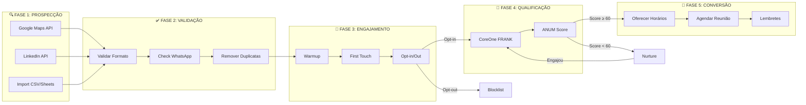

### Explicação das Fases

| Fase | O que acontece | Taxa esperada |
|------|----------------|---------------|
| **Prospecção** | Sistema busca empresas em APIs externas | 100% (entrada) |
| **Validação** | Limpa lista, valida WhatsApp | ~90% passam |
| **Engajamento** | Primeiro contato com botões | ~20% respondem |
| **Qualificação** | Conversa ANUM com CoreOne | ~30% qualificam |
| **Conversão** | Agendamento autônomo | ~50% agendam |

**Resultado final:** De 1.000 prospects → ~30 reuniões agendadas (3%)

---

## 2. Fluxo Detalhado: Prospecção

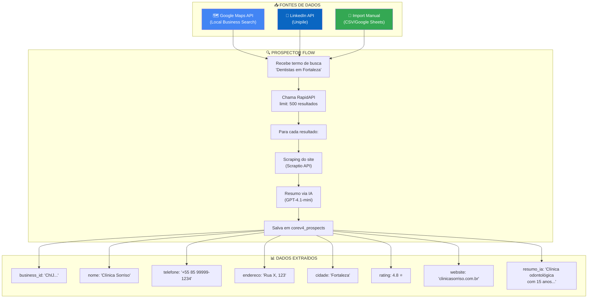

### Exemplo Real

**Entrada do usuário:**
> "Quero prospectar escritórios de advocacia trabalhista na Zona Sul do Rio"

**O que o sistema faz:**
1. Agente IA interpreta → `termo_busca: "Escritórios advocacia trabalhista Zona Sul Rio de Janeiro, Brasil"`
2. Chama RapidAPI → Retorna 347 resultados
3. Para cada resultado:
   - Extrai dados básicos (nome, telefone, endereço, rating)
   - Faz scraping do site
   - IA resume: *"Escritório especializado em direito trabalhista, 20 anos de experiência, foco em empresas de médio porte, destaque para compliance trabalhista..."*
4. Salva no banco com `status: 'new'`

---

## 3. Fluxo Detalhado: Validação

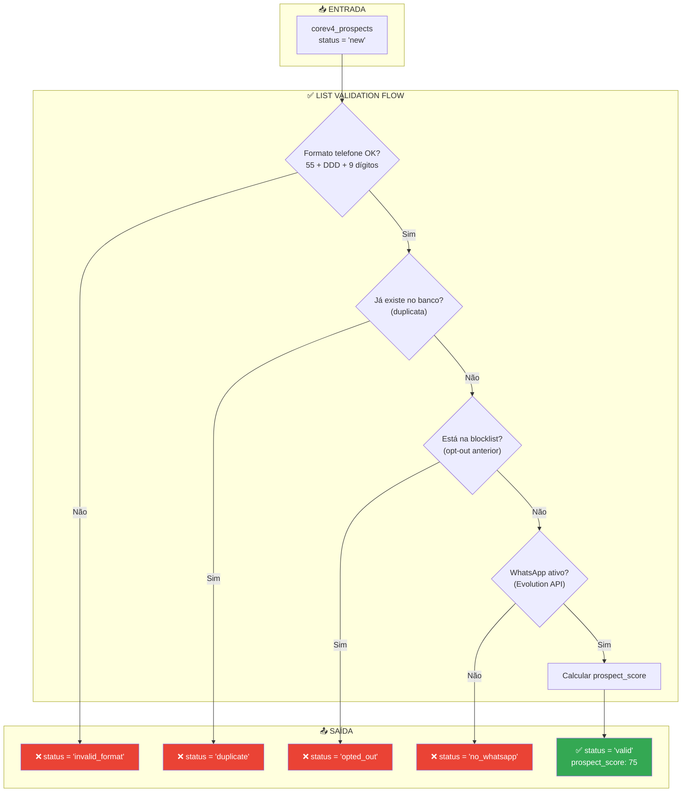

### Cálculo do Prospect Score

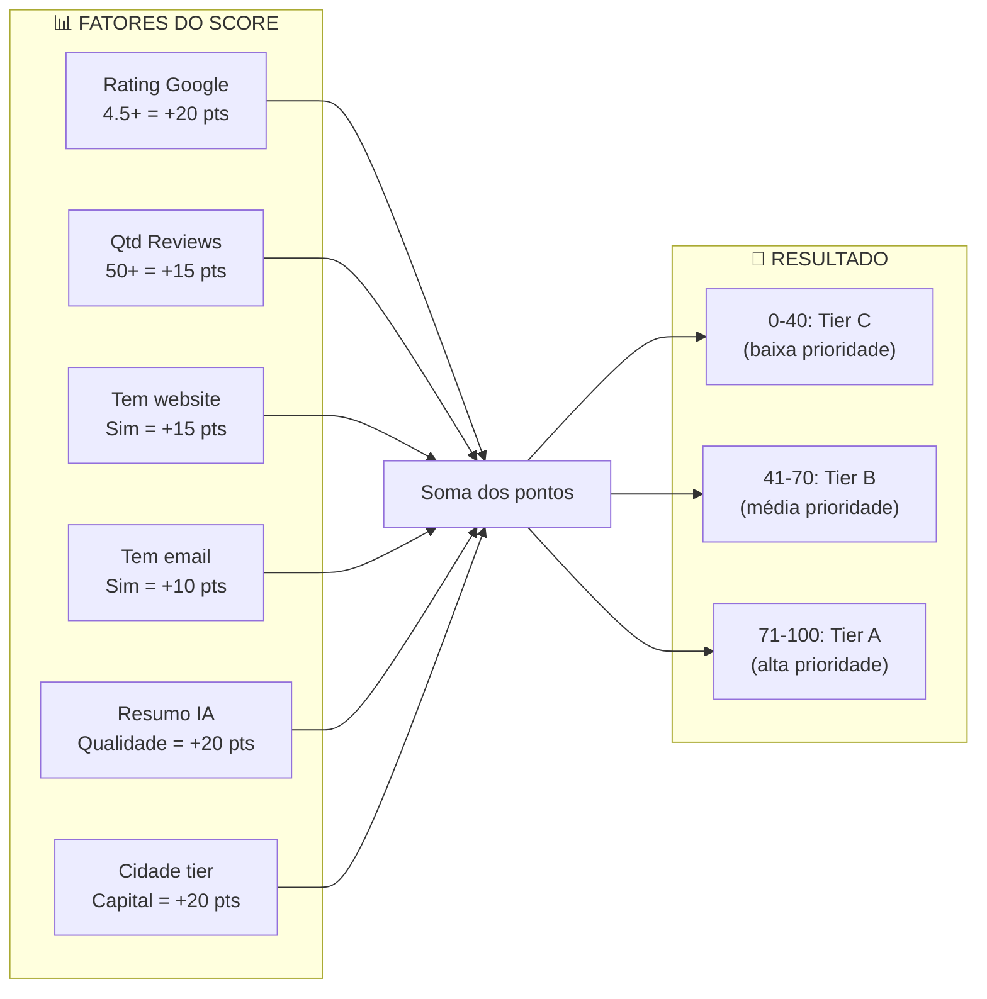

---

## 4. Fluxo Detalhado: Engajamento (First Touch)

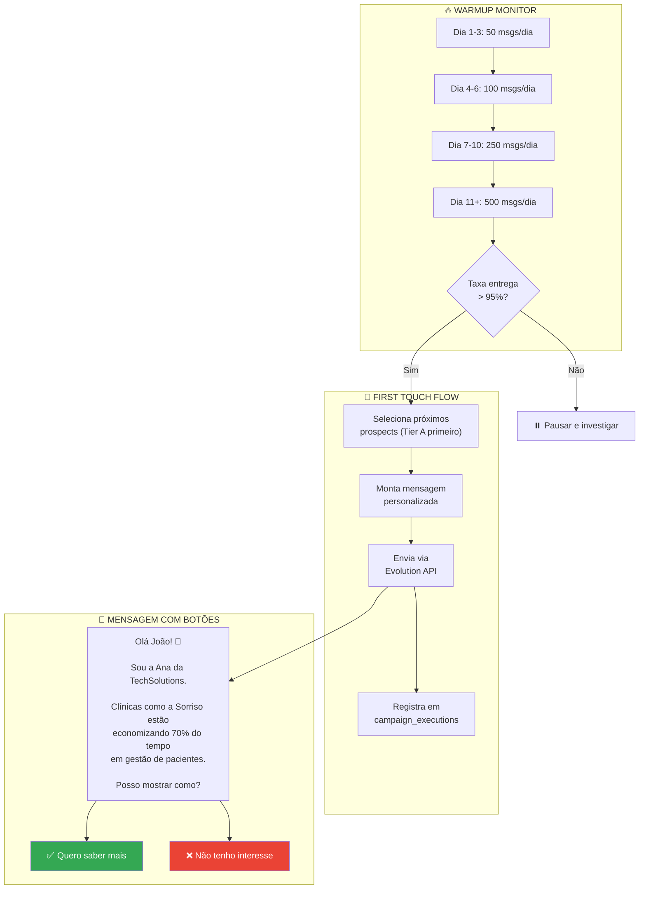

### Exemplo de Mensagem First Touch

```
┌────────────────────────────────────────────────────────┐
│                                                        │
│  Olá Dr. Carlos! 👋                                    │
│                                                        │
│  Sou o Frank da CoreConnect.AI.                        │
│                                                        │
│  Vi que a Clínica Sorriso tem avaliação               │
│  excelente (4.8 ⭐) no Google!                         │
│                                                        │
│  Clínicas como a sua estão dobrando o                 │
│  agendamento de pacientes usando IA no WhatsApp.      │
│                                                        │
│  Posso te mostrar como funciona em 2 minutos?         │
│                                                        │
│  ┌──────────────────┐  ┌──────────────────┐           │
│  │ ✅ Quero ver     │  │ ❌ Não, obrigado │           │
│  └──────────────────┘  └──────────────────┘           │
│                                                        │
└────────────────────────────────────────────────────────┘
```

---

## 5. Fluxo Detalhado: Opt-in Handler

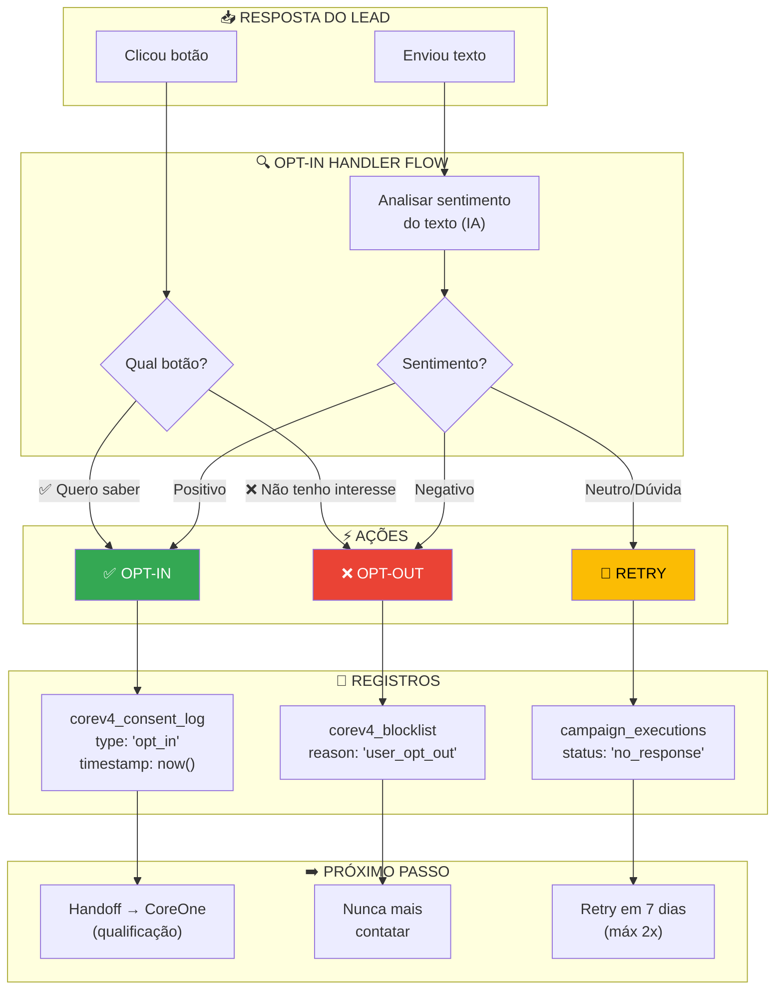

### Exemplos de Respostas e Classificação

| Resposta do Lead | Classificação | Ação |
|------------------|---------------|------|
| *Clicou "✅ Quero saber mais"* | Opt-in | → Handoff |
| *Clicou "❌ Não tenho interesse"* | Opt-out | → Blocklist |
| *"Sim, me conta mais"* | Positivo | → Handoff |
| *"Não me interessa"* | Negativo | → Blocklist |
| *"Para de me mandar mensagem"* | Negativo | → Blocklist |
| *"Quem é você?"* | Neutro | → Retry com mais contexto |
| *"Agora não posso"* | Neutro | → Retry em 7 dias |
| *"Quanto custa?"* | Positivo | → Handoff imediato |
| *(sem resposta 48h)* | No response | → Retry em 7 dias |

---

## 6. Fluxo Detalhado: Handoff (Proativo → Receptivo)

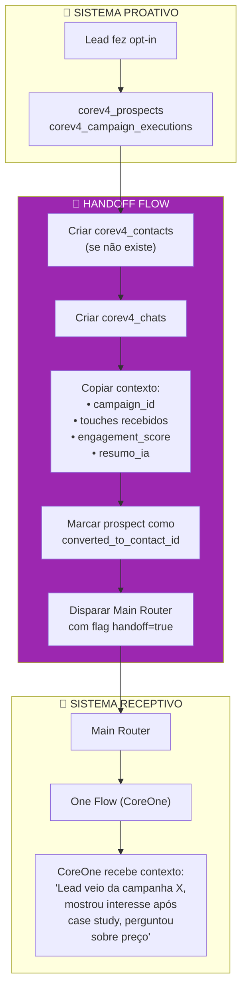

### Contexto Passado no Handoff

```json
{
  "handoff_source": "proactive_campaign",
  "campaign": {
    "id": "camp_dentistas_fortaleza_q1",
    "name": "Dentistas Fortaleza Q1 2026"
  },
  "prospect": {
    "nome": "Dr. Carlos Silva",
    "empresa": "Clínica Sorriso",
    "cargo_inferido": "Proprietário",
    "cidade": "Fortaleza"
  },
  "engagement": {
    "touches_received": 1,
    "first_touch_response": "Clicou opt-in",
    "engagement_score": 72,
    "tempo_resposta": "4 horas"
  },
  "enrichment": {
    "rating_google": 4.8,
    "reviews_count": 127,
    "resumo_site": "Clínica odontológica com 15 anos, foco em implantes e estética dental, equipe de 8 profissionais..."
  },
  "recommended_approach": "Lead mostrou interesse rápido. Abordar direto o valor, perguntar sobre volume de pacientes atual."
}
```

---

## 7. Fluxo Detalhado: Qualificação (CoreOne + ANUM)

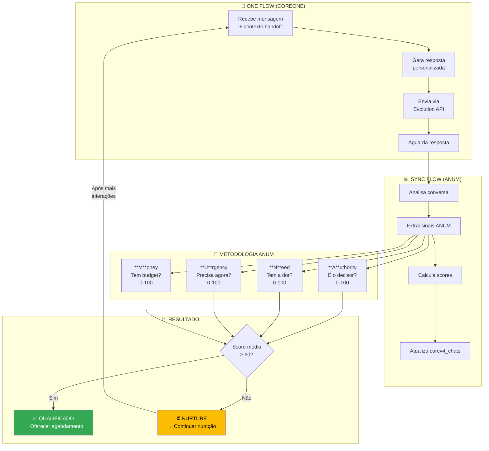

### Exemplo de Conversa de Qualificação

```
┌─────────────────────────────────────────────────────────────────────┐
│                    CONVERSA DE QUALIFICAÇÃO                          │
├─────────────────────────────────────────────────────────────────────┤
│                                                                      │
│  COREONE: Que bom que quer saber mais, Dr. Carlos! 😊                │
│                                                                      │
│  Vi que a Clínica Sorriso tem avaliação excelente no Google.        │
│  Como vocês fazem hoje pra gerenciar os agendamentos?                │
│                                                                      │
│  ───────────────────────────────────────────────────────────────    │
│                                                                      │
│  LEAD: Usamos uma agenda no computador, mas é bem manual.           │
│  A recepcionista fica o dia todo no telefone.                        │
│                                                                      │
│  ───────────────────────────────────────────────────────────────    │
│  📊 ANUM DETECTADO:                                                  │
│  • Need: 75 (mencionou dor: processo manual, recepcionista ocupada) │
│  ───────────────────────────────────────────────────────────────    │
│                                                                      │
│  COREONE: Entendo! Isso é super comum.                               │
│  E essa parte de confirmar consultas, como funciona?                 │
│  Vocês ligam um por um ou mandam mensagem?                           │
│                                                                      │
│  ───────────────────────────────────────────────────────────────    │
│                                                                      │
│  LEAD: Tentamos ligar mas não dá tempo. Muito no-show.              │
│                                                                      │
│  ───────────────────────────────────────────────────────────────    │
│  📊 ANUM ATUALIZADO:                                                 │
│  • Need: 85 (confirmou dor adicional: no-show)                       │
│  • Urgency: 60 (problema está causando perda de receita)            │
│  ───────────────────────────────────────────────────────────────    │
│                                                                      │
│  COREONE: No-show é um problema sério, né?                          │
│  Clínicas que usam confirmação automática por WhatsApp               │
│  reduziram isso em 70%.                                              │
│                                                                      │
│  Você que cuida dessa parte ou tem alguém?                          │
│                                                                      │
│  ───────────────────────────────────────────────────────────────    │
│                                                                      │
│  LEAD: Eu que decido essas coisas, sou o dono.                      │
│                                                                      │
│  ───────────────────────────────────────────────────────────────    │
│  📊 ANUM ATUALIZADO:                                                 │
│  • Authority: 95 (é o decisor/dono)                                  │
│  • Need: 85                                                          │
│  • Urgency: 60                                                       │
│  • Money: 50 (ainda não mencionou)                                   │
│  • MÉDIA: 72.5 → ✅ QUALIFICADO!                                     │
│  ───────────────────────────────────────────────────────────────    │
│                                                                      │
└─────────────────────────────────────────────────────────────────────┘
```

---

## 8. Fluxo Detalhado: Agendamento Autônomo

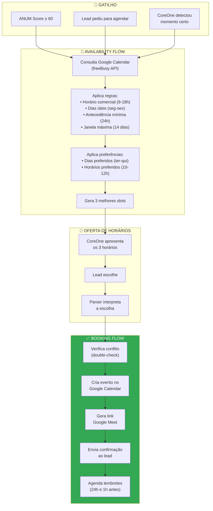

### Exemplo de Oferta de Horários

```
┌─────────────────────────────────────────────────────────────────────┐
│                    AGENDAMENTO AUTÔNOMO                              │
├─────────────────────────────────────────────────────────────────────┤
│                                                                      │
│  COREONE: Perfeito, Dr. Carlos!                                      │
│                                                                      │
│  Que tal agendarmos uma conversa de 30 minutos                      │
│  pra eu te mostrar como funciona na prática?                        │
│                                                                      │
│  Tenho esses horários disponíveis:                                  │
│                                                                      │
│  1️⃣  Terça (24/12) às 10:00                                         │
│  2️⃣  Quarta (25/12) às 14:30                                        │
│  3️⃣  Quinta (26/12) às 11:00                                        │
│                                                                      │
│  Qual funciona melhor pra você?                                     │
│                                                                      │
│  ───────────────────────────────────────────────────────────────    │
│                                                                      │
│  LEAD: Terça de manhã tá ótimo!                                      │
│                                                                      │
│  ───────────────────────────────────────────────────────────────    │
│  🔍 PARSER DETECTOU:                                                 │
│  • "Terça" → Slot 1                                                  │
│  • "de manhã" → confirma Slot 1 (10:00)                             │
│  • Confiança: 95%                                                    │
│  ───────────────────────────────────────────────────────────────    │
│                                                                      │
│  COREONE: Pronto, agendado! ✅                                        │
│                                                                      │
│  📅 Terça, 24/12 às 10:00                                            │
│  📍 Google Meet: meet.google.com/abc-defg-hij                       │
│  ⏱️ Duração: 30 minutos                                              │
│                                                                      │
│  Vou te mandar um lembrete amanhã e 1 hora antes.                   │
│  Até lá! 👋                                                          │
│                                                                      │
└─────────────────────────────────────────────────────────────────────┘
```

### Parser de Seleção de Horário

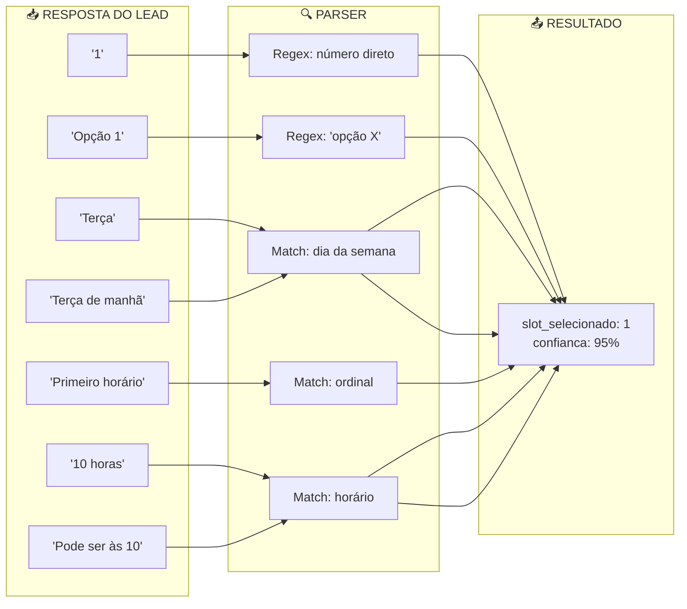

---

## 9. Fluxo Completo: Jornada de Ponta a Ponta

```mermaid
flowchart TB
    subgraph DIA1 ["📅 DIA 1"]
        D1_1["🔍 Prospector busca<br/>'Dentistas Fortaleza'"]
        D1_2["✅ 347 empresas encontradas"]
        D1_3["📊 312 validadas (90%)"]
    end

    subgraph DIA2_7 ["📅 DIA 2-7"]
        D2_1["🔥 Warmup: 50→100 msgs/dia"]
        D2_2["📈 Taxa entrega: 96%"]
    end

    subgraph DIA8 ["📅 DIA 8"]
        D8_1["🎯 First Touch enviado<br/>para Clínica Sorriso"]
        D8_2["💬 'Olá Dr. Carlos...'<br/>+ botões"]
    end

    subgraph DIA8_TARDE ["📅 DIA 8 (4h depois)"]
        D8_3["✅ Lead clicou<br/>'Quero saber mais'"]
        D8_4["🔄 Handoff → CoreOne"]
    end

    subgraph DIA8_9 ["📅 DIA 8-9"]
        D9_1["🧠 CoreOne qualifica"]
        D9_2["📊 ANUM: 72.5"]
        D9_3["✅ QUALIFICADO!"]
    end

    subgraph DIA9 ["📅 DIA 9"]
        D9_4["📅 Oferece 3 horários"]
        D9_5["👆 Lead escolhe Terça 10h"]
        D9_6["✅ Reunião agendada!"]
        D9_7["📧 Confirmação enviada"]
    end

    subgraph DIA10 ["📅 DIA 10"]
        D10_1["⏰ Lembrete 24h antes"]
    end

    subgraph DIA11 ["📅 DIA 11 (Terça)"]
        D11_1["⏰ Lembrete 1h antes"]
        D11_2["🎉 REUNIÃO REALIZADA!"]
    end

    D1_1 --> D1_2 --> D1_3
    D1_3 --> D2_1 --> D2_2
    D2_2 --> D8_1 --> D8_2
    D8_2 --> D8_3 --> D8_4
    D8_4 --> D9_1 --> D9_2 --> D9_3
    D9_3 --> D9_4 --> D9_5 --> D9_6 --> D9_7
    D9_7 --> D10_1 --> D11_1 --> D11_2

    style D11_2 fill:#34A853,color:#fff,stroke:#2E7D32,stroke-width:3px
```

---

## 10. Estados do Lead (State Machine)

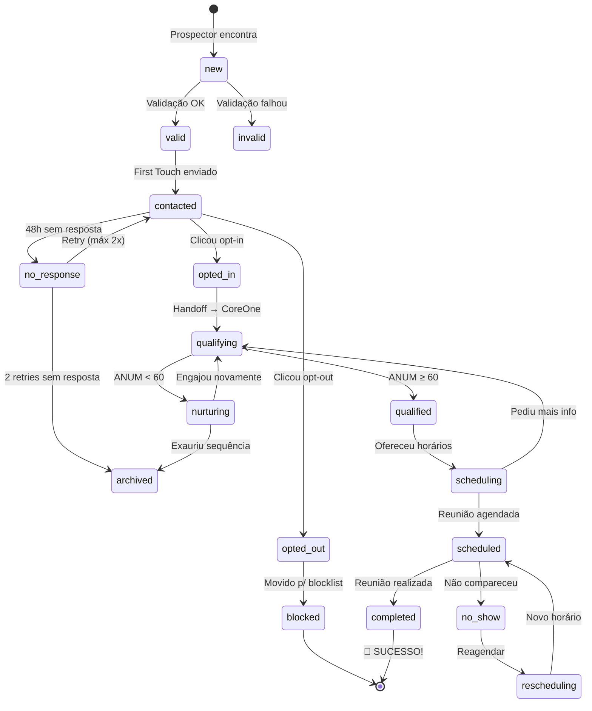

---

## 11. Métricas do Funil (Resumo)

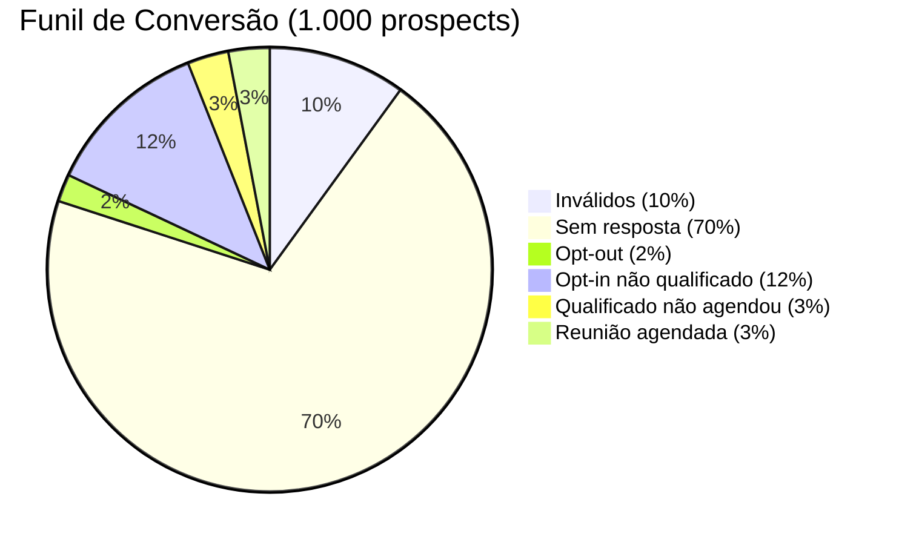

| Etapa | Quantidade | Taxa | Acumulado |
|-------|------------|------|-----------|
| Prospects encontrados | 1.000 | 100% | 100% |
| Validados | 900 | 90% | 90% |
| Responderam | 180 | 20% | 18% |
| Opt-in | 150 | 83% | 15% |
| Qualificados (ANUM ≥ 60) | 60 | 40% | 6% |
| Reunião agendada | 30 | 50% | **3%** |

---

## Como usar estes diagramas

1. **No GitHub:** Markdown com Mermaid renderiza automaticamente
2. **No Notion:** Cole o código Mermaid em bloco de código
3. **Em apresentações:** Use [Mermaid Live Editor](https://mermaid.live) para exportar PNG/SVG
4. **No site:** Inclua a lib Mermaid.js para renderizar

```html
<script src="https://cdn.jsdelivr.net/npm/mermaid/dist/mermaid.min.js"></script>
<script>mermaid.initialize({startOnLoad:true});</script>
```
